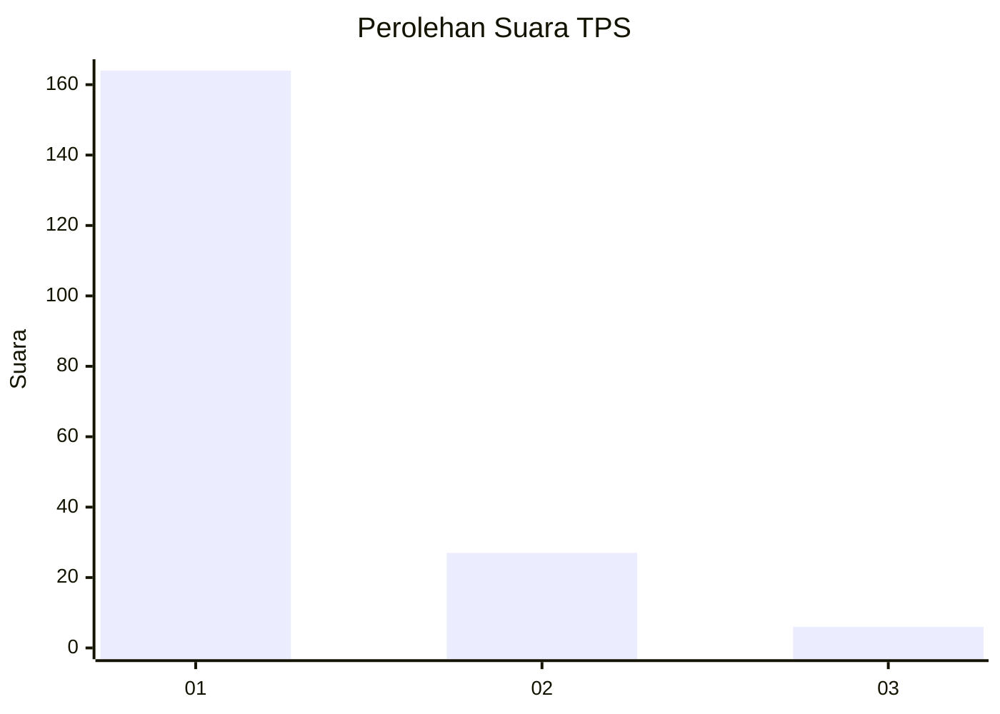
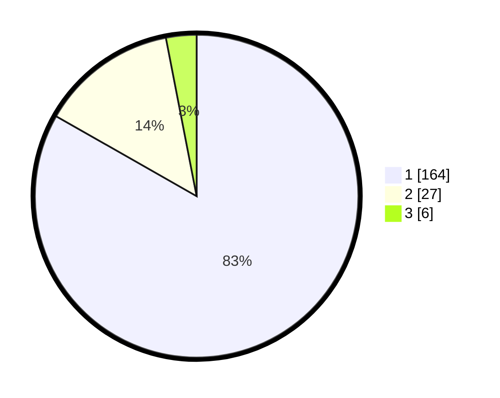

# Hasil

## Grafik

## Tabel

| No. | Nama Paslon    | Suara | Suara (raw) | Persentase |
|:--- |:-------------- | -----:| -----------:| ----------:|
| 1   | ANIES MUHAIMIN | 164   | [164][p-1]  | 83,25      |
| 2   | PRABOWO GIBRAN | 27    | [27][p-2]   | 13,71      |
| 3   | GANJAR MAHFUD  | 6     | [6][p-3]    | 3,05       |

[p-1]: https://github.com/gigit-pemilu/pemilu-2024-11-aceh/blob/main/pilpres/hitung-suara/sub/11-aceh/sub/01-aceh-selatan/sub/04-labuhanhaji/sub/2006-ujung-batu/sub/001-tps/sub/paslon-1.txt
[p-2]: https://github.com/gigit-pemilu/pemilu-2024-11-aceh/blob/main/pilpres/hitung-suara/sub/11-aceh/sub/01-aceh-selatan/sub/04-labuhanhaji/sub/2006-ujung-batu/sub/001-tps/sub/paslon-2.txt
[p-3]: https://github.com/gigit-pemilu/pemilu-2024-11-aceh/blob/main/pilpres/hitung-suara/sub/11-aceh/sub/01-aceh-selatan/sub/04-labuhanhaji/sub/2006-ujung-batu/sub/001-tps/sub/paslon-3.txt

## Foto C Plano

https://sirekap-obj-formc.kpu.go.id/15ab/pemilu/ppwp/11/01/04/20/06/1101042006001-20240215-020235--4358de80-a93c-41a9-bf63-0221a2a92faa.jpg

https://sirekap-obj-formc.kpu.go.id/15ab/pemilu/ppwp/11/01/04/20/06/1101042006001-20240215-020422--72f0116a-d507-4a6a-b5fa-9d85d8ed2dfe.jpg

https://sirekap-obj-formc.kpu.go.id/15ab/pemilu/ppwp/11/01/04/20/06/1101042006001-20240215-020605--85185404-6245-4262-9c0b-6a38b86738f5.jpg

## Metadata

| Key        | Value               |
| ---------- | ------------------- |
| Time Stamp | 2024-02-17 01:30:00 |

