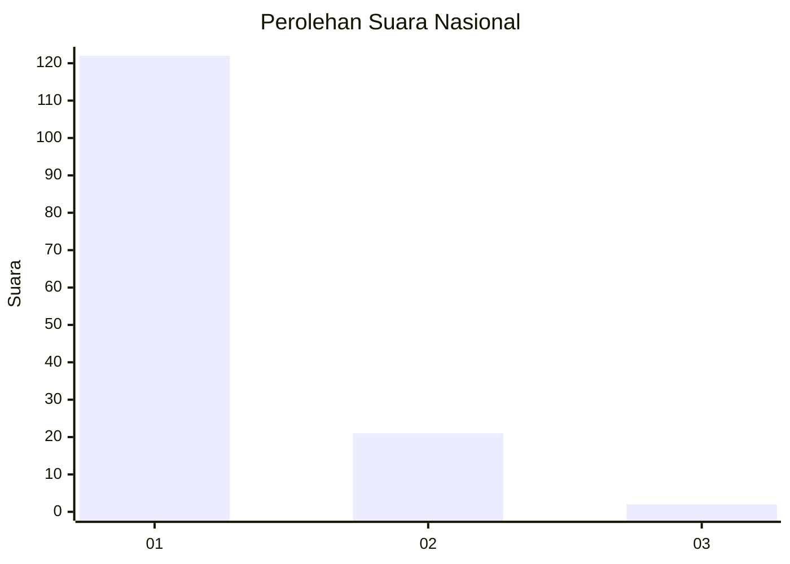
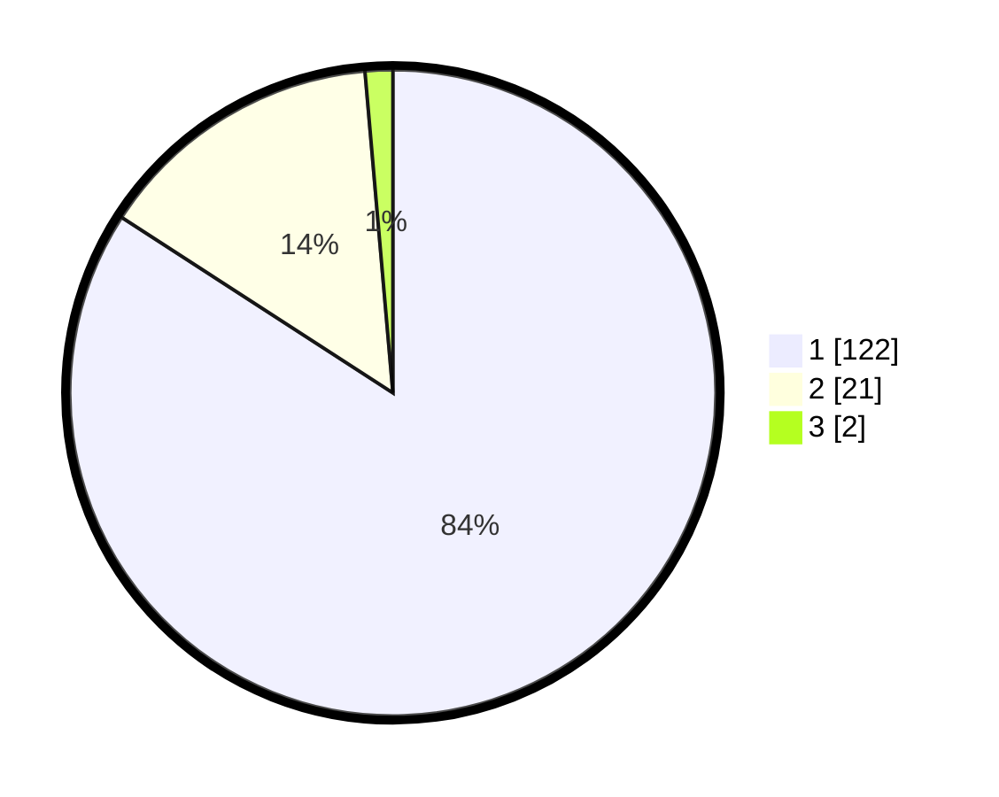

# Hasil

## Grafik

## Tabel

| No. | Nama Paslon    | Suara | Suara (raw) | Persentase |
|:--- |:-------------- | -----:| -----------:| ----------:|
| 1   | ANIES MUHAIMIN | 122   | [122][p-1]  | 84,14      |
| 2   | PRABOWO GIBRAN | 21    | [21][p-2]   | 14,48      |
| 3   | GANJAR MAHFUD  | 2     | [2][p-3]    | 1,38       |

[p-1]: https://github.com/gigit-pemilu/pemilu-2024/blob/main/pilpres/hitung-suara/sub/11-aceh/sub/01-aceh-selatan/sub/04-labuhanhaji/sub/2011-tengah-pisang/sub/002-tps/sub/paslon-1.txt
[p-2]: https://github.com/gigit-pemilu/pemilu-2024/blob/main/pilpres/hitung-suara/sub/11-aceh/sub/01-aceh-selatan/sub/04-labuhanhaji/sub/2011-tengah-pisang/sub/002-tps/sub/paslon-2.txt
[p-3]: https://github.com/gigit-pemilu/pemilu-2024/blob/main/pilpres/hitung-suara/sub/11-aceh/sub/01-aceh-selatan/sub/04-labuhanhaji/sub/2011-tengah-pisang/sub/002-tps/sub/paslon-3.txt

## Foto C Plano

https://sirekap-obj-formc.kpu.go.id/75f2/pemilu/ppwp/11/01/04/20/11/1101042011002-20240217-153543--1ccbe770-dea0-4839-a5c2-a9e062166799.jpg

https://sirekap-obj-formc.kpu.go.id/75f2/pemilu/ppwp/11/01/04/20/11/1101042011002-20240217-153545--118345be-c6cf-4e9c-917a-770f5b0384b1.jpg

https://sirekap-obj-formc.kpu.go.id/75f2/pemilu/ppwp/11/01/04/20/11/1101042011002-20240217-153544--eaa3d72d-d271-4f61-bfc4-9d3ee330a19b.jpg

## Metadata

| Key        | Value               |
| ---------- | ------------------- |
| Time Stamp | 2024-02-21 13:00:00 |

## DATA PEMILIH TETAP

Jumlah pemilih dalam DPT: **162**.
 * L: **85**.
 * P: **77**.

## DATA PENGGUNA HAK PILIH

Jumlah pengguna hak pilih dalam DPT: **142**.
 * L: **69**.
 * P: **73**.

Jumlah pengguna hak pilih dalam DPTb: **3**.
 * L: **2**.
 * P: **1**.

Jumlah pengguna hak pilih dalam DPK: **1**.
 * L: **1**.
 * P: **0**.

Jumlah pengguna hak pilih: **146**.
 * L: **72**.
 * P: **74**.

## JUMLAH SUARA SAH DAN TIDAK SAH

JUMLAH SELURUH SUARA SAH: **145**.

JUMLAH SUARA TIDAK SAH: **1**.

JUMLAH SELURUH SUARA SAH DAN SUARA TIDAK SAH: **146**.

