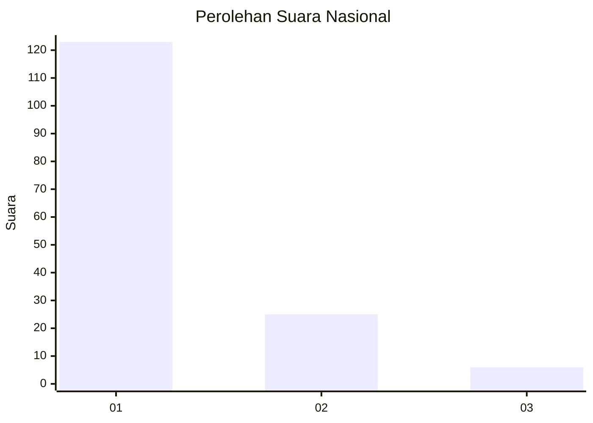
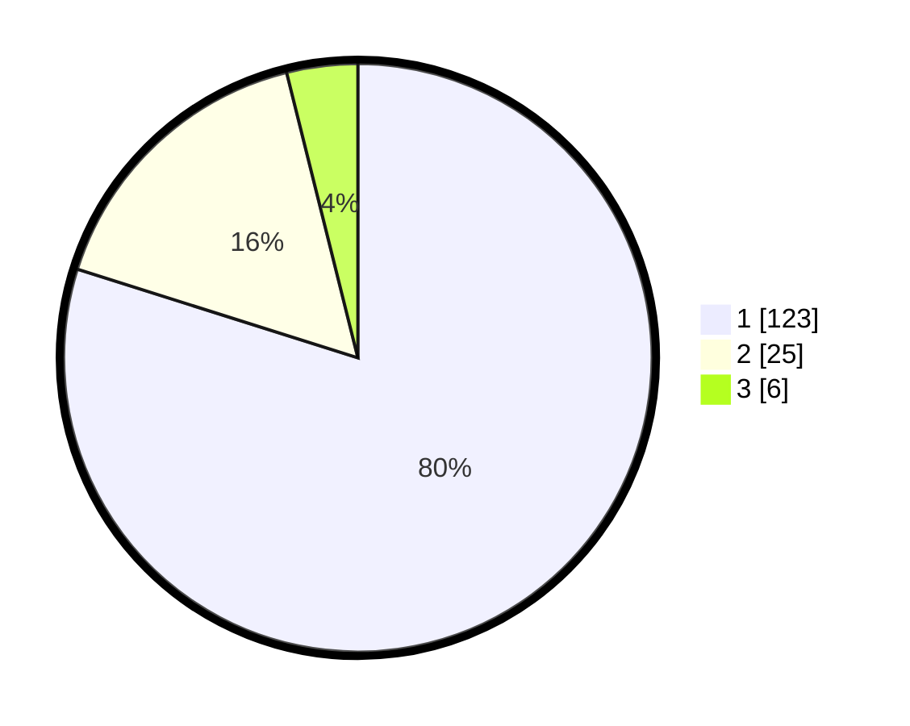

# Hasil

## Grafik

## Tabel

| No. | Nama Paslon    | Suara | Suara (raw) | Persentase |
|:--- |:-------------- | -----:| -----------:| ----------:|
| 1   | ANIES MUHAIMIN | 123   | [123][p-1]  | 79,87      |
| 2   | PRABOWO GIBRAN | 25    | [25][p-2]   | 16,23      |
| 3   | GANJAR MAHFUD  | 6     | [6][p-3]    | 3,90       |

[p-1]: https://github.com/gigit-pemilu/pemilu-2024/blob/main/pilpres/hitung-suara/sub/11-aceh/sub/01-aceh-selatan/sub/04-labuhanhaji/sub/2014-tengah-baru/sub/004-tps/sub/paslon-1.txt
[p-2]: https://github.com/gigit-pemilu/pemilu-2024/blob/main/pilpres/hitung-suara/sub/11-aceh/sub/01-aceh-selatan/sub/04-labuhanhaji/sub/2014-tengah-baru/sub/004-tps/sub/paslon-2.txt
[p-3]: https://github.com/gigit-pemilu/pemilu-2024/blob/main/pilpres/hitung-suara/sub/11-aceh/sub/01-aceh-selatan/sub/04-labuhanhaji/sub/2014-tengah-baru/sub/004-tps/sub/paslon-3.txt

## Foto C Plano

https://sirekap-obj-formc.kpu.go.id/9175/pemilu/ppwp/11/01/04/20/14/1101042014004-20240215-105548--efef614f-60fe-4d67-95da-d5ece339e03e.jpg

https://sirekap-obj-formc.kpu.go.id/9175/pemilu/ppwp/11/01/04/20/14/1101042014004-20240215-105620--e753bcfe-6d8e-483e-b40c-d8ec43147faf.jpg

https://sirekap-obj-formc.kpu.go.id/9175/pemilu/ppwp/11/01/04/20/14/1101042014004-20240215-105845--615b77de-6934-4734-9a39-9e0cf3e1dd98.jpg

## Metadata

| Key        | Value               |
| ---------- | ------------------- |
| Time Stamp | 2024-02-24 22:31:28 |

## DATA PEMILIH TETAP

Jumlah pemilih dalam DPT: **164**.
 * L: **75**.
 * P: **89**.

## DATA PENGGUNA HAK PILIH

Jumlah pengguna hak pilih dalam DPT: **149**.
 * L: **66**.
 * P: **83**.

Jumlah pengguna hak pilih dalam DPTb: **6**.
 * L: **4**.
 * P: **2**.

Jumlah pengguna hak pilih dalam DPK: **0**.
 * L: **0**.
 * P: **0**.

Jumlah pengguna hak pilih: **155**.
 * L: **70**.
 * P: **85**.

## JUMLAH SUARA SAH DAN TIDAK SAH

JUMLAH SELURUH SUARA SAH: **154**.

JUMLAH SUARA TIDAK SAH: **1**.

JUMLAH SELURUH SUARA SAH DAN SUARA TIDAK SAH: **155**.

