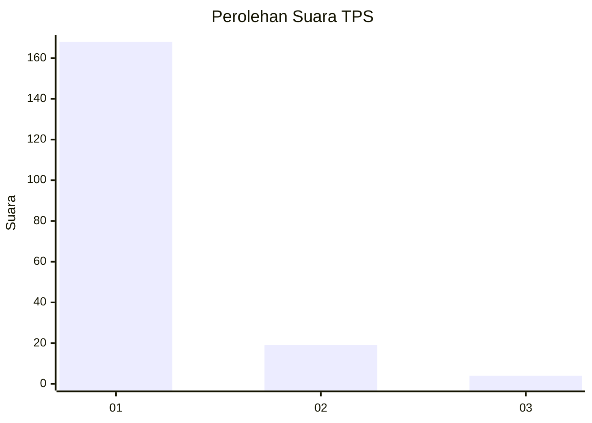
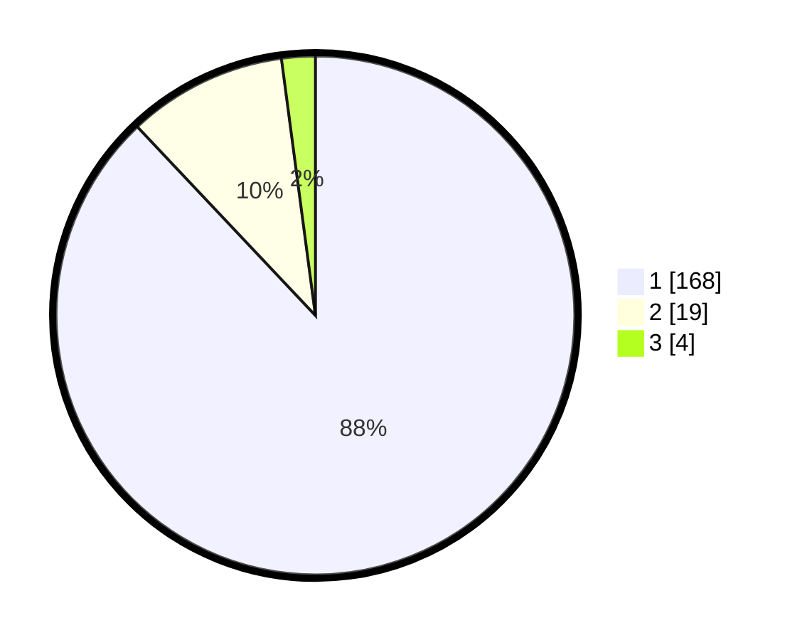

# Hasil

## Grafik

## Tabel

| No. | Nama Paslon    | Suara | Suara (raw) | Persentase |
|:--- |:-------------- | -----:| -----------:| ----------:|
| 1   | ANIES MUHAIMIN | 168   | [168][p-1]  | 87,96      |
| 2   | PRABOWO GIBRAN | 19    | [19][p-2]   | 9,95       |
| 3   | GANJAR MAHFUD  | 4     | [4][p-3]    | 2,09       |

[p-1]: https://github.com/gigit-pemilu/pemilu-2024-11-aceh/blob/main/pilpres/hitung-suara/sub/11-aceh/sub/01-aceh-selatan/sub/05-meukek/sub/2001-kuta-buloh-ii/sub/001-tps/sub/paslon-1.txt
[p-2]: https://github.com/gigit-pemilu/pemilu-2024-11-aceh/blob/main/pilpres/hitung-suara/sub/11-aceh/sub/01-aceh-selatan/sub/05-meukek/sub/2001-kuta-buloh-ii/sub/001-tps/sub/paslon-2.txt
[p-3]: https://github.com/gigit-pemilu/pemilu-2024-11-aceh/blob/main/pilpres/hitung-suara/sub/11-aceh/sub/01-aceh-selatan/sub/05-meukek/sub/2001-kuta-buloh-ii/sub/001-tps/sub/paslon-3.txt

## Foto C Plano

https://sirekap-obj-formc.kpu.go.id/f48f/pemilu/ppwp/11/01/05/20/01/1101052001001-20240216-152628--67683b47-8381-4b5f-a2a6-a09e10ae06b7.jpg

https://sirekap-obj-formc.kpu.go.id/f48f/pemilu/ppwp/11/01/05/20/01/1101052001001-20240216-152630--79518671-49e4-4027-a464-2e307fd09d9f.jpg

https://sirekap-obj-formc.kpu.go.id/f48f/pemilu/ppwp/11/01/05/20/01/1101052001001-20240216-152629--b66a0841-c4af-4c79-98db-fe0ad8b50004.jpg

## Metadata

| Key        | Value               |
| ---------- | ------------------- |
| Time Stamp | 2024-02-16 21:01:00 |

## DATA PEMILIH TETAP

Jumlah pemilih dalam DPT: **216**.
 * L: **107**.
 * P: **109**.

## DATA PENGGUNA HAK PILIH

Jumlah pengguna hak pilih dalam DPT: **190**.
 * L: **92**.
 * P: **98**.

Jumlah pengguna hak pilih dalam DPTb: **1**.
 * L: **1**.
 * P: **0**.

Jumlah pengguna hak pilih dalam DPK: **1**.
 * L: **1**.
 * P: **0**.

Jumlah pengguna hak pilih: **192**.
 * L: **94**.
 * P: **98**.

## JUMLAH SUARA SAH DAN TIDAK SAH

JUMLAH SELURUH SUARA SAH: **191**.

JUMLAH SUARA TIDAK SAH: **1**.

JUMLAH SELURUH SUARA SAH DAN SUARA TIDAK SAH: **192**.

