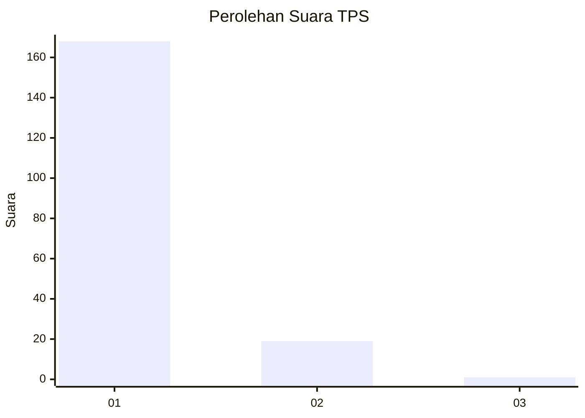
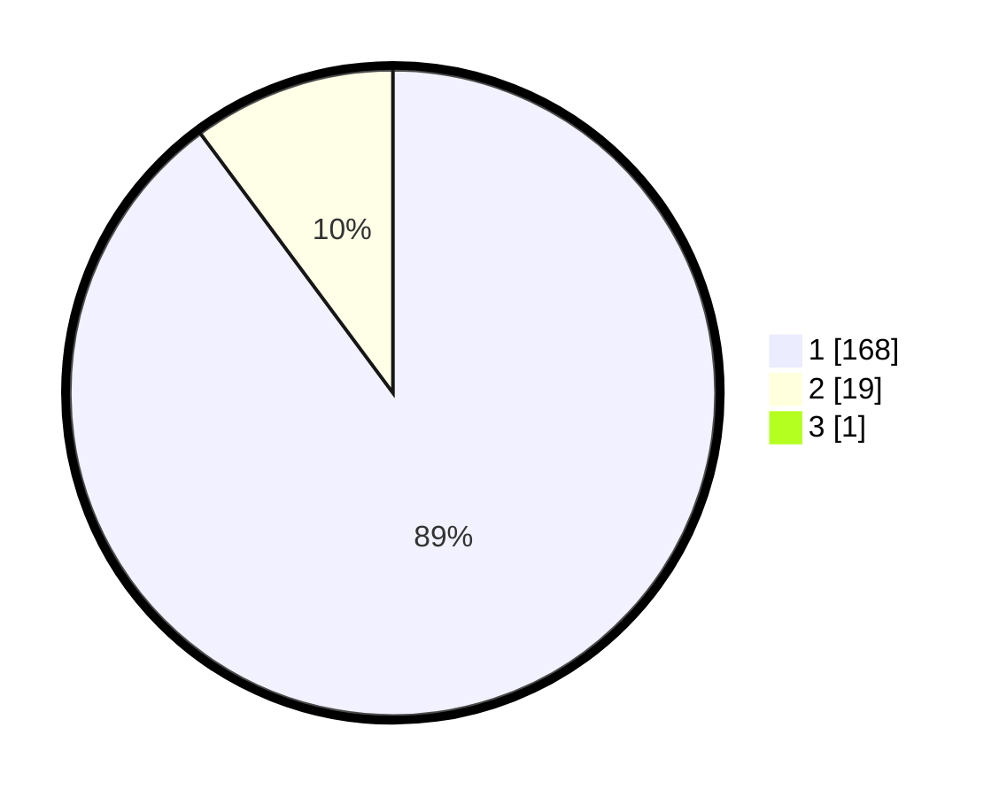

# Hasil

## Grafik

## Tabel

| No. | Nama Paslon    | Suara | Suara (raw) | Persentase |
|:--- |:-------------- | -----:| -----------:| ----------:|
| 1   | ANIES MUHAIMIN | 168   | [168][p-1]  | 89,36      |
| 2   | PRABOWO GIBRAN | 19    | [19][p-2]   | 10,11      |
| 3   | GANJAR MAHFUD  | 1     | [1][p-3]    | 0,53       |

[p-1]: https://github.com/gigit-pemilu/pemilu-2024-11-aceh/blob/main/pilpres/hitung-suara/sub/11-aceh/sub/01-aceh-selatan/sub/05-meukek/sub/2001-kuta-buloh-ii/sub/003-tps/sub/paslon-1.txt
[p-2]: https://github.com/gigit-pemilu/pemilu-2024-11-aceh/blob/main/pilpres/hitung-suara/sub/11-aceh/sub/01-aceh-selatan/sub/05-meukek/sub/2001-kuta-buloh-ii/sub/003-tps/sub/paslon-2.txt
[p-3]: https://github.com/gigit-pemilu/pemilu-2024-11-aceh/blob/main/pilpres/hitung-suara/sub/11-aceh/sub/01-aceh-selatan/sub/05-meukek/sub/2001-kuta-buloh-ii/sub/003-tps/sub/paslon-3.txt

## Foto C Plano

https://sirekap-obj-formc.kpu.go.id/f71b/pemilu/ppwp/11/01/05/20/01/1101052001003-20240215-150432--9047e81d-bcbc-420c-a14e-a67ea0a63047.jpg

https://sirekap-obj-formc.kpu.go.id/f71b/pemilu/ppwp/11/01/05/20/01/1101052001003-20240215-144915--85974688-7d10-4806-9fc8-132e87400eef.jpg

https://sirekap-obj-formc.kpu.go.id/f71b/pemilu/ppwp/11/01/05/20/01/1101052001003-20240215-145039--6978061d-d872-4b9a-8477-42f5fa8a3c35.jpg

## Metadata

| Key        | Value               |
| ---------- | ------------------- |
| Time Stamp | 2024-02-16 16:25:10 |

## DATA PEMILIH TETAP

Jumlah pemilih dalam DPT: **214**.
 * L: **114**.
 * P: **100**.

## DATA PENGGUNA HAK PILIH

Jumlah pengguna hak pilih dalam DPT: **185**.
 * L: **92**.
 * P: **93**.

Jumlah pengguna hak pilih dalam DPTb: **3**.
 * L: **1**.
 * P: **2**.

Jumlah pengguna hak pilih dalam DPK: **0**.
 * L: **0**.
 * P: **0**.

Jumlah pengguna hak pilih: **188**.
 * L: **93**.
 * P: **95**.

## JUMLAH SUARA SAH DAN TIDAK SAH

JUMLAH SELURUH SUARA SAH: **188**.

JUMLAH SUARA TIDAK SAH: **0**.

JUMLAH SELURUH SUARA SAH DAN SUARA TIDAK SAH: **188**.

