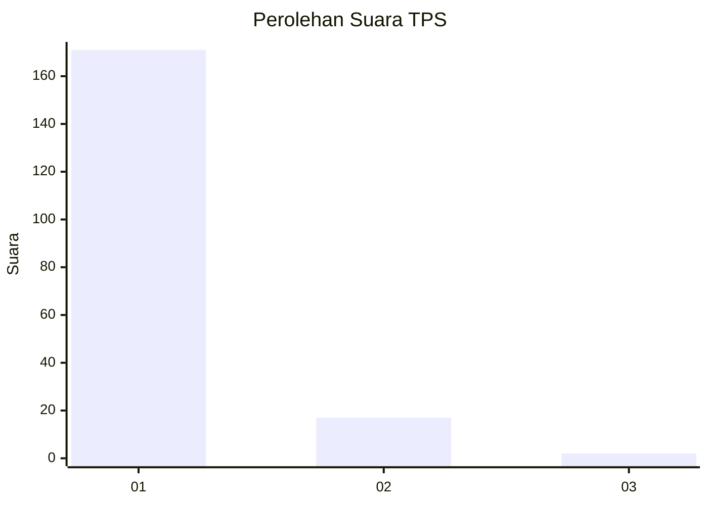
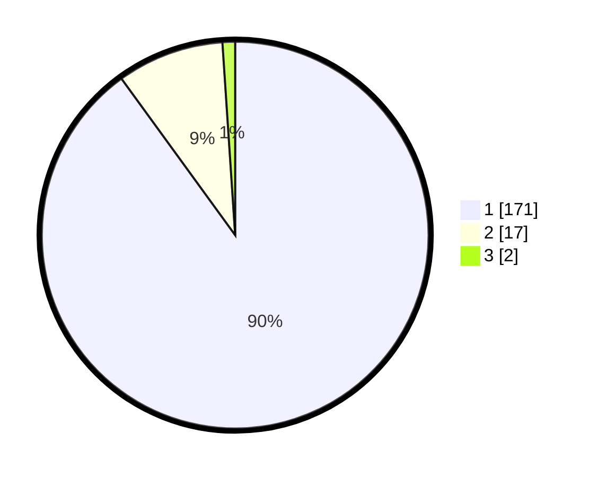

# Hasil

## Grafik

## Tabel

| No. | Nama Paslon    | Suara | Suara (raw) | Persentase |
|:--- |:-------------- | -----:| -----------:| ----------:|
| 1   | ANIES MUHAIMIN | 171   | [171][p-1]  | 90,00      |
| 2   | PRABOWO GIBRAN | 17    | [17][p-2]   | 8,95       |
| 3   | GANJAR MAHFUD  | 2     | [2][p-3]    | 1,05       |

[p-1]: https://github.com/gigit-pemilu/pemilu-2024-11-aceh/blob/main/pilpres/hitung-suara/sub/11-aceh/sub/01-aceh-selatan/sub/05-meukek/sub/2002-kuta-buloh-i/sub/001-tps/sub/paslon-1.txt
[p-2]: https://github.com/gigit-pemilu/pemilu-2024-11-aceh/blob/main/pilpres/hitung-suara/sub/11-aceh/sub/01-aceh-selatan/sub/05-meukek/sub/2002-kuta-buloh-i/sub/001-tps/sub/paslon-2.txt
[p-3]: https://github.com/gigit-pemilu/pemilu-2024-11-aceh/blob/main/pilpres/hitung-suara/sub/11-aceh/sub/01-aceh-selatan/sub/05-meukek/sub/2002-kuta-buloh-i/sub/001-tps/sub/paslon-3.txt

## Foto C Plano

https://sirekap-obj-formc.kpu.go.id/b1f7/pemilu/ppwp/11/01/05/20/02/1101052002001-20240216-134712--25d197c1-68d1-4c1e-b9ce-c35535e0839e.jpg

https://sirekap-obj-formc.kpu.go.id/b1f7/pemilu/ppwp/11/01/05/20/02/1101052002001-20240216-134713--e4998ddb-199a-4837-a3ad-7d41c604eb7f.jpg

https://sirekap-obj-formc.kpu.go.id/b1f7/pemilu/ppwp/11/01/05/20/02/1101052002001-20240216-134713--4c5e6f0d-3b34-45f4-9c97-58c5f0129e30.jpg

## Metadata

| Key        | Value               |
| ---------- | ------------------- |
| Time Stamp | 2024-02-16 21:01:00 |

## DATA PEMILIH TETAP

Jumlah pemilih dalam DPT: **233**.
 * L: **110**.
 * P: **123**.

## DATA PENGGUNA HAK PILIH

Jumlah pengguna hak pilih dalam DPT: **189**.
 * L: **83**.
 * P: **106**.

Jumlah pengguna hak pilih dalam DPTb: **1**.
 * L: **0**.
 * P: **1**.

Jumlah pengguna hak pilih dalam DPK: **1**.
 * L: **1**.
 * P: **0**.

Jumlah pengguna hak pilih: **191**.
 * L: **84**.
 * P: **107**.

## JUMLAH SUARA SAH DAN TIDAK SAH

JUMLAH SELURUH SUARA SAH: **190**.

JUMLAH SUARA TIDAK SAH: **1**.

JUMLAH SELURUH SUARA SAH DAN SUARA TIDAK SAH: **191**.

