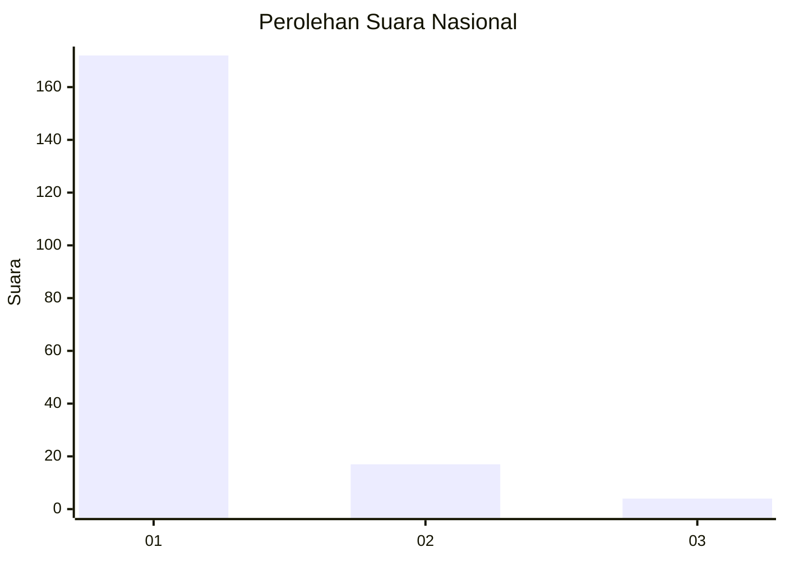
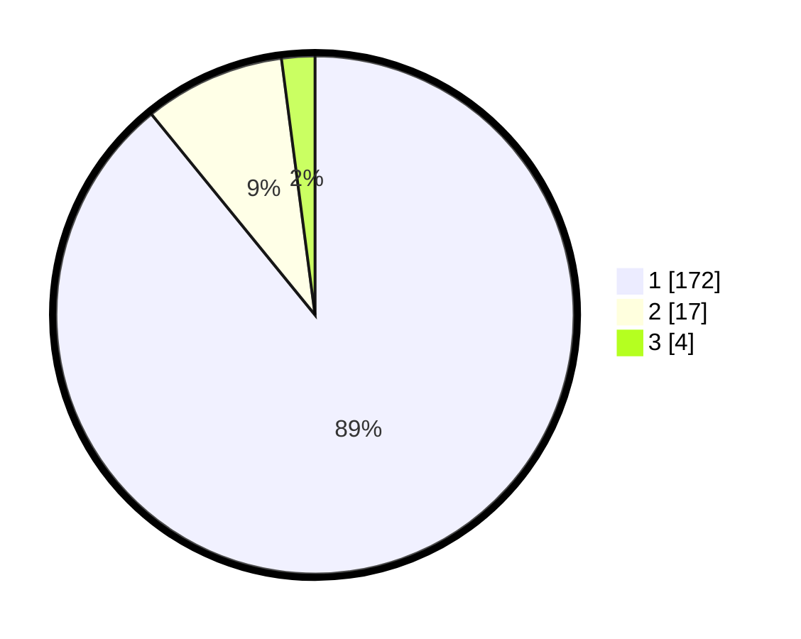

# Hasil

## Grafik

## Tabel

| No. | Nama Paslon    | Suara | Suara (raw) | Persentase |
|:--- |:-------------- | -----:| -----------:| ----------:|
| 1   | ANIES MUHAIMIN | 172   | [172][p-1]  | 89,12      |
| 2   | PRABOWO GIBRAN | 17    | [17][p-2]   | 8,81       |
| 3   | GANJAR MAHFUD  | 4     | [4][p-3]    | 2,07       |

[p-1]: https://github.com/gigit-pemilu/pemilu-2024/blob/main/pilpres/hitung-suara/sub/11-aceh/sub/01-aceh-selatan/sub/05-meukek/sub/2002-kuta-buloh-i/sub/002-tps/sub/paslon-1.txt
[p-2]: https://github.com/gigit-pemilu/pemilu-2024/blob/main/pilpres/hitung-suara/sub/11-aceh/sub/01-aceh-selatan/sub/05-meukek/sub/2002-kuta-buloh-i/sub/002-tps/sub/paslon-2.txt
[p-3]: https://github.com/gigit-pemilu/pemilu-2024/blob/main/pilpres/hitung-suara/sub/11-aceh/sub/01-aceh-selatan/sub/05-meukek/sub/2002-kuta-buloh-i/sub/002-tps/sub/paslon-3.txt

## Foto C Plano

https://sirekap-obj-formc.kpu.go.id/29bb/pemilu/ppwp/11/01/05/20/02/1101052002002-20240215-230909--77af912c-8a67-4f9d-9d2e-71153fe42319.jpg

https://sirekap-obj-formc.kpu.go.id/29bb/pemilu/ppwp/11/01/05/20/02/1101052002002-20240215-230913--b45a1e0d-c62e-42c8-9e03-6cb578dbb807.jpg

https://sirekap-obj-formc.kpu.go.id/29bb/pemilu/ppwp/11/01/05/20/02/1101052002002-20240215-230911--e4875c93-aad7-415e-807d-db2e148c96bf.jpg

## Metadata

| Key        | Value               |
| ---------- | ------------------- |
| Time Stamp | 2024-02-15 23:29:50 |

## DATA PEMILIH TETAP

Jumlah pemilih dalam DPT: **230**.
 * L: **98**.
 * P: **132**.

## DATA PENGGUNA HAK PILIH

Jumlah pengguna hak pilih dalam DPT: **193**.
 * L: **77**.
 * P: **116**.

Jumlah pengguna hak pilih dalam DPTb: **0**.
 * L: **0**.
 * P: **0**.

Jumlah pengguna hak pilih dalam DPK: **0**.
 * L: **0**.
 * P: **0**.

Jumlah pengguna hak pilih: **193**.
 * L: **77**.
 * P: **116**.

## JUMLAH SUARA SAH DAN TIDAK SAH

JUMLAH SELURUH SUARA SAH: **193**.

JUMLAH SUARA TIDAK SAH: **0**.

JUMLAH SELURUH SUARA SAH DAN SUARA TIDAK SAH: **193**.

