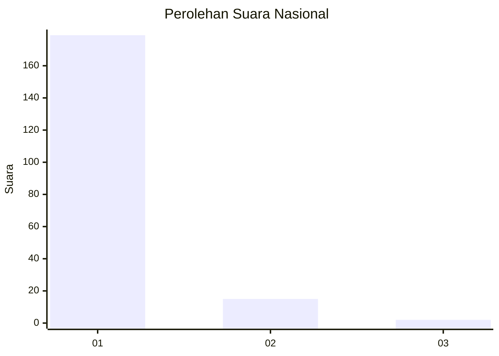
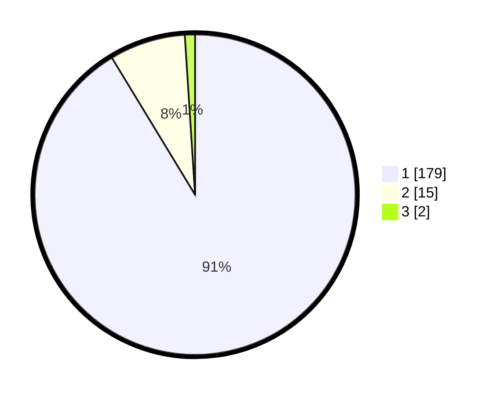

# Hasil

## Grafik

## Tabel

| No. | Nama Paslon    | Suara | Suara (raw) | Persentase |
|:--- |:-------------- | -----:| -----------:| ----------:|
| 1   | ANIES MUHAIMIN | 179   | [179][p-1]  | 91,33      |
| 2   | PRABOWO GIBRAN | 15    | [15][p-2]   | 7,65       |
| 3   | GANJAR MAHFUD  | 2     | [2][p-3]    | 1,02       |

[p-1]: https://github.com/gigit-pemilu/pemilu-2024/blob/main/pilpres/hitung-suara/sub/11-aceh/sub/01-aceh-selatan/sub/05-meukek/sub/2002-kuta-buloh-i/sub/003-tps/sub/paslon-1.txt
[p-2]: https://github.com/gigit-pemilu/pemilu-2024/blob/main/pilpres/hitung-suara/sub/11-aceh/sub/01-aceh-selatan/sub/05-meukek/sub/2002-kuta-buloh-i/sub/003-tps/sub/paslon-2.txt
[p-3]: https://github.com/gigit-pemilu/pemilu-2024/blob/main/pilpres/hitung-suara/sub/11-aceh/sub/01-aceh-selatan/sub/05-meukek/sub/2002-kuta-buloh-i/sub/003-tps/sub/paslon-3.txt

## Foto C Plano

https://sirekap-obj-formc.kpu.go.id/7db4/pemilu/ppwp/11/01/05/20/02/1101052002003-20240215-234607--5a0b5ffe-358c-413a-a4b8-36490fa89b8f.jpg

https://sirekap-obj-formc.kpu.go.id/7db4/pemilu/ppwp/11/01/05/20/02/1101052002003-20240215-234611--ae658573-cfdc-40e6-9b78-7764a2c4651f.jpg

https://sirekap-obj-formc.kpu.go.id/7db4/pemilu/ppwp/11/01/05/20/02/1101052002003-20240215-234610--dcd57bc7-aa03-4c8d-9bed-f164bb5aab67.jpg

## Metadata

| Key        | Value               |
| ---------- | ------------------- |
| Time Stamp | 2024-02-16 11:00:29 |

## DATA PEMILIH TETAP

Jumlah pemilih dalam DPT: **246**.
 * L: **114**.
 * P: **132**.

## DATA PENGGUNA HAK PILIH

Jumlah pengguna hak pilih dalam DPT: **202**.
 * L: **89**.
 * P: **113**.

Jumlah pengguna hak pilih dalam DPTb: **0**.
 * L: **0**.
 * P: **0**.

Jumlah pengguna hak pilih dalam DPK: **0**.
 * L: **0**.
 * P: **0**.

Jumlah pengguna hak pilih: **202**.
 * L: **89**.
 * P: **113**.

## JUMLAH SUARA SAH DAN TIDAK SAH

JUMLAH SELURUH SUARA SAH: **196**.

JUMLAH SUARA TIDAK SAH: **6**.

JUMLAH SELURUH SUARA SAH DAN SUARA TIDAK SAH: **202**.

