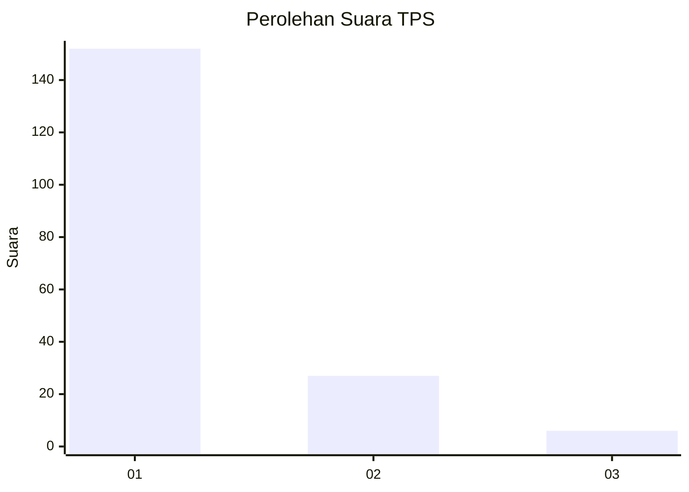
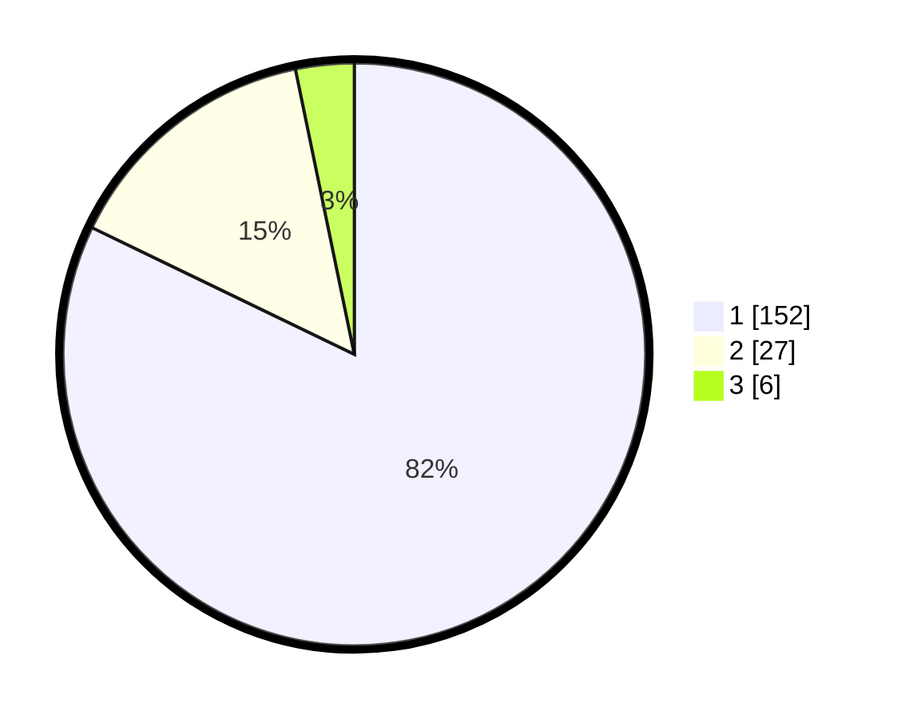

# Hasil

## Grafik

## Tabel

| No. | Nama Paslon    | Suara | Suara (raw) | Persentase |
|:--- |:-------------- | -----:| -----------:| ----------:|
| 1   | ANIES MUHAIMIN | 152   | [152][p-1]  | 82,16      |
| 2   | PRABOWO GIBRAN | 27    | [27][p-2]   | 14,59      |
| 3   | GANJAR MAHFUD  | 6     | [6][p-3]    | 3,24       |

[p-1]: https://github.com/gigit-pemilu/pemilu-2024-11-aceh/blob/main/pilpres/hitung-suara/sub/11-aceh/sub/01-aceh-selatan/sub/05-meukek/sub/2002-kuta-buloh-i/sub/004-tps/sub/paslon-1.txt
[p-2]: https://github.com/gigit-pemilu/pemilu-2024-11-aceh/blob/main/pilpres/hitung-suara/sub/11-aceh/sub/01-aceh-selatan/sub/05-meukek/sub/2002-kuta-buloh-i/sub/004-tps/sub/paslon-2.txt
[p-3]: https://github.com/gigit-pemilu/pemilu-2024-11-aceh/blob/main/pilpres/hitung-suara/sub/11-aceh/sub/01-aceh-selatan/sub/05-meukek/sub/2002-kuta-buloh-i/sub/004-tps/sub/paslon-3.txt

## Foto C Plano

https://sirekap-obj-formc.kpu.go.id/15a4/pemilu/ppwp/11/01/05/20/02/1101052002004-20240216-190421--22903f56-bf63-4825-bc47-75c51d5c06ff.jpg

https://sirekap-obj-formc.kpu.go.id/15a4/pemilu/ppwp/11/01/05/20/02/1101052002004-20240216-190423--240c82a6-22e0-4c71-8661-4440be6479ea.jpg

https://sirekap-obj-formc.kpu.go.id/15a4/pemilu/ppwp/11/01/05/20/02/1101052002004-20240216-190422--95577883-445c-4d5d-9fdf-e0e50b8e8a9c.jpg

## Metadata

| Key        | Value               |
| ---------- | ------------------- |
| Time Stamp | 2024-02-16 21:01:00 |

## DATA PEMILIH TETAP

Jumlah pemilih dalam DPT: **202**.
 * L: **93**.
 * P: **109**.

## DATA PENGGUNA HAK PILIH

Jumlah pengguna hak pilih dalam DPT: **181**.
 * L: **83**.
 * P: **98**.

Jumlah pengguna hak pilih dalam DPTb: **2**.
 * L: **1**.
 * P: **1**.

Jumlah pengguna hak pilih dalam DPK: **7**.
 * L: **1**.
 * P: **6**.

Jumlah pengguna hak pilih: **190**.
 * L: **85**.
 * P: **105**.

## JUMLAH SUARA SAH DAN TIDAK SAH

JUMLAH SELURUH SUARA SAH: **185**.

JUMLAH SUARA TIDAK SAH: **5**.

JUMLAH SELURUH SUARA SAH DAN SUARA TIDAK SAH: **190**.

