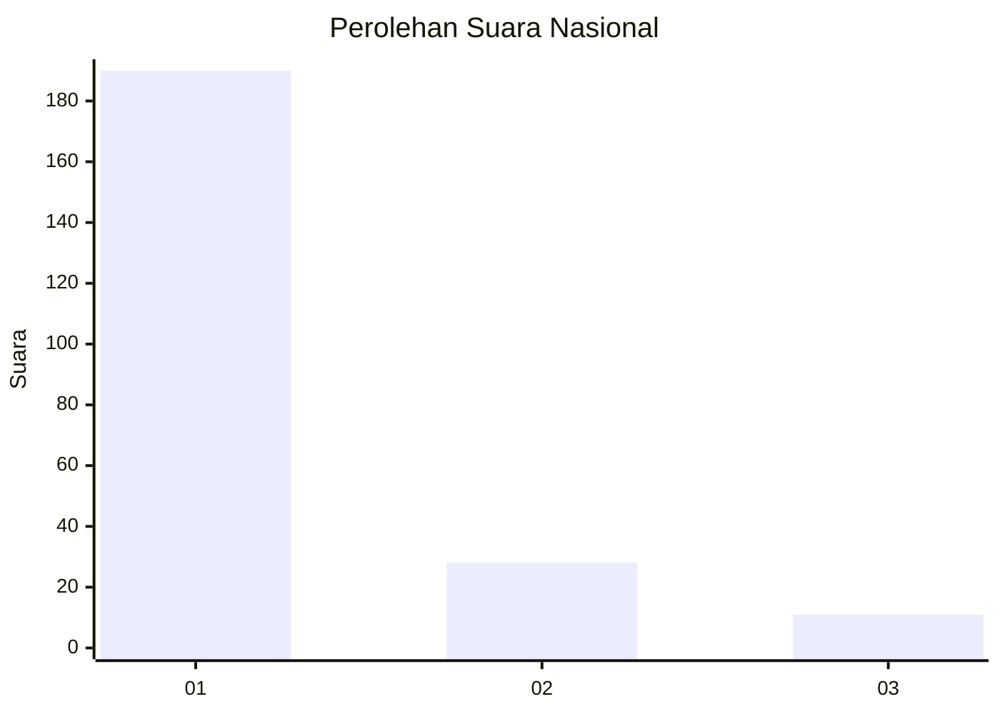
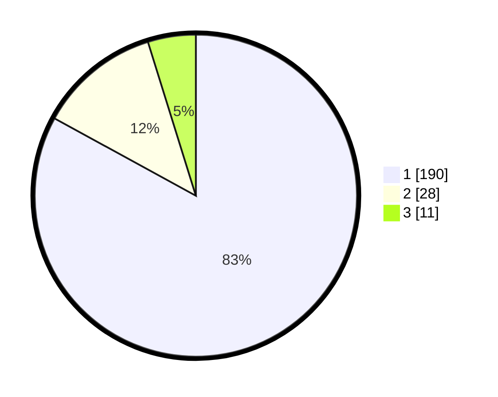

# Hasil

## Grafik

## Tabel

| No. | Nama Paslon    | Suara | Suara (raw) | Persentase |
|:--- |:-------------- | -----:| -----------:| ----------:|
| 1   | ANIES MUHAIMIN | 190   | [190][p-1]  | 82,97      |
| 2   | PRABOWO GIBRAN | 28    | [28][p-2]   | 12,23      |
| 3   | GANJAR MAHFUD  | 11    | [11][p-3]   | 4,80       |

[p-1]: https://github.com/gigit-pemilu/pemilu-2024/blob/main/pilpres/hitung-suara/sub/11-aceh/sub/01-aceh-selatan/sub/05-meukek/sub/2005-jambo-papeun/sub/005-tps/sub/paslon-1.txt
[p-2]: https://github.com/gigit-pemilu/pemilu-2024/blob/main/pilpres/hitung-suara/sub/11-aceh/sub/01-aceh-selatan/sub/05-meukek/sub/2005-jambo-papeun/sub/005-tps/sub/paslon-2.txt
[p-3]: https://github.com/gigit-pemilu/pemilu-2024/blob/main/pilpres/hitung-suara/sub/11-aceh/sub/01-aceh-selatan/sub/05-meukek/sub/2005-jambo-papeun/sub/005-tps/sub/paslon-3.txt

## Foto C Plano

https://sirekap-obj-formc.kpu.go.id/ed0a/pemilu/ppwp/11/01/05/20/05/1101052005005-20240215-112623--567e775a-b728-4389-ab12-86239904d4f8.jpg

https://sirekap-obj-formc.kpu.go.id/ed0a/pemilu/ppwp/11/01/05/20/05/1101052005005-20240215-164036--9b9b39fb-0e9a-42c8-90af-f16858dbf750.jpg

https://sirekap-obj-formc.kpu.go.id/ed0a/pemilu/ppwp/11/01/05/20/05/1101052005005-20240215-112845--18c21d05-d469-4e50-8f69-67d1912fd0a6.jpg

## Metadata

| Key        | Value               |
| ---------- | ------------------- |
| Time Stamp | 2024-02-24 22:31:28 |

