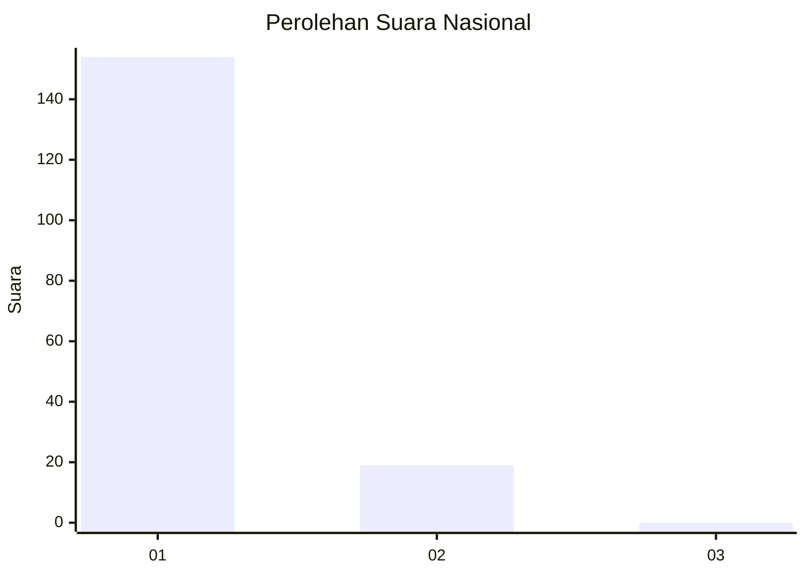
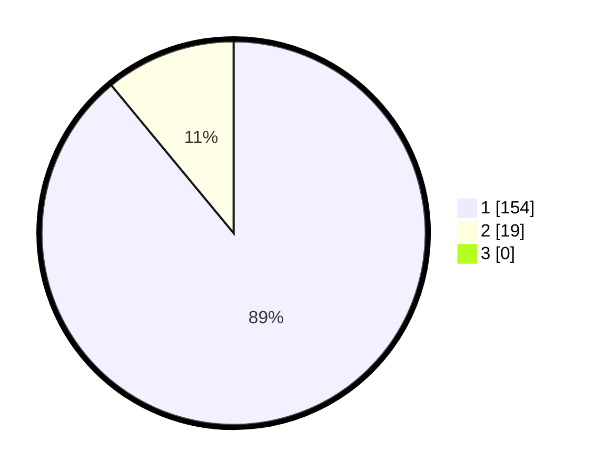

# Hasil

## Grafik

## Tabel

| No. | Nama Paslon    | Suara | Suara (raw) | Persentase |
|:--- |:-------------- | -----:| -----------:| ----------:|
| 1   | ANIES MUHAIMIN | 154   | [154][p-1]  | 89,02      |
| 2   | PRABOWO GIBRAN | 19    | [19][p-2]   | 10,98      |
| 3   | GANJAR MAHFUD  | 0     | [0][p-3]    | 0,00       |

[p-1]: https://github.com/gigit-pemilu/pemilu-2024/blob/main/pilpres/hitung-suara/sub/11-aceh/sub/01-aceh-selatan/sub/05-meukek/sub/2006-buket-meuh/sub/001-tps/sub/paslon-1.txt
[p-2]: https://github.com/gigit-pemilu/pemilu-2024/blob/main/pilpres/hitung-suara/sub/11-aceh/sub/01-aceh-selatan/sub/05-meukek/sub/2006-buket-meuh/sub/001-tps/sub/paslon-2.txt
[p-3]: https://github.com/gigit-pemilu/pemilu-2024/blob/main/pilpres/hitung-suara/sub/11-aceh/sub/01-aceh-selatan/sub/05-meukek/sub/2006-buket-meuh/sub/001-tps/sub/paslon-3.txt

## Foto C Plano

https://sirekap-obj-formc.kpu.go.id/e20f/pemilu/ppwp/11/01/05/20/06/1101052006001-20240214-195350--3119babc-9626-43d1-829a-c83bd4cd8207.jpg

https://sirekap-obj-formc.kpu.go.id/e20f/pemilu/ppwp/11/01/05/20/06/1101052006001-20240214-195420--9dfaa9d9-fc87-4162-b699-3dcf188b14fa.jpg

https://sirekap-obj-formc.kpu.go.id/e20f/pemilu/ppwp/11/01/05/20/06/1101052006001-20240214-195440--6e9838c8-1063-4d2d-a3f2-25723025614b.jpg

## Metadata

| Key        | Value               |
| ---------- | ------------------- |
| Time Stamp | 2024-02-14 21:46:01 |

