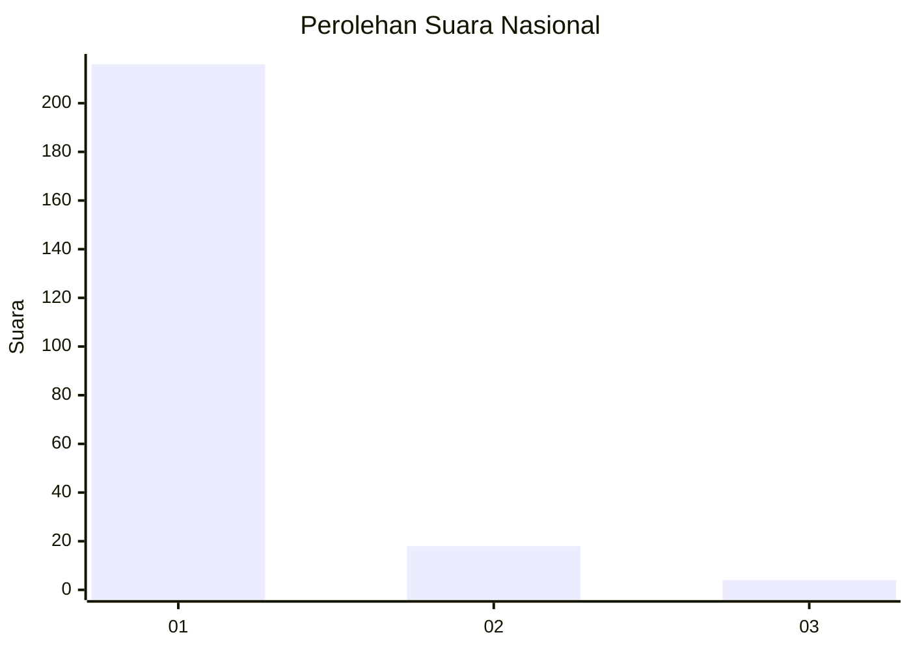
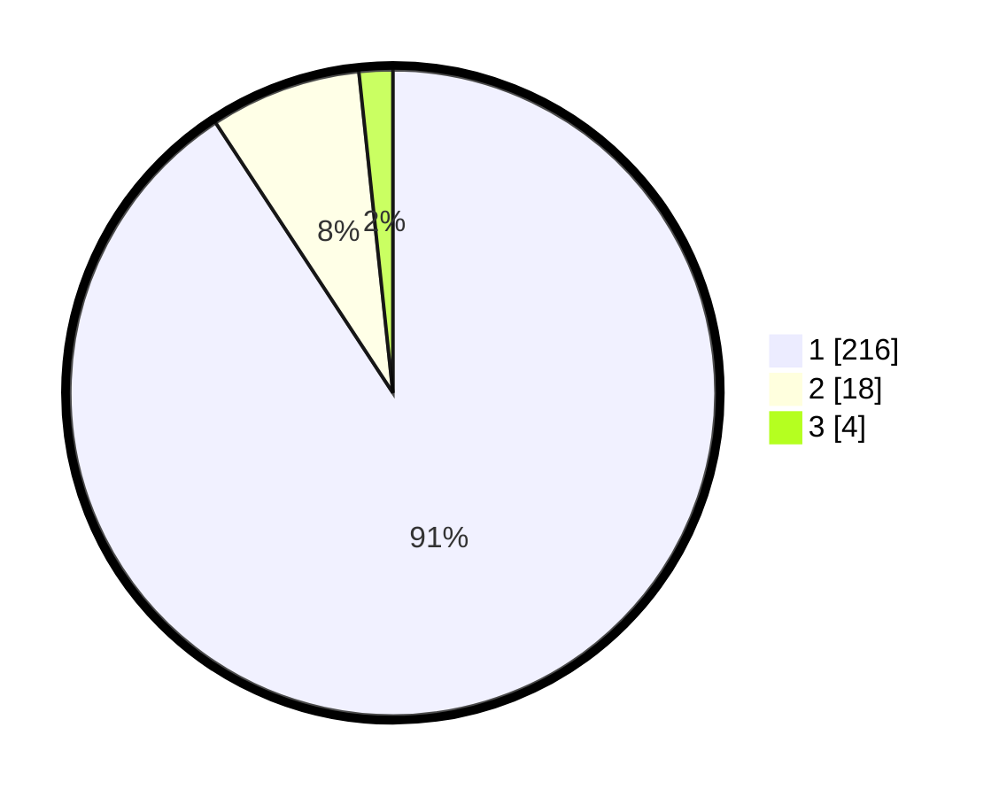

# Hasil

## Grafik

## Tabel

| No. | Nama Paslon    | Suara | Suara (raw) | Persentase |
|:--- |:-------------- | -----:| -----------:| ----------:|
| 1   | ANIES MUHAIMIN | 216   | [216][p-1]  | 90,76      |
| 2   | PRABOWO GIBRAN | 18    | [18][p-2]   | 7,56       |
| 3   | GANJAR MAHFUD  | 4     | [4][p-3]    | 1,68       |

[p-1]: https://github.com/gigit-pemilu/pemilu-2024/blob/main/pilpres/hitung-suara/sub/11-aceh/sub/01-aceh-selatan/sub/05-meukek/sub/2007-blang-kuala/sub/001-tps/sub/paslon-1.txt
[p-2]: https://github.com/gigit-pemilu/pemilu-2024/blob/main/pilpres/hitung-suara/sub/11-aceh/sub/01-aceh-selatan/sub/05-meukek/sub/2007-blang-kuala/sub/001-tps/sub/paslon-2.txt
[p-3]: https://github.com/gigit-pemilu/pemilu-2024/blob/main/pilpres/hitung-suara/sub/11-aceh/sub/01-aceh-selatan/sub/05-meukek/sub/2007-blang-kuala/sub/001-tps/sub/paslon-3.txt

## Foto C Plano

https://sirekap-obj-formc.kpu.go.id/0ef0/pemilu/ppwp/11/01/05/20/07/1101052007001-20240216-212544--138a16e9-8e89-4f4e-997c-115983ce82b8.jpg

https://sirekap-obj-formc.kpu.go.id/0ef0/pemilu/ppwp/11/01/05/20/07/1101052007001-20240216-212545--16b394c8-ebf7-4a48-bee5-9ad62de07f62.jpg

https://sirekap-obj-formc.kpu.go.id/0ef0/pemilu/ppwp/11/01/05/20/07/1101052007001-20240216-212545--c82cdb17-5ca8-472e-965f-abe1f4273c79.jpg

## Metadata

| Key        | Value               |
| ---------- | ------------------- |
| Time Stamp | 2024-02-17 14:45:18 |

## DATA PEMILIH TETAP

Jumlah pemilih dalam DPT: **288**.
 * L: **152**.
 * P: **136**.

## DATA PENGGUNA HAK PILIH

Jumlah pengguna hak pilih dalam DPT: **234**.
 * L: **118**.
 * P: **116**.

Jumlah pengguna hak pilih dalam DPTb: **3**.
 * L: **3**.
 * P: **0**.

Jumlah pengguna hak pilih dalam DPK: **5**.
 * L: **4**.
 * P: **1**.

Jumlah pengguna hak pilih: **242**.
 * L: **125**.
 * P: **117**.

## JUMLAH SUARA SAH DAN TIDAK SAH

JUMLAH SELURUH SUARA SAH: **238**.

JUMLAH SUARA TIDAK SAH: **4**.

JUMLAH SELURUH SUARA SAH DAN SUARA TIDAK SAH: **242**.

