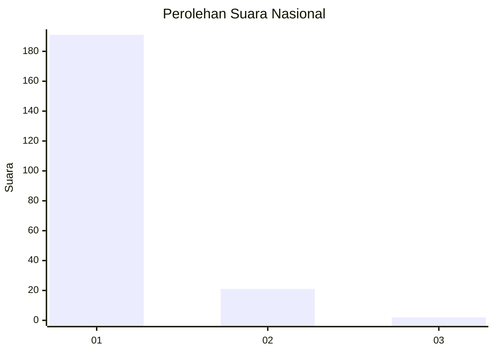
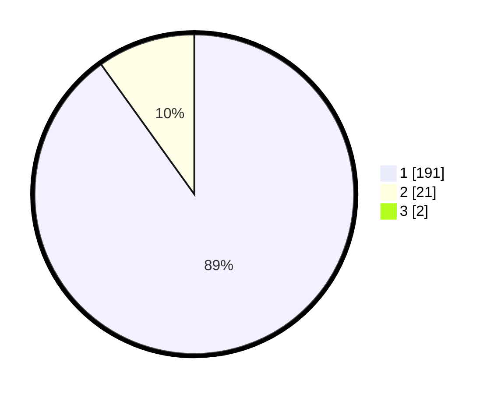

# Hasil

## Grafik

## Tabel

| No. | Nama Paslon    | Suara | Suara (raw) | Persentase |
|:--- |:-------------- | -----:| -----------:| ----------:|
| 1   | ANIES MUHAIMIN | 191   | [191][p-1]  | 89,25      |
| 2   | PRABOWO GIBRAN | 21    | [21][p-2]   | 9,81       |
| 3   | GANJAR MAHFUD  | 2     | [2][p-3]    | 0,93       |

[p-1]: https://github.com/gigit-pemilu/pemilu-2024/blob/main/pilpres/hitung-suara/sub/11-aceh/sub/01-aceh-selatan/sub/05-meukek/sub/2007-blang-kuala/sub/003-tps/sub/paslon-1.txt
[p-2]: https://github.com/gigit-pemilu/pemilu-2024/blob/main/pilpres/hitung-suara/sub/11-aceh/sub/01-aceh-selatan/sub/05-meukek/sub/2007-blang-kuala/sub/003-tps/sub/paslon-2.txt
[p-3]: https://github.com/gigit-pemilu/pemilu-2024/blob/main/pilpres/hitung-suara/sub/11-aceh/sub/01-aceh-selatan/sub/05-meukek/sub/2007-blang-kuala/sub/003-tps/sub/paslon-3.txt

## Foto C Plano

https://sirekap-obj-formc.kpu.go.id/ec67/pemilu/ppwp/11/01/05/20/07/1101052007003-20240216-212946--073f60f8-8665-4fa7-b02e-50e09c3fbf95.jpg

https://sirekap-obj-formc.kpu.go.id/ec67/pemilu/ppwp/11/01/05/20/07/1101052007003-20240216-212948--e5219f93-14b2-44ca-98fc-c4d736857549.jpg

https://sirekap-obj-formc.kpu.go.id/ec67/pemilu/ppwp/11/01/05/20/07/1101052007003-20240216-212947--44aafed1-54ed-4a98-bcb5-0055e9ccf659.jpg

## Metadata

| Key        | Value               |
| ---------- | ------------------- |
| Time Stamp | 2024-02-17 11:00:02 |

## DATA PEMILIH TETAP

Jumlah pemilih dalam DPT: **244**.
 * L: **117**.
 * P: **127**.

## DATA PENGGUNA HAK PILIH

Jumlah pengguna hak pilih dalam DPT: **209**.
 * L: **90**.
 * P: **119**.

Jumlah pengguna hak pilih dalam DPTb: **7**.
 * L: **5**.
 * P: **2**.

Jumlah pengguna hak pilih dalam DPK: **0**.
 * L: **0**.
 * P: **0**.

Jumlah pengguna hak pilih: **216**.
 * L: **95**.
 * P: **121**.

## JUMLAH SUARA SAH DAN TIDAK SAH

JUMLAH SELURUH SUARA SAH: **214**.

JUMLAH SUARA TIDAK SAH: **2**.

JUMLAH SELURUH SUARA SAH DAN SUARA TIDAK SAH: **216**.

