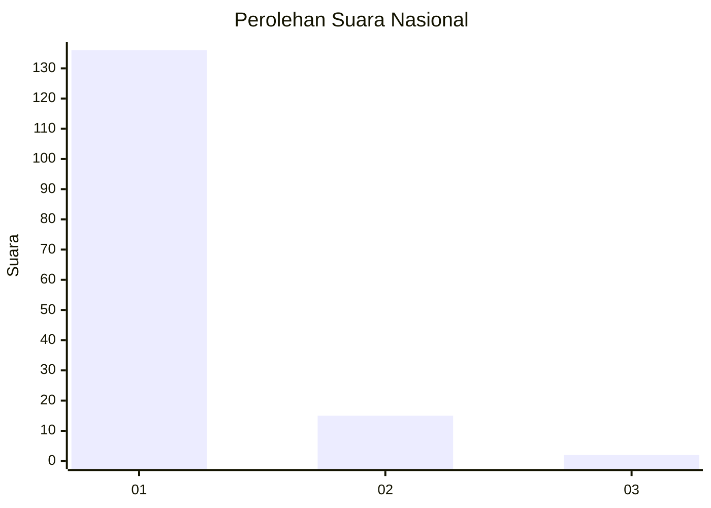
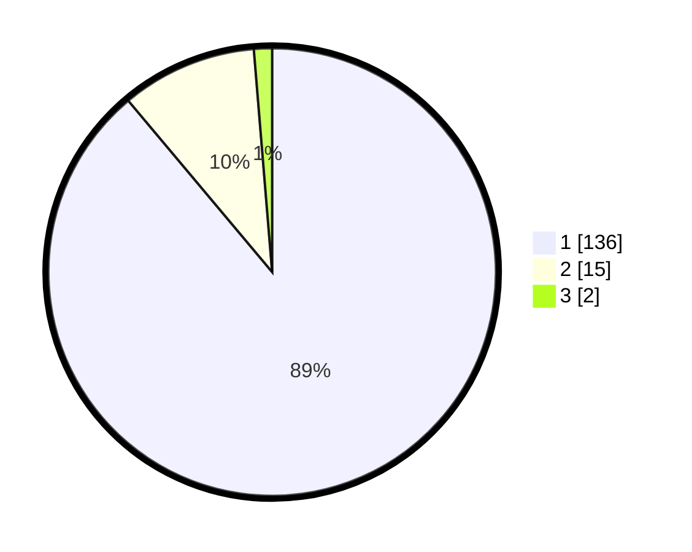

# Hasil

## Grafik

## Tabel

| No. | Nama Paslon    | Suara | Suara (raw) | Persentase |
|:--- |:-------------- | -----:| -----------:| ----------:|
| 1   | ANIES MUHAIMIN | 136   | [136][p-1]  | 88,89      |
| 2   | PRABOWO GIBRAN | 15    | [15][p-2]   | 9,80       |
| 3   | GANJAR MAHFUD  | 2     | [2][p-3]    | 1,31       |

[p-1]: https://github.com/gigit-pemilu/pemilu-2024/blob/main/pilpres/hitung-suara/sub/11-aceh/sub/01-aceh-selatan/sub/05-meukek/sub/2011-lhok-mamplam/sub/001-tps/sub/paslon-1.txt
[p-2]: https://github.com/gigit-pemilu/pemilu-2024/blob/main/pilpres/hitung-suara/sub/11-aceh/sub/01-aceh-selatan/sub/05-meukek/sub/2011-lhok-mamplam/sub/001-tps/sub/paslon-2.txt
[p-3]: https://github.com/gigit-pemilu/pemilu-2024/blob/main/pilpres/hitung-suara/sub/11-aceh/sub/01-aceh-selatan/sub/05-meukek/sub/2011-lhok-mamplam/sub/001-tps/sub/paslon-3.txt

## Foto C Plano

https://sirekap-obj-formc.kpu.go.id/79d4/pemilu/ppwp/11/01/05/20/11/1101052011001-20240216-145525--d83c3568-154e-4fd8-ae7b-e7834061f315.jpg

https://sirekap-obj-formc.kpu.go.id/79d4/pemilu/ppwp/11/01/05/20/11/1101052011001-20240216-145527--bccfd73c-b983-4a23-ae40-8bbff1d43235.jpg

https://sirekap-obj-formc.kpu.go.id/79d4/pemilu/ppwp/11/01/05/20/11/1101052011001-20240216-145526--0a1031aa-9c50-482d-9554-3de5c089f90d.jpg

## Metadata

| Key        | Value               |
| ---------- | ------------------- |
| Time Stamp | 2024-02-16 21:01:00 |

## DATA PEMILIH TETAP

Jumlah pemilih dalam DPT: **175**.
 * L: **92**.
 * P: **83**.

## DATA PENGGUNA HAK PILIH

Jumlah pengguna hak pilih dalam DPT: **154**.
 * L: **73**.
 * P: **81**.

Jumlah pengguna hak pilih dalam DPTb: **0**.
 * L: **0**.
 * P: **0**.

Jumlah pengguna hak pilih dalam DPK: **3**.
 * L: **2**.
 * P: **1**.

Jumlah pengguna hak pilih: **157**.
 * L: **75**.
 * P: **82**.

## JUMLAH SUARA SAH DAN TIDAK SAH

JUMLAH SELURUH SUARA SAH: **153**.

JUMLAH SUARA TIDAK SAH: **4**.

JUMLAH SELURUH SUARA SAH DAN SUARA TIDAK SAH: **157**.

