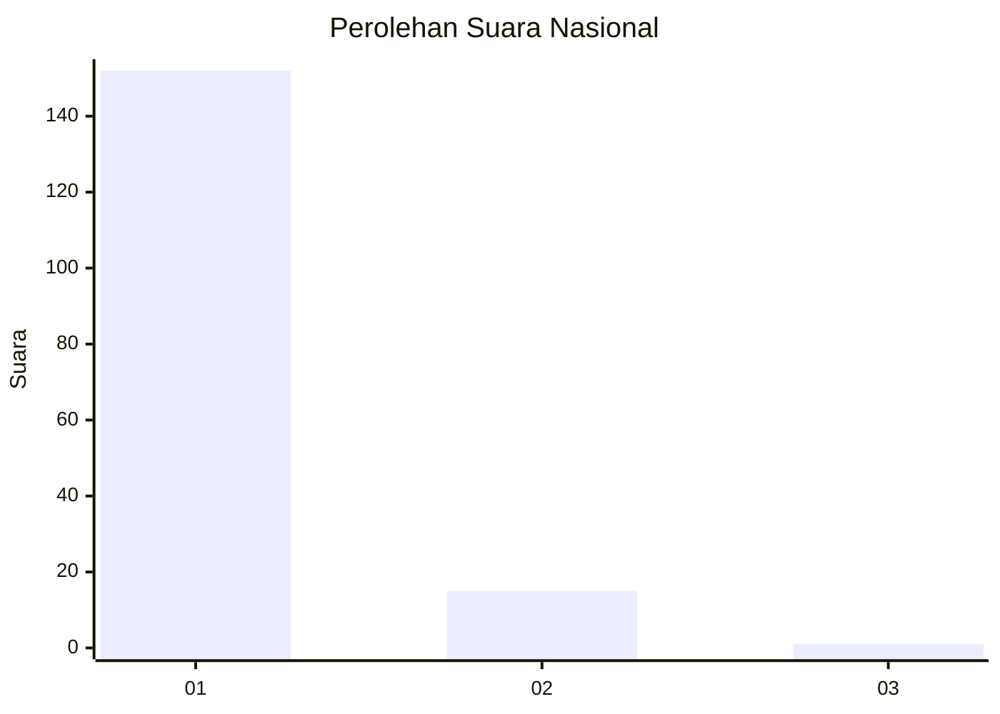
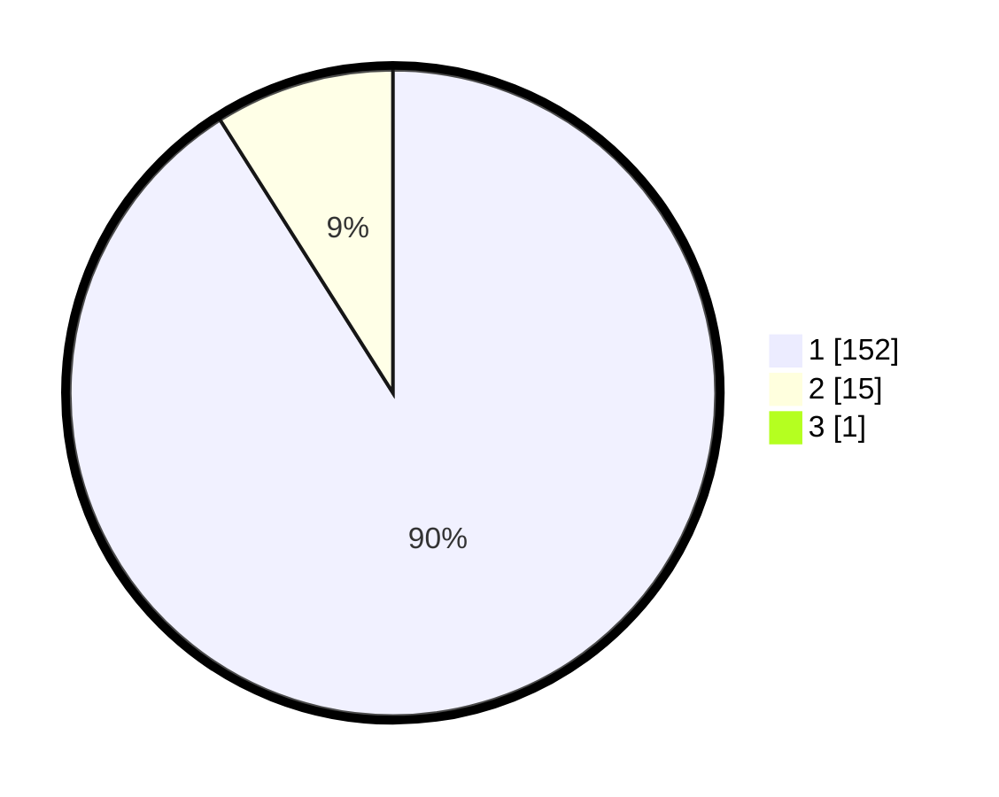

# Hasil

## Grafik

## Tabel

| No. | Nama Paslon    | Suara | Suara (raw) | Persentase |
|:--- |:-------------- | -----:| -----------:| ----------:|
| 1   | ANIES MUHAIMIN | 152   | [152][p-1]  | 90,48      |
| 2   | PRABOWO GIBRAN | 15    | [15][p-2]   | 8,93       |
| 3   | GANJAR MAHFUD  | 1     | [1][p-3]    | 0,60       |

[p-1]: https://github.com/gigit-pemilu/pemilu-2024/blob/main/pilpres/hitung-suara/sub/11-aceh/sub/01-aceh-selatan/sub/05-meukek/sub/2011-lhok-mamplam/sub/002-tps/sub/paslon-1.txt
[p-2]: https://github.com/gigit-pemilu/pemilu-2024/blob/main/pilpres/hitung-suara/sub/11-aceh/sub/01-aceh-selatan/sub/05-meukek/sub/2011-lhok-mamplam/sub/002-tps/sub/paslon-2.txt
[p-3]: https://github.com/gigit-pemilu/pemilu-2024/blob/main/pilpres/hitung-suara/sub/11-aceh/sub/01-aceh-selatan/sub/05-meukek/sub/2011-lhok-mamplam/sub/002-tps/sub/paslon-3.txt

## Foto C Plano

https://sirekap-obj-formc.kpu.go.id/8407/pemilu/ppwp/11/01/05/20/11/1101052011002-20240215-202107--59991cba-7c81-45f8-994c-aa4d7ee7e1f4.jpg

https://sirekap-obj-formc.kpu.go.id/8407/pemilu/ppwp/11/01/05/20/11/1101052011002-20240215-202132--4de2a9c6-b3b8-4e14-afff-4836ec77eb65.jpg

https://sirekap-obj-formc.kpu.go.id/8407/pemilu/ppwp/11/01/05/20/11/1101052011002-20240215-202119--b5773c8b-7126-4cc0-9b8f-05a59a7f2de1.jpg

## Metadata

| Key        | Value               |
| ---------- | ------------------- |
| Time Stamp | 2024-02-15 21:30:27 |

## DATA PEMILIH TETAP

Jumlah pemilih dalam DPT: **181**.
 * L: **91**.
 * P: **90**.

## DATA PENGGUNA HAK PILIH

Jumlah pengguna hak pilih dalam DPT: **171**.
 * L: **81**.
 * P: **90**.

Jumlah pengguna hak pilih dalam DPTb: **0**.
 * L: **0**.
 * P: **0**.

Jumlah pengguna hak pilih dalam DPK: **0**.
 * L: **0**.
 * P: **0**.

Jumlah pengguna hak pilih: **171**.
 * L: **81**.
 * P: **90**.

## JUMLAH SUARA SAH DAN TIDAK SAH

JUMLAH SELURUH SUARA SAH: **168**.

JUMLAH SUARA TIDAK SAH: **3**.

JUMLAH SELURUH SUARA SAH DAN SUARA TIDAK SAH: **171**.

