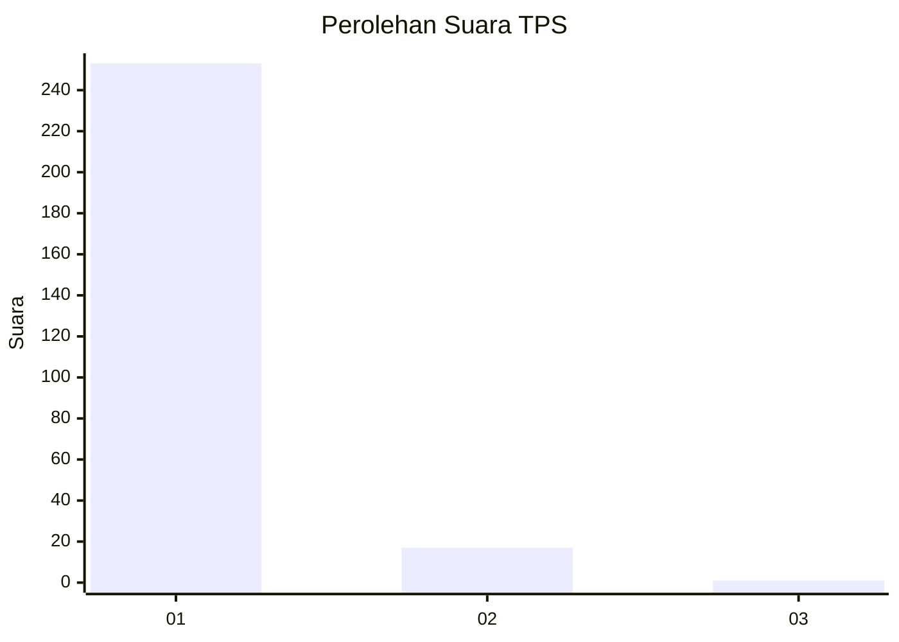
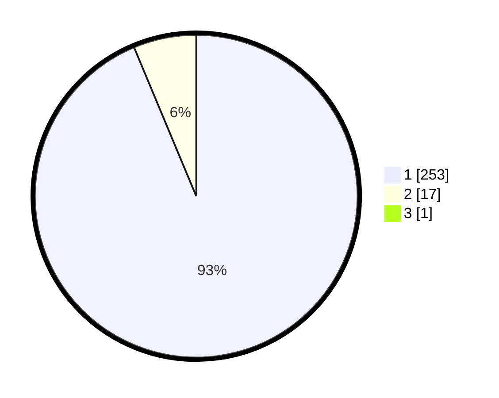

# Hasil

## Grafik

## Tabel

| No. | Nama Paslon    | Suara | Suara (raw) | Persentase |
|:--- |:-------------- | -----:| -----------:| ----------:|
| 1   | ANIES MUHAIMIN | 253   | [253][p-1]  | 93,36      |
| 2   | PRABOWO GIBRAN | 17    | [17][p-2]   | 6,27       |
| 3   | GANJAR MAHFUD  | 1     | [1][p-3]    | 0,37       |

[p-1]: https://github.com/gigit-pemilu/pemilu-2024-11-aceh/blob/main/pilpres/hitung-suara/sub/11-aceh/sub/01-aceh-selatan/sub/05-meukek/sub/2012-arun-tunggai/sub/001-tps/sub/paslon-1.txt
[p-2]: https://github.com/gigit-pemilu/pemilu-2024-11-aceh/blob/main/pilpres/hitung-suara/sub/11-aceh/sub/01-aceh-selatan/sub/05-meukek/sub/2012-arun-tunggai/sub/001-tps/sub/paslon-2.txt
[p-3]: https://github.com/gigit-pemilu/pemilu-2024-11-aceh/blob/main/pilpres/hitung-suara/sub/11-aceh/sub/01-aceh-selatan/sub/05-meukek/sub/2012-arun-tunggai/sub/001-tps/sub/paslon-3.txt

## Foto C Plano

https://sirekap-obj-formc.kpu.go.id/d2d5/pemilu/ppwp/11/01/05/20/12/1101052012001-20240215-170552--2c22fff4-1643-4a57-bd3f-a49e7a6197cd.jpg

https://sirekap-obj-formc.kpu.go.id/d2d5/pemilu/ppwp/11/01/05/20/12/1101052012001-20240215-170042--e11f42ec-696c-4916-ba77-b59f0172d247.jpg

https://sirekap-obj-formc.kpu.go.id/d2d5/pemilu/ppwp/11/01/05/20/12/1101052012001-20240215-145609--9fe42a52-9018-43f5-857e-fdec116f4a9e.jpg

## Metadata

| Key        | Value               |
| ---------- | ------------------- |
| Time Stamp | 2024-02-15 21:30:27 |

## DATA PEMILIH TETAP

Jumlah pemilih dalam DPT: **294**.
 * L: **154**.
 * P: **140**.

## DATA PENGGUNA HAK PILIH

Jumlah pengguna hak pilih dalam DPT: **270**.
 * L: **133**.
 * P: **137**.

Jumlah pengguna hak pilih dalam DPTb: **0**.
 * L: **0**.
 * P: **0**.

Jumlah pengguna hak pilih dalam DPK: **3**.
 * L: **2**.
 * P: **1**.

Jumlah pengguna hak pilih: **273**.
 * L: **135**.
 * P: **138**.

## JUMLAH SUARA SAH DAN TIDAK SAH

JUMLAH SELURUH SUARA SAH: **271**.

JUMLAH SUARA TIDAK SAH: **2**.

JUMLAH SELURUH SUARA SAH DAN SUARA TIDAK SAH: **273**.

