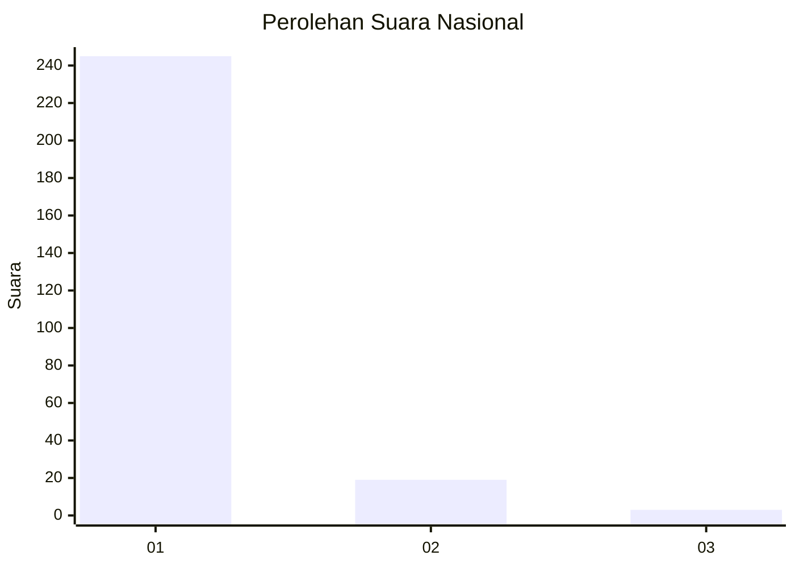
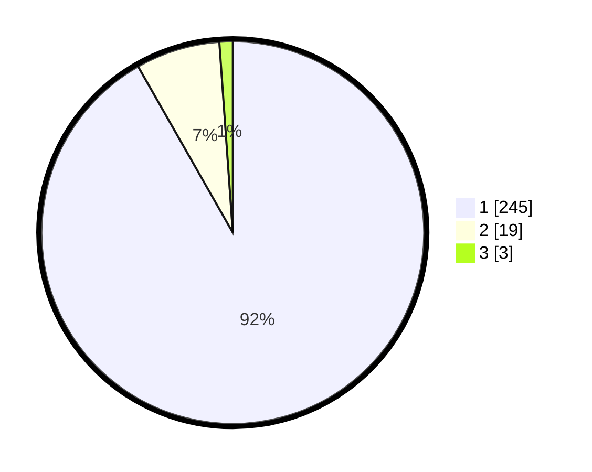

# Hasil

## Grafik

## Tabel

| No. | Nama Paslon    | Suara | Suara (raw) | Persentase |
|:--- |:-------------- | -----:| -----------:| ----------:|
| 1   | ANIES MUHAIMIN | 245   | [245][p-1]  | 91,76      |
| 2   | PRABOWO GIBRAN | 19    | [19][p-2]   | 7,12       |
| 3   | GANJAR MAHFUD  | 3     | [3][p-3]    | 1,12       |

[p-1]: https://github.com/gigit-pemilu/pemilu-2024/blob/main/pilpres/hitung-suara/sub/11-aceh/sub/01-aceh-selatan/sub/05-meukek/sub/2012-arun-tunggai/sub/002-tps/sub/paslon-1.txt
[p-2]: https://github.com/gigit-pemilu/pemilu-2024/blob/main/pilpres/hitung-suara/sub/11-aceh/sub/01-aceh-selatan/sub/05-meukek/sub/2012-arun-tunggai/sub/002-tps/sub/paslon-2.txt
[p-3]: https://github.com/gigit-pemilu/pemilu-2024/blob/main/pilpres/hitung-suara/sub/11-aceh/sub/01-aceh-selatan/sub/05-meukek/sub/2012-arun-tunggai/sub/002-tps/sub/paslon-3.txt

## Foto C Plano

https://sirekap-obj-formc.kpu.go.id/ea3f/pemilu/ppwp/11/01/05/20/12/1101052012002-20240215-104534--37e0c281-b9e9-4e56-8b00-591976f05af7.jpg

https://sirekap-obj-formc.kpu.go.id/ea3f/pemilu/ppwp/11/01/05/20/12/1101052012002-20240215-141446--4eea0ee8-1df3-41f1-af47-2541a99ccef6.jpg

https://sirekap-obj-formc.kpu.go.id/ea3f/pemilu/ppwp/11/01/05/20/12/1101052012002-20240216-181149--f2d0bb90-77b1-45a1-ba13-b4ddc4d035c7.jpg

## Metadata

| Key        | Value               |
| ---------- | ------------------- |
| Time Stamp | 2024-02-24 22:31:28 |

