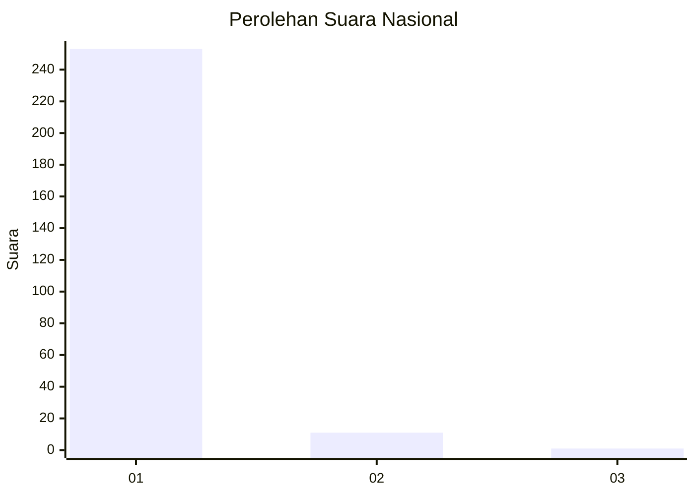
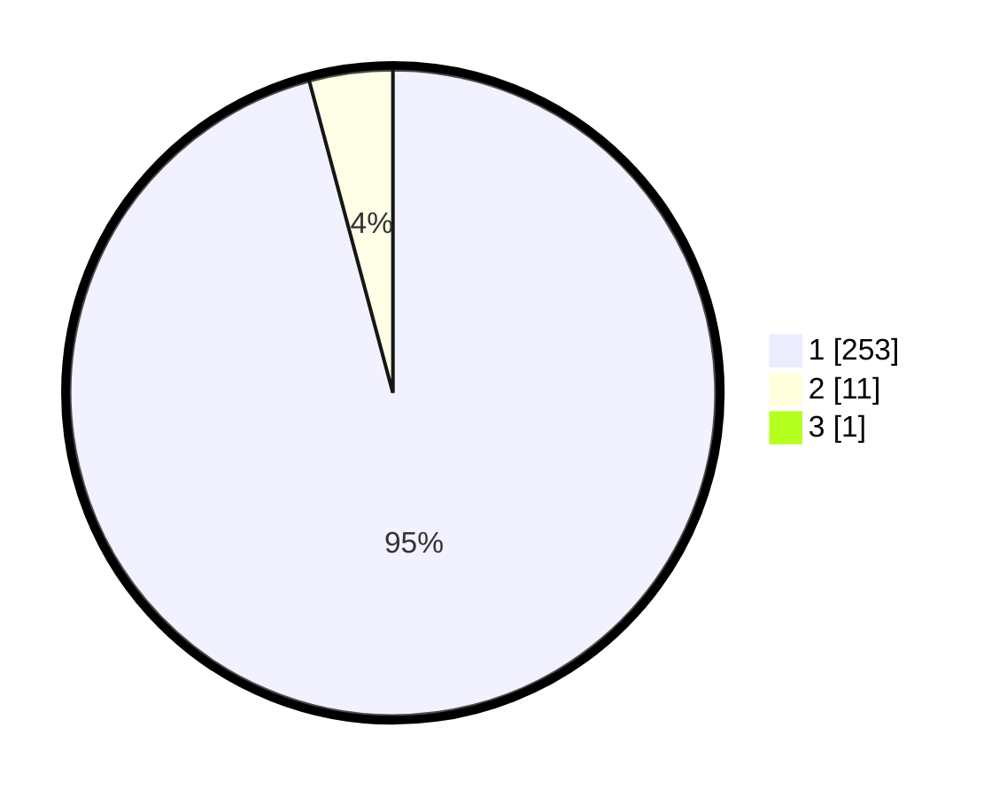

# Hasil

## Grafik

## Tabel

| No. | Nama Paslon    | Suara | Suara (raw) | Persentase |
|:--- |:-------------- | -----:| -----------:| ----------:|
| 1   | ANIES MUHAIMIN | 253   | [253][p-1]  | 95,47      |
| 2   | PRABOWO GIBRAN | 11    | [11][p-2]   | 4,15       |
| 3   | GANJAR MAHFUD  | 1     | [1][p-3]    | 0,38       |

[p-1]: https://github.com/gigit-pemilu/pemilu-2024/blob/main/pilpres/hitung-suara/sub/11-aceh/sub/01-aceh-selatan/sub/05-meukek/sub/2012-arun-tunggai/sub/003-tps/sub/paslon-1.txt
[p-2]: https://github.com/gigit-pemilu/pemilu-2024/blob/main/pilpres/hitung-suara/sub/11-aceh/sub/01-aceh-selatan/sub/05-meukek/sub/2012-arun-tunggai/sub/003-tps/sub/paslon-2.txt
[p-3]: https://github.com/gigit-pemilu/pemilu-2024/blob/main/pilpres/hitung-suara/sub/11-aceh/sub/01-aceh-selatan/sub/05-meukek/sub/2012-arun-tunggai/sub/003-tps/sub/paslon-3.txt

## Foto C Plano

https://sirekap-obj-formc.kpu.go.id/95c1/pemilu/ppwp/11/01/05/20/12/1101052012003-20240215-231039--507a464e-407d-4c0e-8d8f-f2438a83589e.jpg

https://sirekap-obj-formc.kpu.go.id/95c1/pemilu/ppwp/11/01/05/20/12/1101052012003-20240215-231044--28972db1-dfcb-4900-843b-53ec80ae3c5e.jpg

https://sirekap-obj-formc.kpu.go.id/95c1/pemilu/ppwp/11/01/05/20/12/1101052012003-20240215-231042--f3366a4e-b44d-458a-b615-e1cecdbf9546.jpg

## Metadata

| Key        | Value               |
| ---------- | ------------------- |
| Time Stamp | 2024-02-15 23:29:50 |

## DATA PEMILIH TETAP

Jumlah pemilih dalam DPT: **290**.
 * L: **141**.
 * P: **149**.

## DATA PENGGUNA HAK PILIH

Jumlah pengguna hak pilih dalam DPT: **261**.
 * L: **124**.
 * P: **137**.

Jumlah pengguna hak pilih dalam DPTb: **4**.
 * L: **2**.
 * P: **2**.

Jumlah pengguna hak pilih dalam DPK: **2**.
 * L: **0**.
 * P: **2**.

Jumlah pengguna hak pilih: **267**.
 * L: **126**.
 * P: **141**.

## JUMLAH SUARA SAH DAN TIDAK SAH

JUMLAH SELURUH SUARA SAH: **265**.

JUMLAH SUARA TIDAK SAH: **2**.

JUMLAH SELURUH SUARA SAH DAN SUARA TIDAK SAH: **267**.

