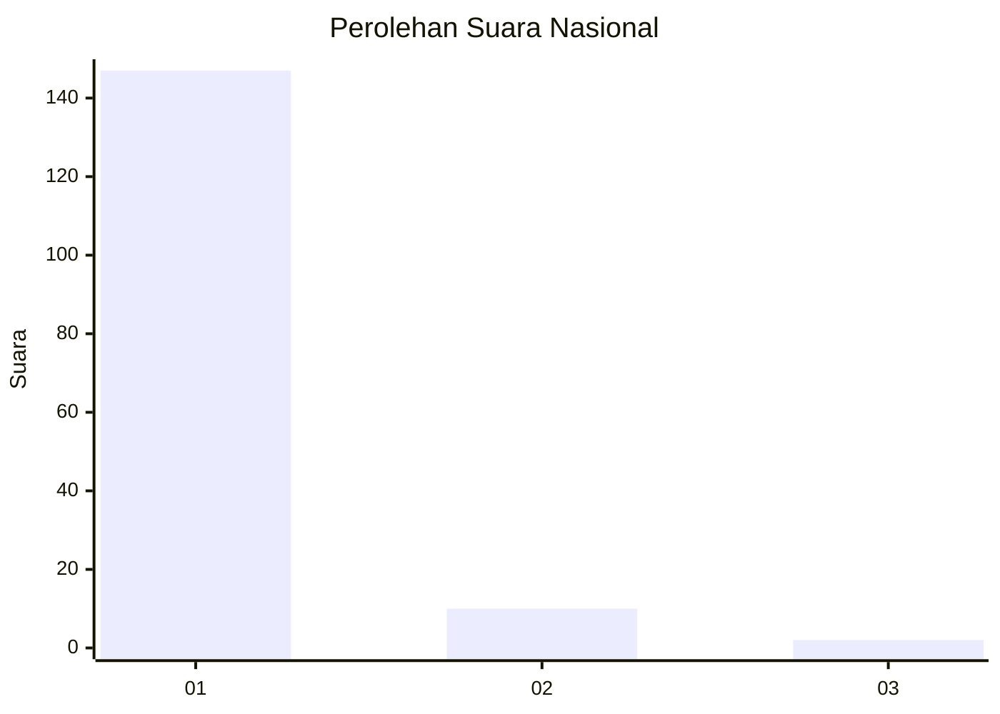
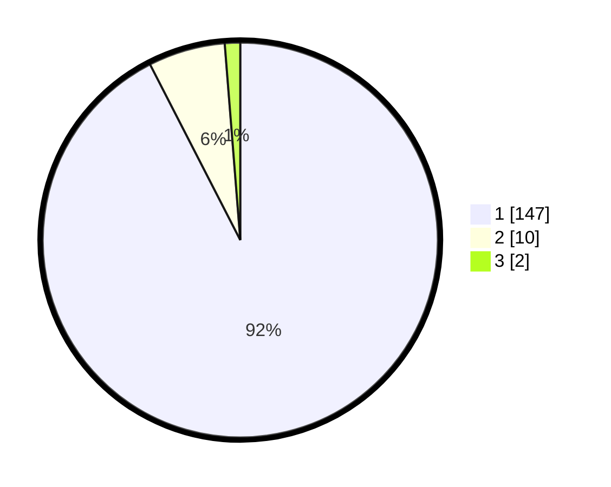

# Hasil

## Grafik

## Tabel

| No. | Nama Paslon    | Suara | Suara (raw) | Persentase |
|:--- |:-------------- | -----:| -----------:| ----------:|
| 1   | ANIES MUHAIMIN | 147   | [147][p-1]  | 92,45      |
| 2   | PRABOWO GIBRAN | 10    | [10][p-2]   | 6,29       |
| 3   | GANJAR MAHFUD  | 2     | [2][p-3]    | 1,26       |

[p-1]: https://github.com/gigit-pemilu/pemilu-2024/blob/main/pilpres/hitung-suara/sub/11-aceh/sub/01-aceh-selatan/sub/05-meukek/sub/2013-blang-teungoh/sub/001-tps/sub/paslon-1.txt
[p-2]: https://github.com/gigit-pemilu/pemilu-2024/blob/main/pilpres/hitung-suara/sub/11-aceh/sub/01-aceh-selatan/sub/05-meukek/sub/2013-blang-teungoh/sub/001-tps/sub/paslon-2.txt
[p-3]: https://github.com/gigit-pemilu/pemilu-2024/blob/main/pilpres/hitung-suara/sub/11-aceh/sub/01-aceh-selatan/sub/05-meukek/sub/2013-blang-teungoh/sub/001-tps/sub/paslon-3.txt

## Foto C Plano

https://sirekap-obj-formc.kpu.go.id/4da5/pemilu/ppwp/11/01/05/20/13/1101052013001-20240215-102137--5d1e6757-a686-47ef-9996-51c6b3cda0f9.jpg

https://sirekap-obj-formc.kpu.go.id/4da5/pemilu/ppwp/11/01/05/20/13/1101052013001-20240215-102238--3cd93e7d-6811-492a-a42e-9903aee301a9.jpg

https://sirekap-obj-formc.kpu.go.id/4da5/pemilu/ppwp/11/01/05/20/13/1101052013001-20240215-102316--7f4de9cd-3afc-44e9-aaa6-09608d32df1b.jpg

## Metadata

| Key        | Value               |
| ---------- | ------------------- |
| Time Stamp | 2024-02-16 21:01:00 |

## DATA PEMILIH TETAP

Jumlah pemilih dalam DPT: **194**.
 * L: **99**.
 * P: **95**.

## DATA PENGGUNA HAK PILIH

Jumlah pengguna hak pilih dalam DPT: **159**.
 * L: **78**.
 * P: **81**.

Jumlah pengguna hak pilih dalam DPTb: **5**.
 * L: **2**.
 * P: **3**.

Jumlah pengguna hak pilih dalam DPK: **1**.
 * L: **0**.
 * P: **1**.

Jumlah pengguna hak pilih: **165**.
 * L: **80**.
 * P: **85**.

## JUMLAH SUARA SAH DAN TIDAK SAH

JUMLAH SELURUH SUARA SAH: **159**.

JUMLAH SUARA TIDAK SAH: **6**.

JUMLAH SELURUH SUARA SAH DAN SUARA TIDAK SAH: **165**.

