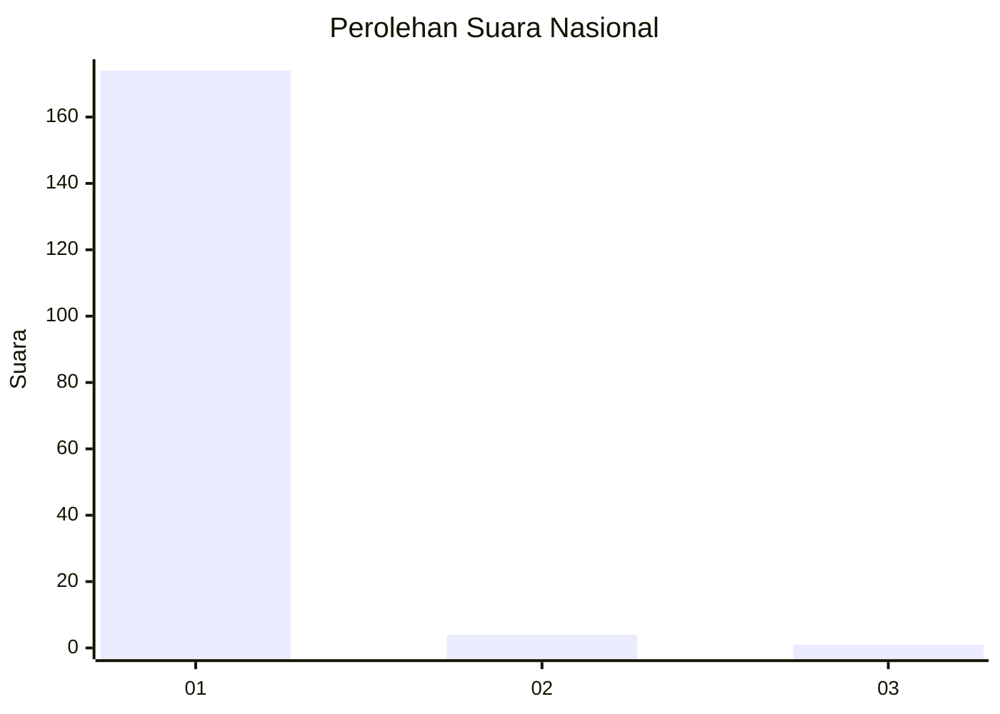
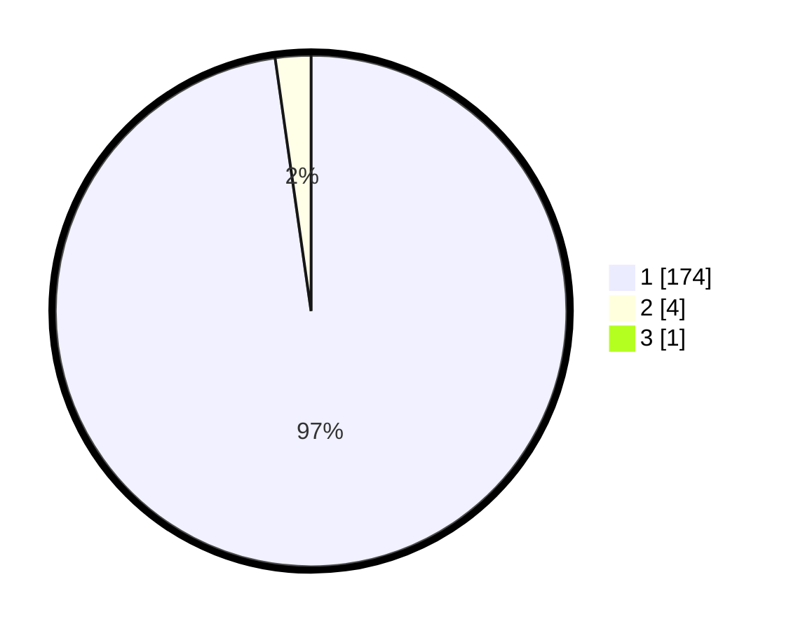

# Hasil

## Grafik

## Tabel

| No. | Nama Paslon    | Suara | Suara (raw) | Persentase |
|:--- |:-------------- | -----:| -----------:| ----------:|
| 1   | ANIES MUHAIMIN | 174   | [174][p-1]  | 97,21      |
| 2   | PRABOWO GIBRAN | 4     | [4][p-2]    | 2,23       |
| 3   | GANJAR MAHFUD  | 1     | [1][p-3]    | 0,56       |

[p-1]: https://github.com/gigit-pemilu/pemilu-2024/blob/main/pilpres/hitung-suara/sub/11-aceh/sub/01-aceh-selatan/sub/05-meukek/sub/2013-blang-teungoh/sub/002-tps/sub/paslon-1.txt
[p-2]: https://github.com/gigit-pemilu/pemilu-2024/blob/main/pilpres/hitung-suara/sub/11-aceh/sub/01-aceh-selatan/sub/05-meukek/sub/2013-blang-teungoh/sub/002-tps/sub/paslon-2.txt
[p-3]: https://github.com/gigit-pemilu/pemilu-2024/blob/main/pilpres/hitung-suara/sub/11-aceh/sub/01-aceh-selatan/sub/05-meukek/sub/2013-blang-teungoh/sub/002-tps/sub/paslon-3.txt

## Foto C Plano

https://sirekap-obj-formc.kpu.go.id/33f8/pemilu/ppwp/11/01/05/20/13/1101052013002-20240217-104324--7492f803-0f35-4534-acee-5cfbb23d3aa3.jpg

https://sirekap-obj-formc.kpu.go.id/33f8/pemilu/ppwp/11/01/05/20/13/1101052013002-20240217-104326--7e91e412-e372-4705-83a6-3c5f2ed05155.jpg

https://sirekap-obj-formc.kpu.go.id/33f8/pemilu/ppwp/11/01/05/20/13/1101052013002-20240217-104325--577e9916-db82-4a79-b7fa-5414af2c1b71.jpg

## Metadata

| Key        | Value               |
| ---------- | ------------------- |
| Time Stamp | 2024-02-17 11:00:02 |

## DATA PEMILIH TETAP

Jumlah pemilih dalam DPT: **198**.
 * L: **105**.
 * P: **93**.

## DATA PENGGUNA HAK PILIH

Jumlah pengguna hak pilih dalam DPT: **176**.
 * L: **89**.
 * P: **87**.

Jumlah pengguna hak pilih dalam DPTb: **0**.
 * L: **0**.
 * P: **0**.

Jumlah pengguna hak pilih dalam DPK: **3**.
 * L: **3**.
 * P: **0**.

Jumlah pengguna hak pilih: **179**.
 * L: **92**.
 * P: **87**.

## JUMLAH SUARA SAH DAN TIDAK SAH

JUMLAH SELURUH SUARA SAH: **179**.

JUMLAH SUARA TIDAK SAH: **0**.

JUMLAH SELURUH SUARA SAH DAN SUARA TIDAK SAH: **179**.

