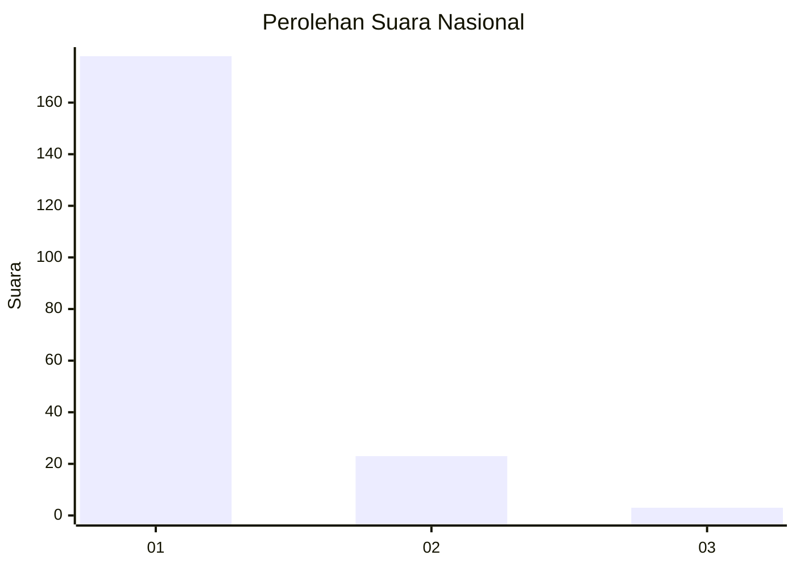
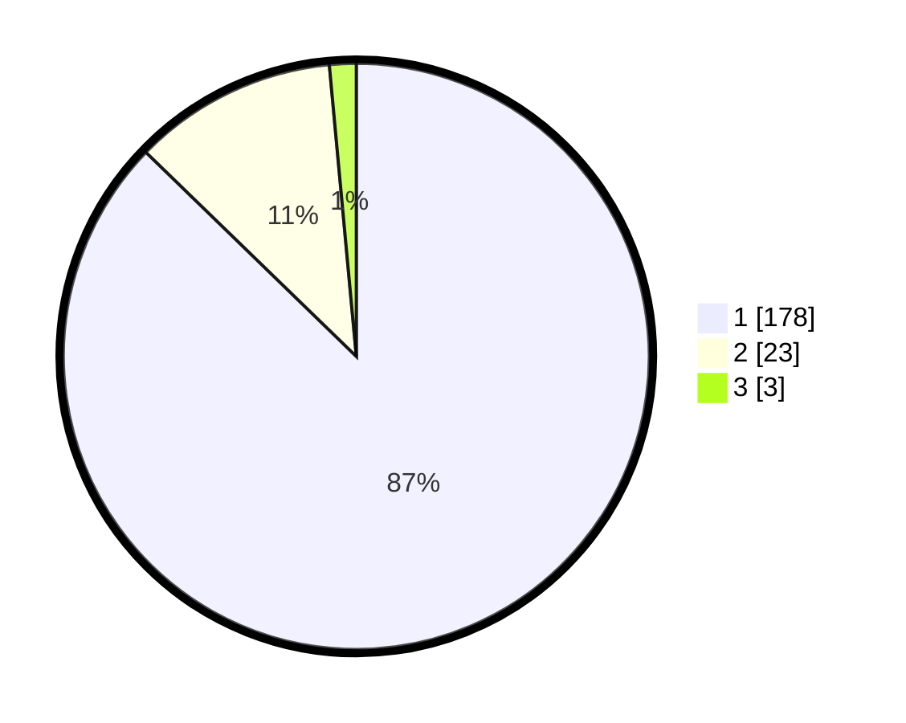

# Hasil

## Grafik

## Tabel

| No. | Nama Paslon    | Suara | Suara (raw) | Persentase |
|:--- |:-------------- | -----:| -----------:| ----------:|
| 1   | ANIES MUHAIMIN | 178   | [178][p-1]  | 87,25      |
| 2   | PRABOWO GIBRAN | 23    | [23][p-2]   | 11,27      |
| 3   | GANJAR MAHFUD  | 3     | [3][p-3]    | 1,47       |

[p-1]: https://github.com/gigit-pemilu/pemilu-2024/blob/main/pilpres/hitung-suara/sub/11-aceh/sub/01-aceh-selatan/sub/05-meukek/sub/2017-kuta-baro/sub/002-tps/sub/paslon-1.txt
[p-2]: https://github.com/gigit-pemilu/pemilu-2024/blob/main/pilpres/hitung-suara/sub/11-aceh/sub/01-aceh-selatan/sub/05-meukek/sub/2017-kuta-baro/sub/002-tps/sub/paslon-2.txt
[p-3]: https://github.com/gigit-pemilu/pemilu-2024/blob/main/pilpres/hitung-suara/sub/11-aceh/sub/01-aceh-selatan/sub/05-meukek/sub/2017-kuta-baro/sub/002-tps/sub/paslon-3.txt

## Foto C Plano

https://sirekap-obj-formc.kpu.go.id/692d/pemilu/ppwp/11/01/05/20/17/1101052017002-20240215-043550--432bae39-a50c-4765-9edc-49ddb6376f9d.jpg

https://sirekap-obj-formc.kpu.go.id/692d/pemilu/ppwp/11/01/05/20/17/1101052017002-20240215-044114--d8f9f5d3-f9f9-45df-9bf2-3a00327a492e.jpg

https://sirekap-obj-formc.kpu.go.id/692d/pemilu/ppwp/11/01/05/20/17/1101052017002-20240215-044304--a4d1b9cc-e665-4ef2-993f-aee9d407870b.jpg

## Metadata

| Key        | Value               |
| ---------- | ------------------- |
| Time Stamp | 2024-02-17 02:00:02 |

