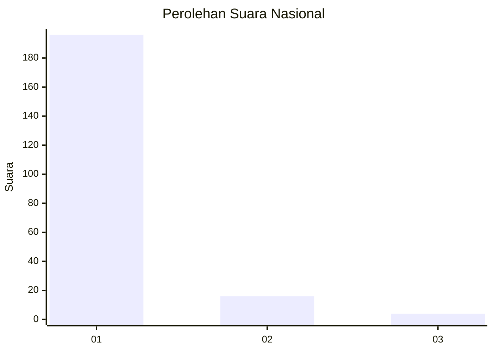
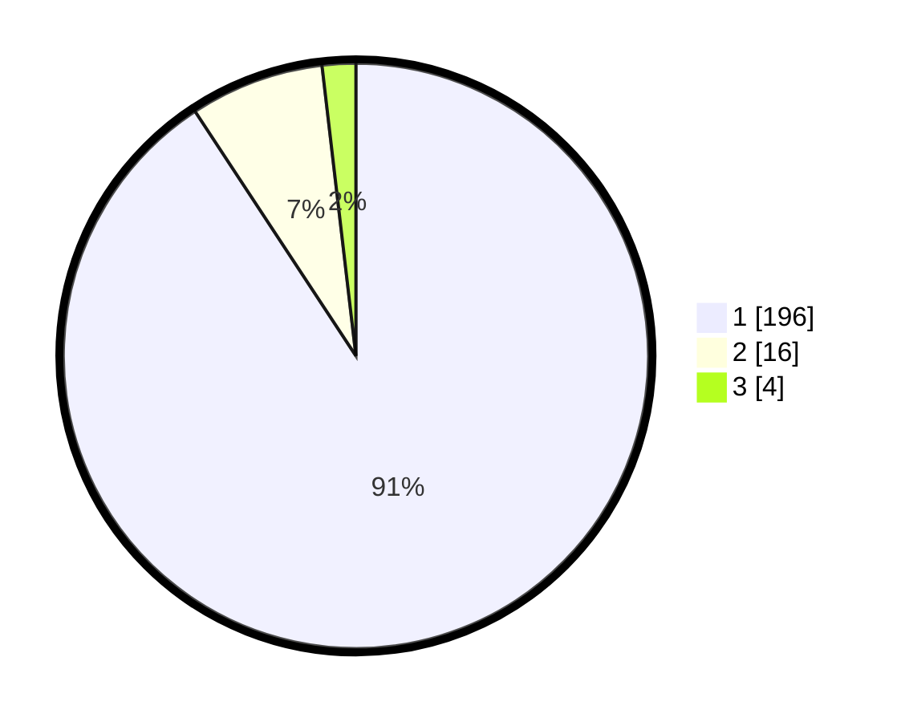

# Hasil

## Grafik

## Tabel

| No. | Nama Paslon    | Suara | Suara (raw) | Persentase |
|:--- |:-------------- | -----:| -----------:| ----------:|
| 1   | ANIES MUHAIMIN | 196   | [196][p-1]  | 90,74      |
| 2   | PRABOWO GIBRAN | 16    | [16][p-2]   | 7,41       |
| 3   | GANJAR MAHFUD  | 4     | [4][p-3]    | 1,85       |

[p-1]: https://github.com/gigit-pemilu/pemilu-2024/blob/main/pilpres/hitung-suara/sub/11-aceh/sub/01-aceh-selatan/sub/05-meukek/sub/2018-tanjung-harapan/sub/001-tps/sub/paslon-1.txt
[p-2]: https://github.com/gigit-pemilu/pemilu-2024/blob/main/pilpres/hitung-suara/sub/11-aceh/sub/01-aceh-selatan/sub/05-meukek/sub/2018-tanjung-harapan/sub/001-tps/sub/paslon-2.txt
[p-3]: https://github.com/gigit-pemilu/pemilu-2024/blob/main/pilpres/hitung-suara/sub/11-aceh/sub/01-aceh-selatan/sub/05-meukek/sub/2018-tanjung-harapan/sub/001-tps/sub/paslon-3.txt

## Foto C Plano

https://sirekap-obj-formc.kpu.go.id/9a9a/pemilu/ppwp/11/01/05/20/18/1101052018001-20240216-101910--a7eb576b-d1ca-425a-9215-9687b296a356.jpg

https://sirekap-obj-formc.kpu.go.id/9a9a/pemilu/ppwp/11/01/05/20/18/1101052018001-20240216-101914--bb3866d3-125f-47b9-84a4-7d00902159d5.jpg

https://sirekap-obj-formc.kpu.go.id/9a9a/pemilu/ppwp/11/01/05/20/18/1101052018001-20240216-101912--c4b58a27-4c6c-4bb7-ba18-4432a2f837d5.jpg

## Metadata

| Key        | Value               |
| ---------- | ------------------- |
| Time Stamp | 2024-02-16 11:00:29 |

## DATA PEMILIH TETAP

Jumlah pemilih dalam DPT: **230**.
 * L: **120**.
 * P: **110**.

## DATA PENGGUNA HAK PILIH

Jumlah pengguna hak pilih dalam DPT: **211**.
 * L: **109**.
 * P: **102**.

Jumlah pengguna hak pilih dalam DPTb: **8**.
 * L: **5**.
 * P: **3**.

Jumlah pengguna hak pilih dalam DPK: **0**.
 * L: **0**.
 * P: **0**.

Jumlah pengguna hak pilih: **219**.
 * L: **114**.
 * P: **105**.

## JUMLAH SUARA SAH DAN TIDAK SAH

JUMLAH SELURUH SUARA SAH: **216**.

JUMLAH SUARA TIDAK SAH: **3**.

JUMLAH SELURUH SUARA SAH DAN SUARA TIDAK SAH: **219**.

