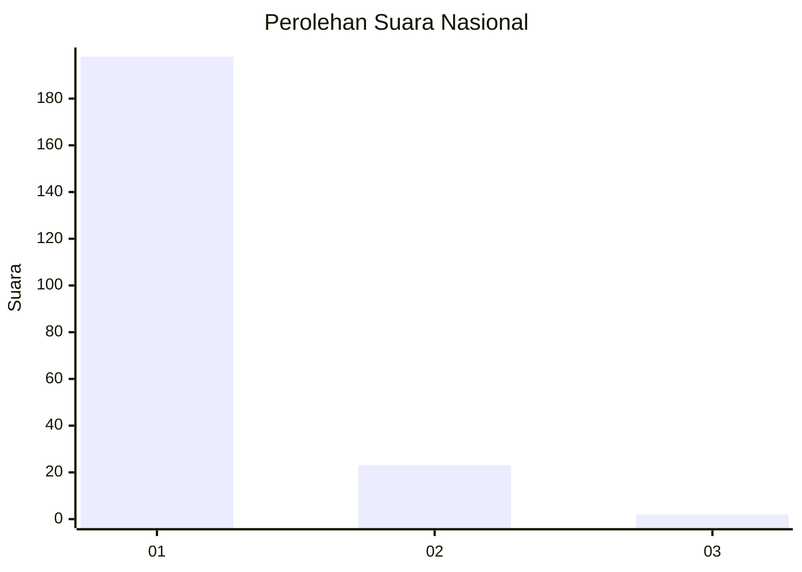
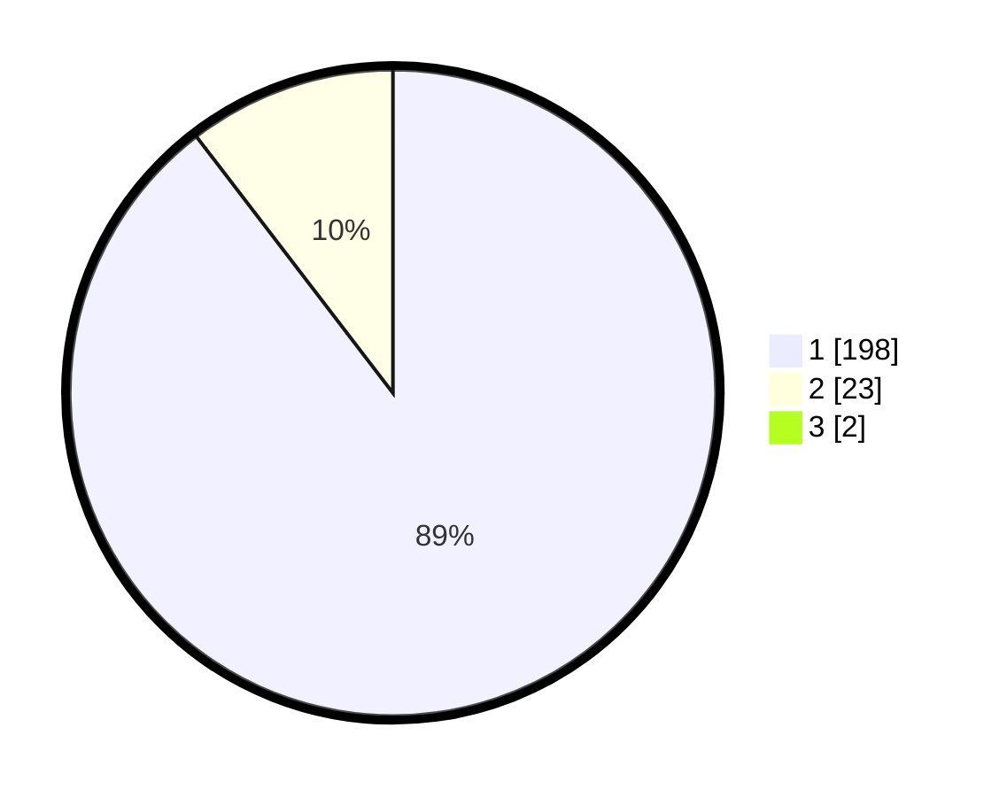

# Hasil

## Grafik

## Tabel

| No. | Nama Paslon    | Suara | Suara (raw) | Persentase |
|:--- |:-------------- | -----:| -----------:| ----------:|
| 1   | ANIES MUHAIMIN | 198   | [198][p-1]  | 88,79      |
| 2   | PRABOWO GIBRAN | 23    | [23][p-2]   | 10,31      |
| 3   | GANJAR MAHFUD  | 2     | [2][p-3]    | 0,90       |

[p-1]: https://github.com/gigit-pemilu/pemilu-2024/blob/main/pilpres/hitung-suara/sub/11-aceh/sub/01-aceh-selatan/sub/05-meukek/sub/2018-tanjung-harapan/sub/002-tps/sub/paslon-1.txt
[p-2]: https://github.com/gigit-pemilu/pemilu-2024/blob/main/pilpres/hitung-suara/sub/11-aceh/sub/01-aceh-selatan/sub/05-meukek/sub/2018-tanjung-harapan/sub/002-tps/sub/paslon-2.txt
[p-3]: https://github.com/gigit-pemilu/pemilu-2024/blob/main/pilpres/hitung-suara/sub/11-aceh/sub/01-aceh-selatan/sub/05-meukek/sub/2018-tanjung-harapan/sub/002-tps/sub/paslon-3.txt

## Foto C Plano

https://sirekap-obj-formc.kpu.go.id/a823/pemilu/ppwp/11/01/05/20/18/1101052018002-20240215-131632--ee184ef3-24bb-4979-8c47-23b3fcaf7c16.jpg

https://sirekap-obj-formc.kpu.go.id/a823/pemilu/ppwp/11/01/05/20/18/1101052018002-20240215-131814--a74c7110-3541-4d8f-aa30-d0255e161caa.jpg

https://sirekap-obj-formc.kpu.go.id/a823/pemilu/ppwp/11/01/05/20/18/1101052018002-20240215-132030--de2ea7a3-8536-4344-9e7c-30e86903728f.jpg

## Metadata

| Key        | Value               |
| ---------- | ------------------- |
| Time Stamp | 2024-02-16 21:01:00 |

