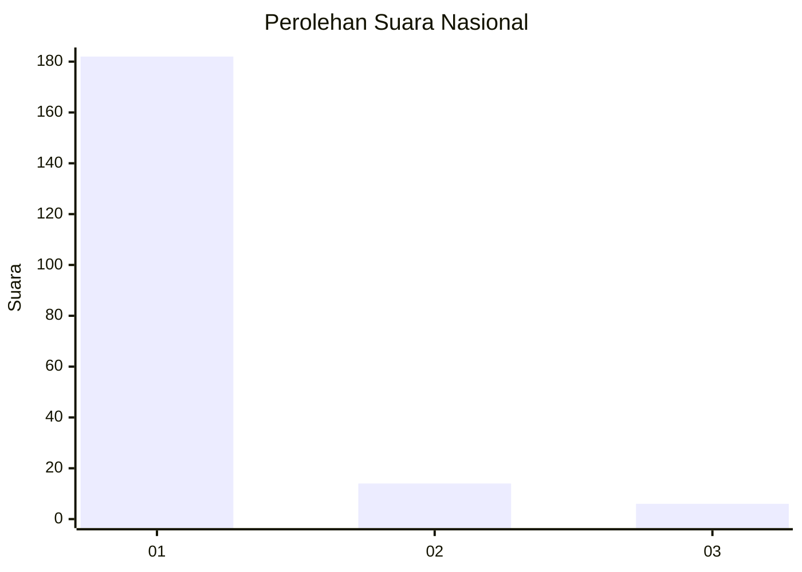
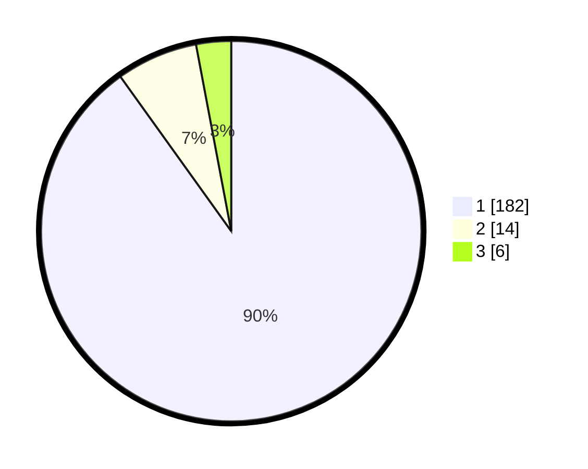

# Hasil

## Grafik

## Tabel

| No. | Nama Paslon    | Suara | Suara (raw) | Persentase |
|:--- |:-------------- | -----:| -----------:| ----------:|
| 1   | ANIES MUHAIMIN | 182   | [182][p-1]  | 90,10      |
| 2   | PRABOWO GIBRAN | 14    | [14][p-2]   | 6,93       |
| 3   | GANJAR MAHFUD  | 6     | [6][p-3]    | 2,97       |

[p-1]: https://github.com/gigit-pemilu/pemilu-2024/blob/main/pilpres/hitung-suara/sub/11-aceh/sub/01-aceh-selatan/sub/05-meukek/sub/2018-tanjung-harapan/sub/003-tps/sub/paslon-1.txt
[p-2]: https://github.com/gigit-pemilu/pemilu-2024/blob/main/pilpres/hitung-suara/sub/11-aceh/sub/01-aceh-selatan/sub/05-meukek/sub/2018-tanjung-harapan/sub/003-tps/sub/paslon-2.txt
[p-3]: https://github.com/gigit-pemilu/pemilu-2024/blob/main/pilpres/hitung-suara/sub/11-aceh/sub/01-aceh-selatan/sub/05-meukek/sub/2018-tanjung-harapan/sub/003-tps/sub/paslon-3.txt

## Foto C Plano

https://sirekap-obj-formc.kpu.go.id/f71d/pemilu/ppwp/11/01/05/20/18/1101052018003-20240214-184452--da8d79e7-ad60-458a-b3f5-3e15104ac6d5.jpg

https://sirekap-obj-formc.kpu.go.id/f71d/pemilu/ppwp/11/01/05/20/18/1101052018003-20240214-204957--9cf55a45-9396-4304-9141-c602d0b5190b.jpg

https://sirekap-obj-formc.kpu.go.id/f71d/pemilu/ppwp/11/01/05/20/18/1101052018003-20240214-201512--3eb5b846-339e-4129-81bd-c50fac48f183.jpg

## Metadata

| Key        | Value               |
| ---------- | ------------------- |
| Time Stamp | 2024-02-15 00:41:44 |

## DATA PEMILIH TETAP

Jumlah pemilih dalam DPT: **236**.
 * L: **114**.
 * P: **122**.

## DATA PENGGUNA HAK PILIH

Jumlah pengguna hak pilih dalam DPT: **210**.
 * L: **105**.
 * P: **105**.

Jumlah pengguna hak pilih dalam DPTb: **1**.
 * L: **0**.
 * P: **1**.

Jumlah pengguna hak pilih dalam DPK: **1**.
 * L: **1**.
 * P: **0**.

Jumlah pengguna hak pilih: **212**.
 * L: **106**.
 * P: **106**.

## JUMLAH SUARA SAH DAN TIDAK SAH

JUMLAH SELURUH SUARA SAH: **207**.

JUMLAH SUARA TIDAK SAH: **5**.

JUMLAH SELURUH SUARA SAH DAN SUARA TIDAK SAH: **212**.

