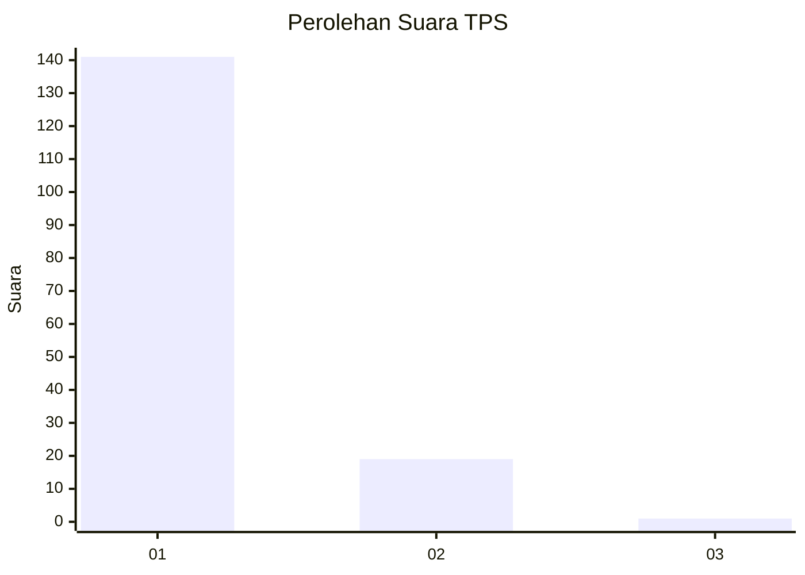
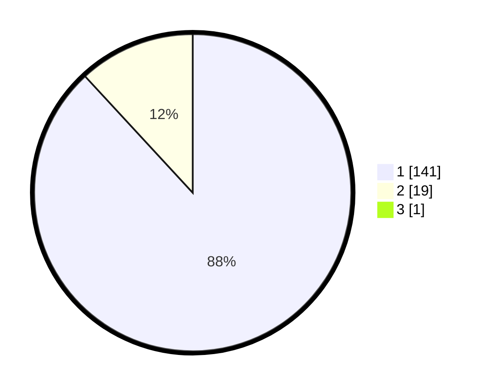

# Hasil

## Grafik

## Tabel

| No. | Nama Paslon    | Suara | Suara (raw) | Persentase |
|:--- |:-------------- | -----:| -----------:| ----------:|
| 1   | ANIES MUHAIMIN | 141   | [141][p-1]  | 87,58      |
| 2   | PRABOWO GIBRAN | 19    | [19][p-2]   | 11,80      |
| 3   | GANJAR MAHFUD  | 1     | [1][p-3]    | 0,62       |

[p-1]: https://github.com/gigit-pemilu/pemilu-2024-11-aceh/blob/main/pilpres/hitung-suara/sub/11-aceh/sub/01-aceh-selatan/sub/05-meukek/sub/2021-alue-meutuah/sub/001-tps/sub/paslon-1.txt
[p-2]: https://github.com/gigit-pemilu/pemilu-2024-11-aceh/blob/main/pilpres/hitung-suara/sub/11-aceh/sub/01-aceh-selatan/sub/05-meukek/sub/2021-alue-meutuah/sub/001-tps/sub/paslon-2.txt
[p-3]: https://github.com/gigit-pemilu/pemilu-2024-11-aceh/blob/main/pilpres/hitung-suara/sub/11-aceh/sub/01-aceh-selatan/sub/05-meukek/sub/2021-alue-meutuah/sub/001-tps/sub/paslon-3.txt

## Foto C Plano

https://sirekap-obj-formc.kpu.go.id/50bc/pemilu/ppwp/11/01/05/20/21/1101052021001-20240216-180405--2c03e0b4-761b-4a67-bf79-626240a3ae10.jpg

https://sirekap-obj-formc.kpu.go.id/50bc/pemilu/ppwp/11/01/05/20/21/1101052021001-20240216-180503--2fd8a810-9ee4-45f1-bd42-71e6040bf1b8.jpg

https://sirekap-obj-formc.kpu.go.id/50bc/pemilu/ppwp/11/01/05/20/21/1101052021001-20240216-180709--139aa206-2ce4-4a85-a51c-819b04d6145d.jpg

## Metadata

| Key        | Value               |
| ---------- | ------------------- |
| Time Stamp | 2024-02-24 22:31:28 |

