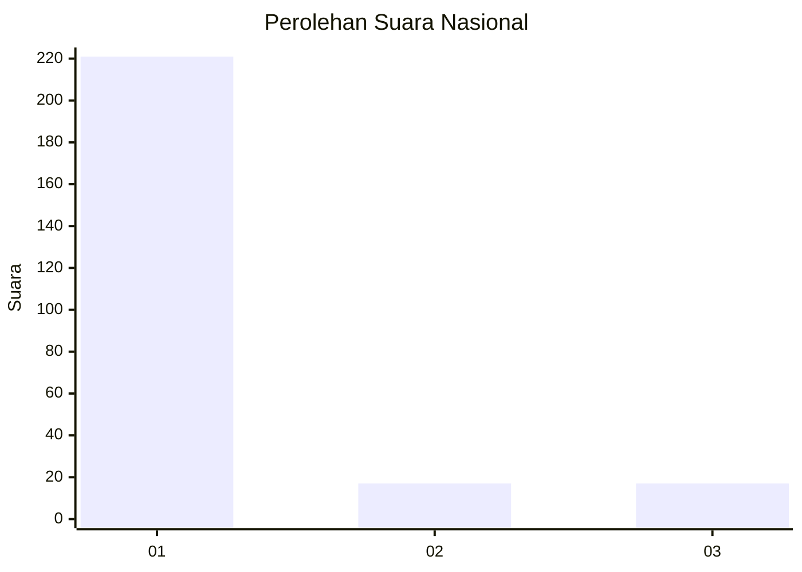
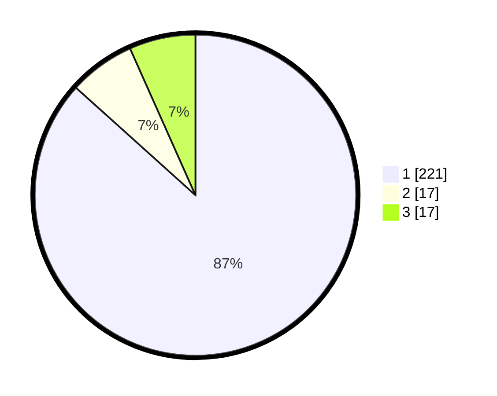

# Hasil

## Grafik

## Tabel

| No. | Nama Paslon    | Suara | Suara (raw) | Persentase |
|:--- |:-------------- | -----:| -----------:| ----------:|
| 1   | ANIES MUHAIMIN | 221   | [221][p-1]  | 86,67      |
| 2   | PRABOWO GIBRAN | 17    | [17][p-2]   | 6,67       |
| 3   | GANJAR MAHFUD  | 17    | [17][p-3]   | 6,67       |

[p-1]: https://github.com/gigit-pemilu/pemilu-2024/blob/main/pilpres/hitung-suara/sub/11-aceh/sub/01-aceh-selatan/sub/05-meukek/sub/2023-labuhan-tarok-ii/sub/001-tps/sub/paslon-1.txt
[p-2]: https://github.com/gigit-pemilu/pemilu-2024/blob/main/pilpres/hitung-suara/sub/11-aceh/sub/01-aceh-selatan/sub/05-meukek/sub/2023-labuhan-tarok-ii/sub/001-tps/sub/paslon-2.txt
[p-3]: https://github.com/gigit-pemilu/pemilu-2024/blob/main/pilpres/hitung-suara/sub/11-aceh/sub/01-aceh-selatan/sub/05-meukek/sub/2023-labuhan-tarok-ii/sub/001-tps/sub/paslon-3.txt

## Foto C Plano

https://sirekap-obj-formc.kpu.go.id/f218/pemilu/ppwp/11/01/05/20/23/1101052023001-20240215-140803--800acc38-0eea-4e66-9458-6f4d27321160.jpg

https://sirekap-obj-formc.kpu.go.id/f218/pemilu/ppwp/11/01/05/20/23/1101052023001-20240215-141229--71057551-606f-4b8c-b5e8-2bfa453903a9.jpg

https://sirekap-obj-formc.kpu.go.id/f218/pemilu/ppwp/11/01/05/20/23/1101052023001-20240215-141550--c662e10e-911b-454f-9f1d-3a89abf7cb0c.jpg

## Metadata

| Key        | Value               |
| ---------- | ------------------- |
| Time Stamp | 2024-02-16 21:01:00 |

