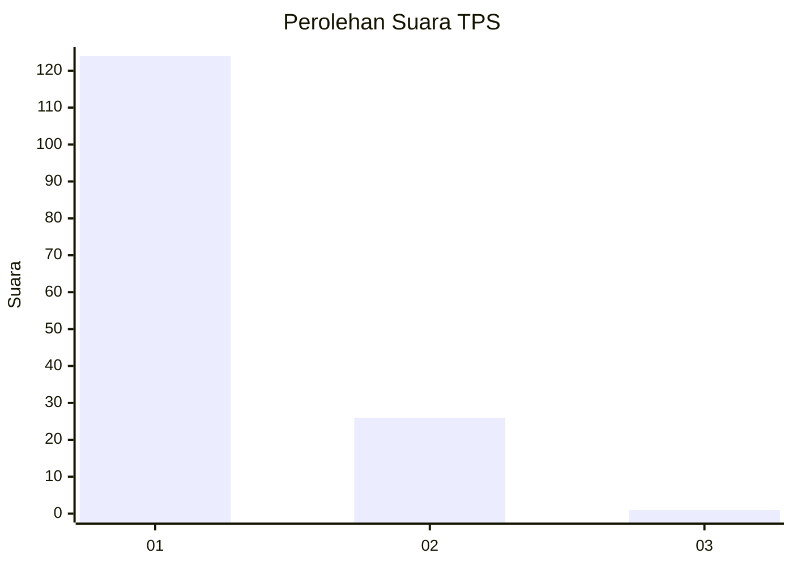
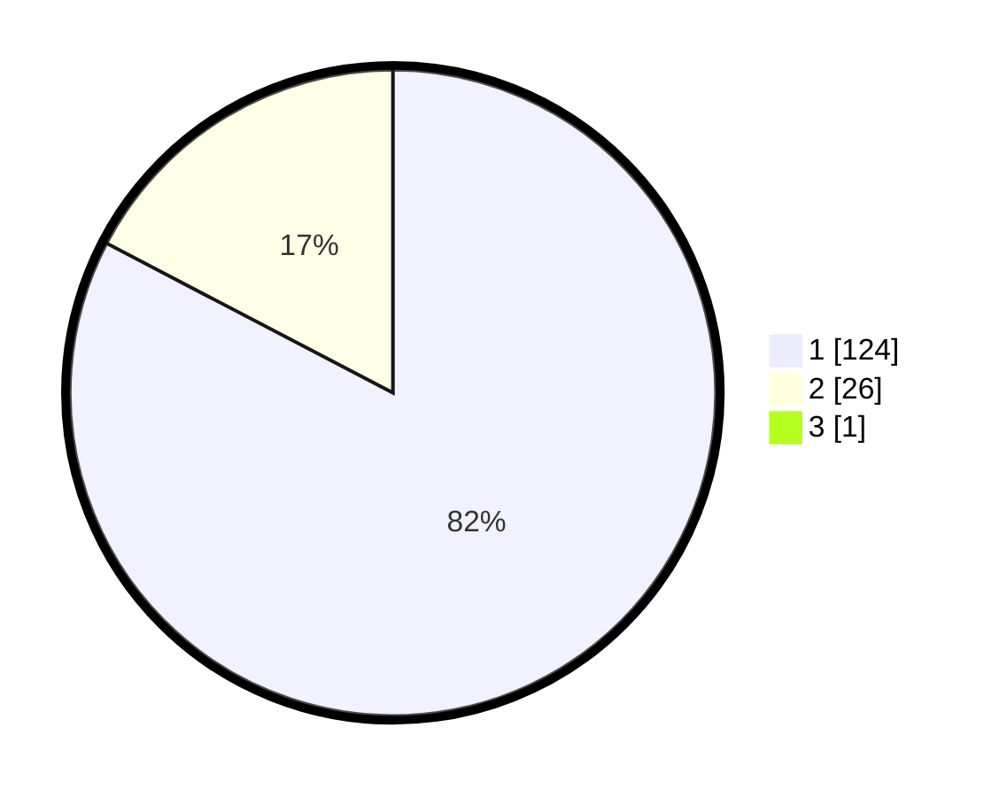

# Hasil

## Grafik

## Tabel

| No. | Nama Paslon    | Suara | Suara (raw) | Persentase |
|:--- |:-------------- | -----:| -----------:| ----------:|
| 1   | ANIES MUHAIMIN | 124   | [124][p-1]  | 82,12      |
| 2   | PRABOWO GIBRAN | 26    | [26][p-2]   | 17,22      |
| 3   | GANJAR MAHFUD  | 1     | [1][p-3]    | 0,66       |

[p-1]: https://github.com/gigit-pemilu/pemilu-2024-11-aceh/blob/main/pilpres/hitung-suara/sub/11-aceh/sub/01-aceh-selatan/sub/06-samadua/sub/2001-dalam/sub/002-tps/sub/paslon-1.txt
[p-2]: https://github.com/gigit-pemilu/pemilu-2024-11-aceh/blob/main/pilpres/hitung-suara/sub/11-aceh/sub/01-aceh-selatan/sub/06-samadua/sub/2001-dalam/sub/002-tps/sub/paslon-2.txt
[p-3]: https://github.com/gigit-pemilu/pemilu-2024-11-aceh/blob/main/pilpres/hitung-suara/sub/11-aceh/sub/01-aceh-selatan/sub/06-samadua/sub/2001-dalam/sub/002-tps/sub/paslon-3.txt

## Foto C Plano

https://sirekap-obj-formc.kpu.go.id/e85d/pemilu/ppwp/11/01/06/20/01/1101062001002-20240214-192844--1dd75cf9-5784-463b-a598-fde23ac5e3fd.jpg

https://sirekap-obj-formc.kpu.go.id/e85d/pemilu/ppwp/11/01/06/20/01/1101062001002-20240214-203437--9aebd3a0-db0a-4e9d-98e5-afcc6811b49a.jpg

https://sirekap-obj-formc.kpu.go.id/e85d/pemilu/ppwp/11/01/06/20/01/1101062001002-20240214-203739--c3c1f602-8819-438d-8a36-1d56b4be19f5.jpg

## Metadata

| Key        | Value               |
| ---------- | ------------------- |
| Time Stamp | 2024-02-15 00:41:44 |

## DATA PEMILIH TETAP

Jumlah pemilih dalam DPT: **161**.
 * L: **77**.
 * P: **84**.

## DATA PENGGUNA HAK PILIH

Jumlah pengguna hak pilih dalam DPT: **152**.
 * L: **71**.
 * P: **81**.

Jumlah pengguna hak pilih dalam DPTb: **0**.
 * L: **0**.
 * P: **0**.

Jumlah pengguna hak pilih dalam DPK: **0**.
 * L: **0**.
 * P: **0**.

Jumlah pengguna hak pilih: **152**.
 * L: **71**.
 * P: **81**.

## JUMLAH SUARA SAH DAN TIDAK SAH

JUMLAH SELURUH SUARA SAH: **151**.

JUMLAH SUARA TIDAK SAH: **1**.

JUMLAH SELURUH SUARA SAH DAN SUARA TIDAK SAH: **152**.

