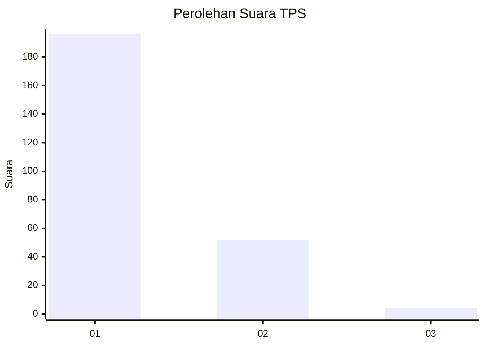
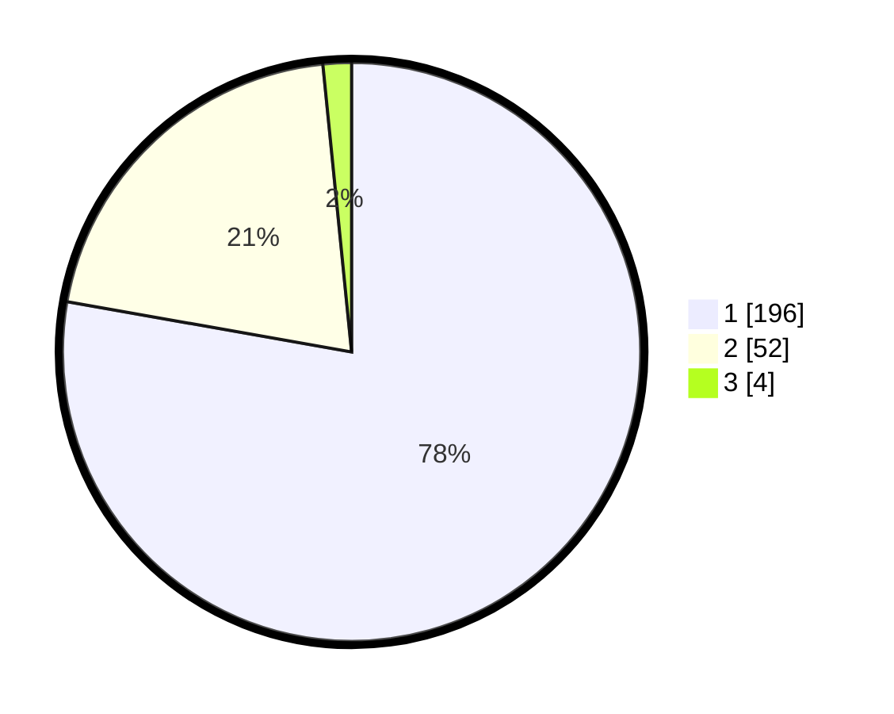

# Hasil

## Grafik

## Tabel

| No. | Nama Paslon    | Suara | Suara (raw) | Persentase |
|:--- |:-------------- | -----:| -----------:| ----------:|
| 1   | ANIES MUHAIMIN | 196   | [196][p-1]  | 77,78      |
| 2   | PRABOWO GIBRAN | 52    | [52][p-2]   | 20,63      |
| 3   | GANJAR MAHFUD  | 4     | [4][p-3]    | 1,59       |

[p-1]: https://github.com/gigit-pemilu/pemilu-2024-11-aceh/blob/main/pilpres/hitung-suara/sub/11-aceh/sub/01-aceh-selatan/sub/06-samadua/sub/2002-subarang/sub/001-tps/sub/paslon-1.txt
[p-2]: https://github.com/gigit-pemilu/pemilu-2024-11-aceh/blob/main/pilpres/hitung-suara/sub/11-aceh/sub/01-aceh-selatan/sub/06-samadua/sub/2002-subarang/sub/001-tps/sub/paslon-2.txt
[p-3]: https://github.com/gigit-pemilu/pemilu-2024-11-aceh/blob/main/pilpres/hitung-suara/sub/11-aceh/sub/01-aceh-selatan/sub/06-samadua/sub/2002-subarang/sub/001-tps/sub/paslon-3.txt

## Foto C Plano

https://sirekap-obj-formc.kpu.go.id/57f9/pemilu/ppwp/11/01/06/20/02/1101062002001-20240216-153843--745ee81e-5eab-45c3-8628-8787aa5eafd8.jpg

https://sirekap-obj-formc.kpu.go.id/57f9/pemilu/ppwp/11/01/06/20/02/1101062002001-20240214-223920--512a293e-308f-42e5-95f2-941c99eb6c42.jpg

https://sirekap-obj-formc.kpu.go.id/57f9/pemilu/ppwp/11/01/06/20/02/1101062002001-20240216-153843--3ce700f8-10cc-4ec2-8767-57327c1c51d5.jpg

## Metadata

| Key        | Value               |
| ---------- | ------------------- |
| Time Stamp | 2024-02-16 16:25:10 |

## DATA PEMILIH TETAP

Jumlah pemilih dalam DPT: **274**.
 * L: **130**.
 * P: **144**.

## DATA PENGGUNA HAK PILIH

Jumlah pengguna hak pilih dalam DPT: **252**.
 * L: **117**.
 * P: **135**.

Jumlah pengguna hak pilih dalam DPTb: **2**.
 * L: **1**.
 * P: **1**.

Jumlah pengguna hak pilih dalam DPK: **0**.
 * L: **0**.
 * P: **0**.

Jumlah pengguna hak pilih: **254**.
 * L: **118**.
 * P: **136**.

## JUMLAH SUARA SAH DAN TIDAK SAH

JUMLAH SELURUH SUARA SAH: **252**.

JUMLAH SUARA TIDAK SAH: **2**.

JUMLAH SELURUH SUARA SAH DAN SUARA TIDAK SAH: **254**.

