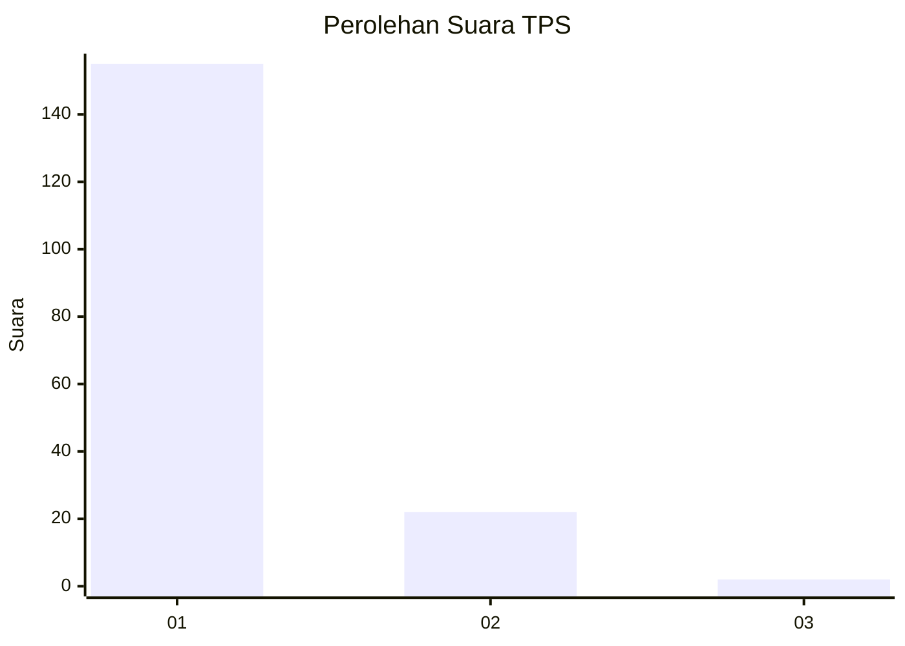
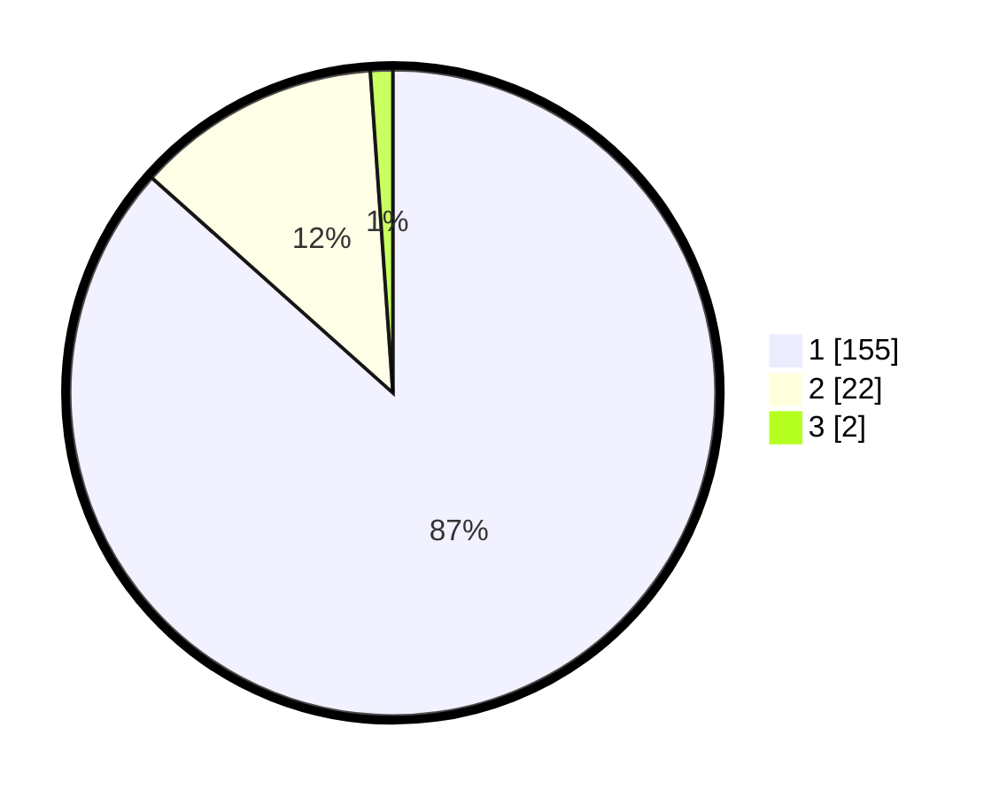

# Hasil

## Grafik

## Tabel

| No. | Nama Paslon    | Suara | Suara (raw) | Persentase |
|:--- |:-------------- | -----:| -----------:| ----------:|
| 1   | ANIES MUHAIMIN | 155   | [155][p-1]  | 86,59      |
| 2   | PRABOWO GIBRAN | 22    | [22][p-2]   | 12,29      |
| 3   | GANJAR MAHFUD  | 2     | [2][p-3]    | 1,12       |

[p-1]: https://github.com/gigit-pemilu/pemilu-2024-11-aceh/blob/main/pilpres/hitung-suara/sub/11-aceh/sub/01-aceh-selatan/sub/06-samadua/sub/2003-kuta-baru/sub/001-tps/sub/paslon-1.txt
[p-2]: https://github.com/gigit-pemilu/pemilu-2024-11-aceh/blob/main/pilpres/hitung-suara/sub/11-aceh/sub/01-aceh-selatan/sub/06-samadua/sub/2003-kuta-baru/sub/001-tps/sub/paslon-2.txt
[p-3]: https://github.com/gigit-pemilu/pemilu-2024-11-aceh/blob/main/pilpres/hitung-suara/sub/11-aceh/sub/01-aceh-selatan/sub/06-samadua/sub/2003-kuta-baru/sub/001-tps/sub/paslon-3.txt

## Foto C Plano

https://sirekap-obj-formc.kpu.go.id/77c6/pemilu/ppwp/11/01/06/20/03/1101062003001-20240214-215457--ff74884f-7f79-4075-bacc-7398b489ff93.jpg

https://sirekap-obj-formc.kpu.go.id/77c6/pemilu/ppwp/11/01/06/20/03/1101062003001-20240214-221316--c71a6ed3-2f00-490b-985e-a244bbab9521.jpg

https://sirekap-obj-formc.kpu.go.id/77c6/pemilu/ppwp/11/01/06/20/03/1101062003001-20240214-215708--1a5caba1-5132-4e1d-9ad9-ce6d035c7af0.jpg

## Metadata

| Key        | Value               |
| ---------- | ------------------- |
| Time Stamp | 2024-02-15 09:00:24 |

## DATA PEMILIH TETAP

Jumlah pemilih dalam DPT: **187**.
 * L: **92**.
 * P: **95**.

## DATA PENGGUNA HAK PILIH

Jumlah pengguna hak pilih dalam DPT: **173**.
 * L: **83**.
 * P: **90**.

Jumlah pengguna hak pilih dalam DPTb: **4**.
 * L: **2**.
 * P: **2**.

Jumlah pengguna hak pilih dalam DPK: **2**.
 * L: **0**.
 * P: **2**.

Jumlah pengguna hak pilih: **179**.
 * L: **85**.
 * P: **94**.

## JUMLAH SUARA SAH DAN TIDAK SAH

JUMLAH SELURUH SUARA SAH: **179**.

JUMLAH SUARA TIDAK SAH: **0**.

JUMLAH SELURUH SUARA SAH DAN SUARA TIDAK SAH: **179**.

