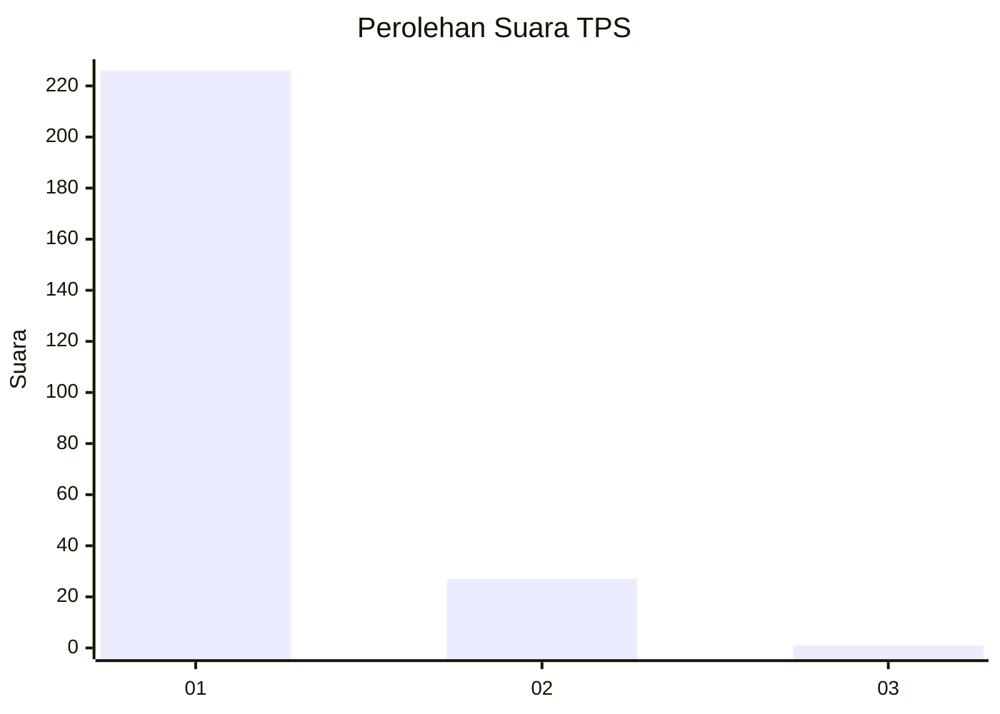
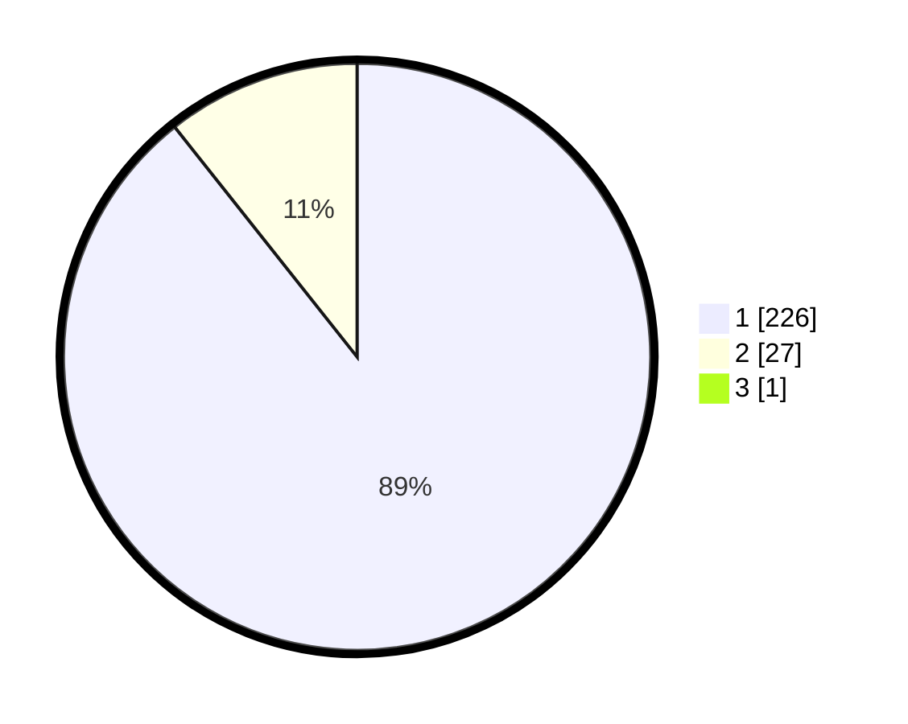

# Hasil

## Grafik

## Tabel

| No. | Nama Paslon    | Suara | Suara (raw) | Persentase |
|:--- |:-------------- | -----:| -----------:| ----------:|
| 1   | ANIES MUHAIMIN | 226   | [226][p-1]  | 88,98      |
| 2   | PRABOWO GIBRAN | 27    | [27][p-2]   | 10,63      |
| 3   | GANJAR MAHFUD  | 1     | [1][p-3]    | 0,39       |

[p-1]: https://github.com/gigit-pemilu/pemilu-2024-11-aceh/blob/main/pilpres/hitung-suara/sub/11-aceh/sub/01-aceh-selatan/sub/06-samadua/sub/2005-ladang-panton-luas/sub/001-tps/sub/paslon-1.txt
[p-2]: https://github.com/gigit-pemilu/pemilu-2024-11-aceh/blob/main/pilpres/hitung-suara/sub/11-aceh/sub/01-aceh-selatan/sub/06-samadua/sub/2005-ladang-panton-luas/sub/001-tps/sub/paslon-2.txt
[p-3]: https://github.com/gigit-pemilu/pemilu-2024-11-aceh/blob/main/pilpres/hitung-suara/sub/11-aceh/sub/01-aceh-selatan/sub/06-samadua/sub/2005-ladang-panton-luas/sub/001-tps/sub/paslon-3.txt

## Foto C Plano

https://sirekap-obj-formc.kpu.go.id/99be/pemilu/ppwp/11/01/06/20/05/1101062005001-20240214-190951--9c70f76d-9bbd-4257-9916-e53fb8fd8304.jpg

https://sirekap-obj-formc.kpu.go.id/99be/pemilu/ppwp/11/01/06/20/05/1101062005001-20240214-190958--e540b740-1953-4dc5-bafe-dbb4f51585e3.jpg

https://sirekap-obj-formc.kpu.go.id/99be/pemilu/ppwp/11/01/06/20/05/1101062005001-20240214-191006--dea8e2eb-3ef1-4176-9a87-24aea260ebea.jpg

## Metadata

| Key        | Value               |
| ---------- | ------------------- |
| Time Stamp | 2024-02-15 03:06:03 |

## DATA PEMILIH TETAP

Jumlah pemilih dalam DPT: **277**.
 * L: **129**.
 * P: **148**.

## DATA PENGGUNA HAK PILIH

Jumlah pengguna hak pilih dalam DPT: **252**.
 * L: **113**.
 * P: **139**.

Jumlah pengguna hak pilih dalam DPTb: **2**.
 * L: **1**.
 * P: **1**.

Jumlah pengguna hak pilih dalam DPK: **0**.
 * L: **0**.
 * P: **0**.

Jumlah pengguna hak pilih: **254**.
 * L: **114**.
 * P: **140**.

## JUMLAH SUARA SAH DAN TIDAK SAH

JUMLAH SELURUH SUARA SAH: **254**.

JUMLAH SUARA TIDAK SAH: **0**.

JUMLAH SELURUH SUARA SAH DAN SUARA TIDAK SAH: **254**.

