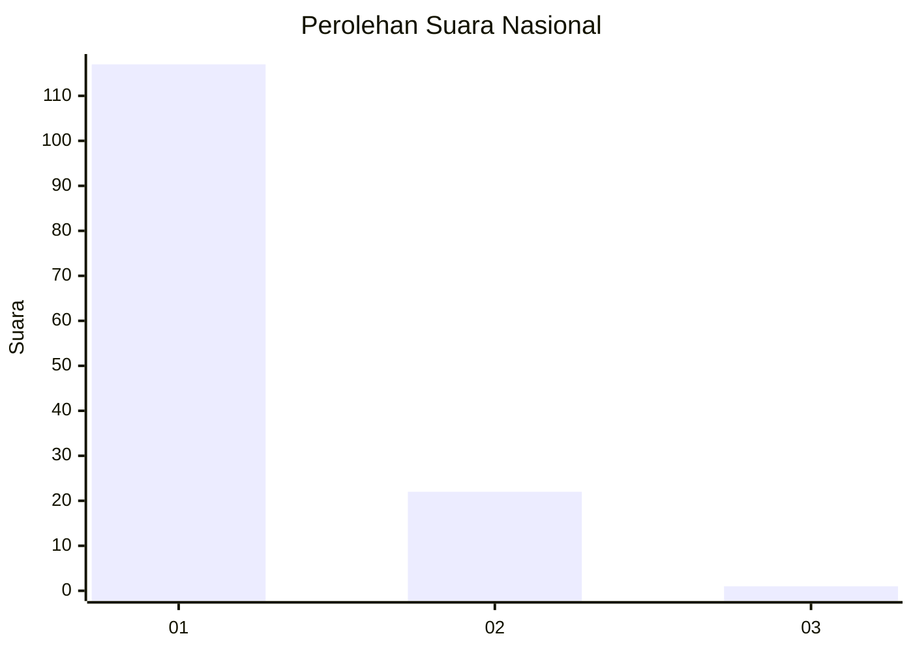
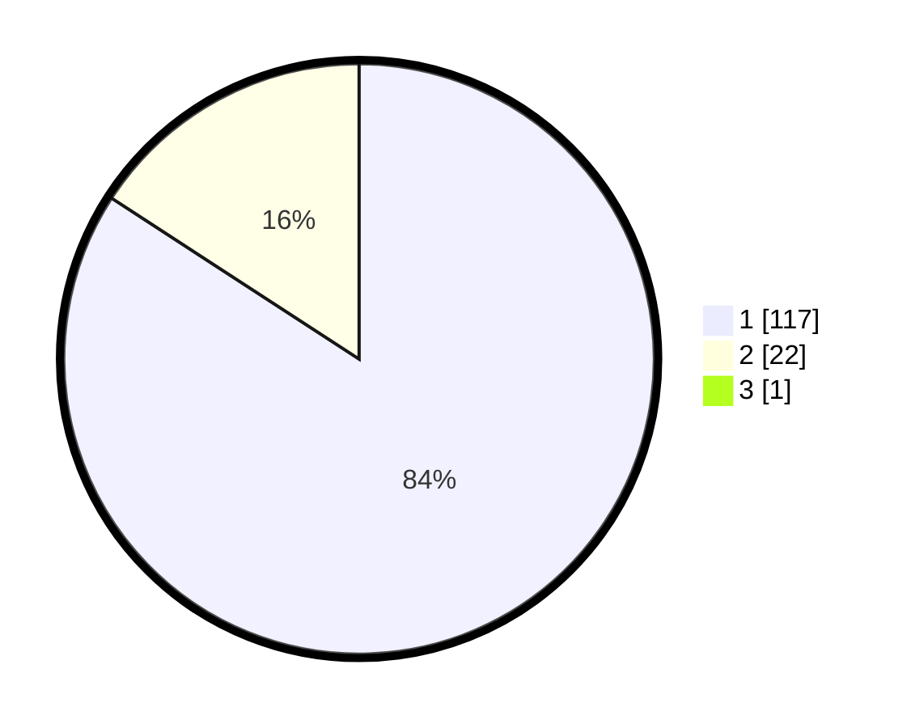

# Hasil

## Grafik

## Tabel

| No. | Nama Paslon    | Suara | Suara (raw) | Persentase |
|:--- |:-------------- | -----:| -----------:| ----------:|
| 1   | ANIES MUHAIMIN | 117   | [117][p-1]  | 83,57      |
| 2   | PRABOWO GIBRAN | 22    | [22][p-2]   | 15,71      |
| 3   | GANJAR MAHFUD  | 1     | [1][p-3]    | 0,71       |

[p-1]: https://github.com/gigit-pemilu/pemilu-2024/blob/main/pilpres/hitung-suara/sub/11-aceh/sub/01-aceh-selatan/sub/06-samadua/sub/2006-madat/sub/002-tps/sub/paslon-1.txt
[p-2]: https://github.com/gigit-pemilu/pemilu-2024/blob/main/pilpres/hitung-suara/sub/11-aceh/sub/01-aceh-selatan/sub/06-samadua/sub/2006-madat/sub/002-tps/sub/paslon-2.txt
[p-3]: https://github.com/gigit-pemilu/pemilu-2024/blob/main/pilpres/hitung-suara/sub/11-aceh/sub/01-aceh-selatan/sub/06-samadua/sub/2006-madat/sub/002-tps/sub/paslon-3.txt

## Foto C Plano

https://sirekap-obj-formc.kpu.go.id/8114/pemilu/ppwp/11/01/06/20/06/1101062006002-20240220-175314--9a1ebb9f-173e-4785-9161-b47362c889ab.jpg

https://sirekap-obj-formc.kpu.go.id/8114/pemilu/ppwp/11/01/06/20/06/1101062006002-20240220-175428--532cba9b-fe5f-496b-be51-e843ee56b9b3.jpg

https://sirekap-obj-formc.kpu.go.id/8114/pemilu/ppwp/11/01/06/20/06/1101062006002-20240220-175546--68587cea-080c-41aa-bcc9-d75e21180a5b.jpg

## Metadata

| Key        | Value               |
| ---------- | ------------------- |
| Time Stamp | 2024-02-20 18:00:00 |

## DATA PEMILIH TETAP

Jumlah pemilih dalam DPT: **147**.
 * L: **68**.
 * P: **73**.

## DATA PENGGUNA HAK PILIH

Jumlah pengguna hak pilih dalam DPT: **140**.
 * L: **62**.
 * P: **70**.

Jumlah pengguna hak pilih dalam DPTb: **1**.
 * L: **1**.
 * P: **800**.

Jumlah pengguna hak pilih dalam DPK: **0**.
 * L: **0**.
 * P: **0**.

Jumlah pengguna hak pilih: **141**.
 * L: **63**.
 * P: **70**.

## JUMLAH SUARA SAH DAN TIDAK SAH

JUMLAH SELURUH SUARA SAH: **140**.

JUMLAH SUARA TIDAK SAH: **1**.

JUMLAH SELURUH SUARA SAH DAN SUARA TIDAK SAH: **141**.

