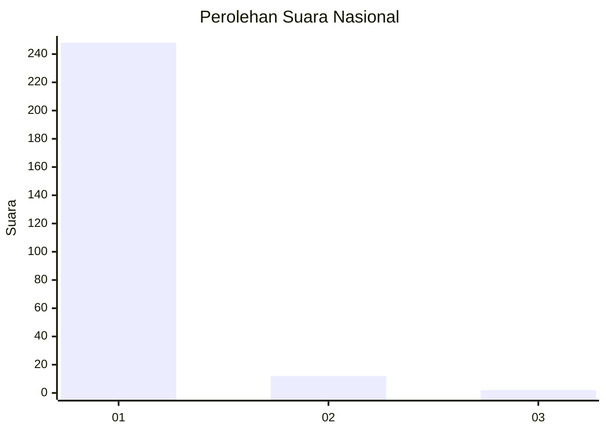
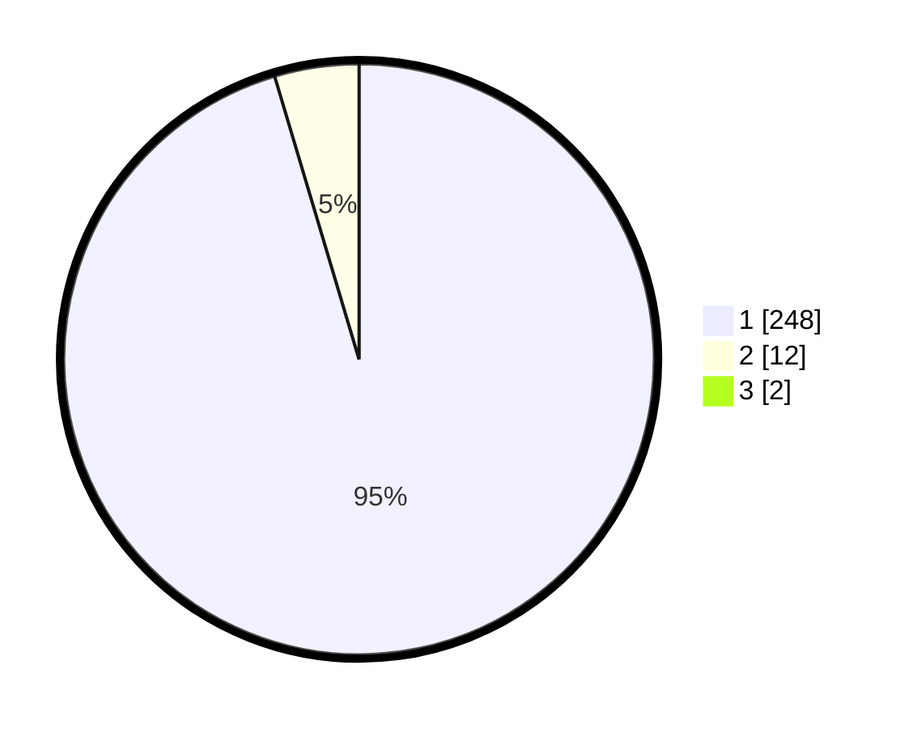

# Hasil

## Grafik

## Tabel

| No. | Nama Paslon    | Suara | Suara (raw) | Persentase |
|:--- |:-------------- | -----:| -----------:| ----------:|
| 1   | ANIES MUHAIMIN | 248   | [248][p-1]  | 94,66      |
| 2   | PRABOWO GIBRAN | 12    | [12][p-2]   | 4,58       |
| 3   | GANJAR MAHFUD  | 2     | [2][p-3]    | 0,76       |

[p-1]: https://github.com/gigit-pemilu/pemilu-2024/blob/main/pilpres/hitung-suara/sub/11-aceh/sub/01-aceh-selatan/sub/06-samadua/sub/2007-alur-seumerah/sub/001-tps/sub/paslon-1.txt
[p-2]: https://github.com/gigit-pemilu/pemilu-2024/blob/main/pilpres/hitung-suara/sub/11-aceh/sub/01-aceh-selatan/sub/06-samadua/sub/2007-alur-seumerah/sub/001-tps/sub/paslon-2.txt
[p-3]: https://github.com/gigit-pemilu/pemilu-2024/blob/main/pilpres/hitung-suara/sub/11-aceh/sub/01-aceh-selatan/sub/06-samadua/sub/2007-alur-seumerah/sub/001-tps/sub/paslon-3.txt

## Foto C Plano

https://sirekap-obj-formc.kpu.go.id/ef8c/pemilu/ppwp/11/01/06/20/07/1101062007001-20240215-010139--1d79084e-c7e0-4dbd-b910-3970127bbc20.jpg

https://sirekap-obj-formc.kpu.go.id/ef8c/pemilu/ppwp/11/01/06/20/07/1101062007001-20240215-010611--c548a30e-4210-4eb5-a023-85c37d5a3e1b.jpg

https://sirekap-obj-formc.kpu.go.id/ef8c/pemilu/ppwp/11/01/06/20/07/1101062007001-20240215-011713--87203a44-6d37-4ec0-bbbc-234f5c09c1e6.jpg

## Metadata

| Key        | Value               |
| ---------- | ------------------- |
| Time Stamp | 2024-02-16 21:01:00 |

