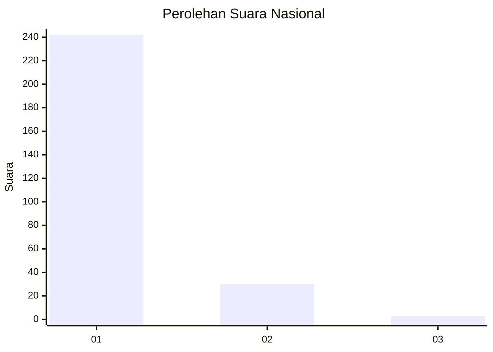
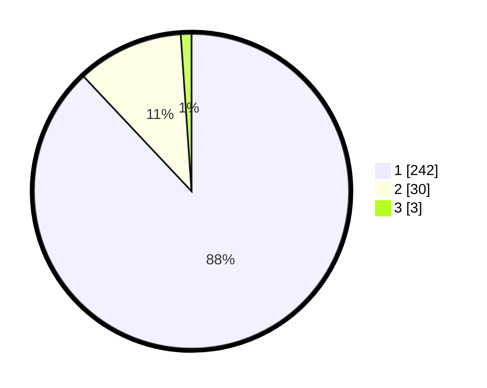

# Hasil

## Grafik

## Tabel

| No. | Nama Paslon    | Suara | Suara (raw) | Persentase |
|:--- |:-------------- | -----:| -----------:| ----------:|
| 1   | ANIES MUHAIMIN | 242   | [242][p-1]  | 88,00      |
| 2   | PRABOWO GIBRAN | 30    | [30][p-2]   | 10,91      |
| 3   | GANJAR MAHFUD  | 3     | [3][p-3]    | 1,09       |

[p-1]: https://github.com/gigit-pemilu/pemilu-2024/blob/main/pilpres/hitung-suara/sub/11-aceh/sub/01-aceh-selatan/sub/06-samadua/sub/2009-gunung-cut/sub/001-tps/sub/paslon-1.txt
[p-2]: https://github.com/gigit-pemilu/pemilu-2024/blob/main/pilpres/hitung-suara/sub/11-aceh/sub/01-aceh-selatan/sub/06-samadua/sub/2009-gunung-cut/sub/001-tps/sub/paslon-2.txt
[p-3]: https://github.com/gigit-pemilu/pemilu-2024/blob/main/pilpres/hitung-suara/sub/11-aceh/sub/01-aceh-selatan/sub/06-samadua/sub/2009-gunung-cut/sub/001-tps/sub/paslon-3.txt

## Foto C Plano

https://sirekap-obj-formc.kpu.go.id/a9fb/pemilu/ppwp/11/01/06/20/09/1101062009001-20240214-231629--5386cb53-b64c-4a43-827d-1549243277c8.jpg

https://sirekap-obj-formc.kpu.go.id/a9fb/pemilu/ppwp/11/01/06/20/09/1101062009001-20240214-232202--a5839e8a-2a0b-4edb-af68-0d90c445edb7.jpg

https://sirekap-obj-formc.kpu.go.id/a9fb/pemilu/ppwp/11/01/06/20/09/1101062009001-20240214-232444--3948a25d-4c46-487b-966f-d607f70bd89a.jpg

## Metadata

| Key        | Value               |
| ---------- | ------------------- |
| Time Stamp | 2024-02-16 21:01:00 |

## DATA PEMILIH TETAP

Jumlah pemilih dalam DPT: **300**.
 * L: **151**.
 * P: **149**.

## DATA PENGGUNA HAK PILIH

Jumlah pengguna hak pilih dalam DPT: **273**.
 * L: **131**.
 * P: **142**.

Jumlah pengguna hak pilih dalam DPTb: **3**.
 * L: **0**.
 * P: **3**.

Jumlah pengguna hak pilih dalam DPK: **0**.
 * L: **0**.
 * P: **0**.

Jumlah pengguna hak pilih: **276**.
 * L: **131**.
 * P: **145**.

## JUMLAH SUARA SAH DAN TIDAK SAH

JUMLAH SELURUH SUARA SAH: **275**.

JUMLAH SUARA TIDAK SAH: **1**.

JUMLAH SELURUH SUARA SAH DAN SUARA TIDAK SAH: **276**.

