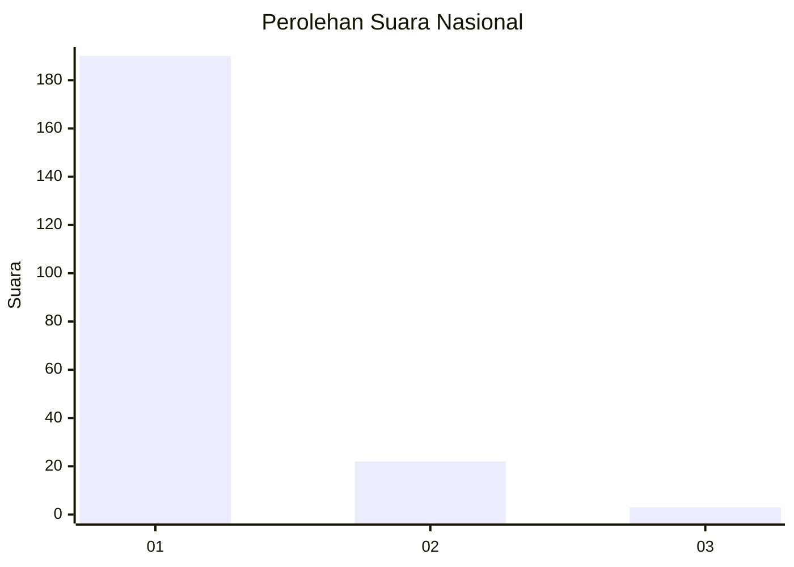
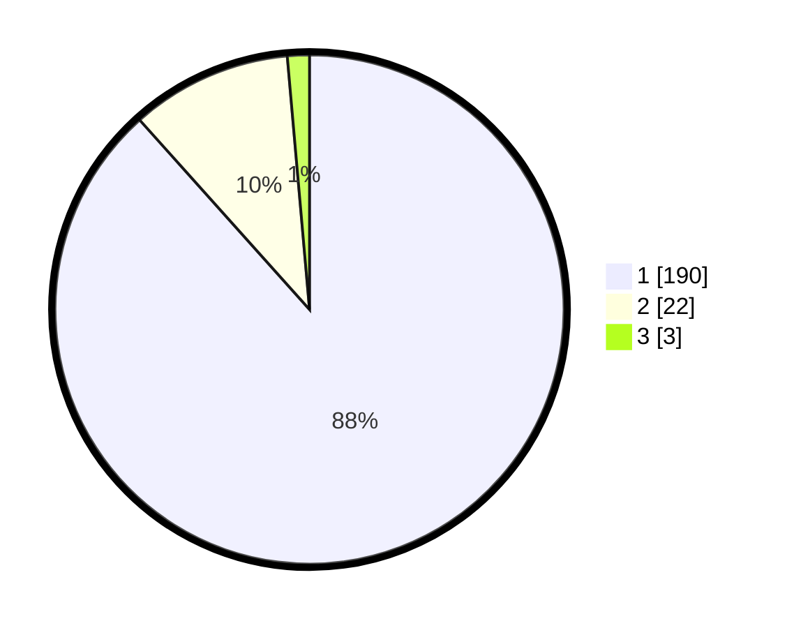

# Hasil

## Grafik

## Tabel

| No. | Nama Paslon    | Suara | Suara (raw) | Persentase |
|:--- |:-------------- | -----:| -----------:| ----------:|
| 1   | ANIES MUHAIMIN | 190   | [190][p-1]  | 88,37      |
| 2   | PRABOWO GIBRAN | 22    | [22][p-2]   | 10,23      |
| 3   | GANJAR MAHFUD  | 3     | [3][p-3]    | 1,40       |

[p-1]: https://github.com/gigit-pemilu/pemilu-2024/blob/main/pilpres/hitung-suara/sub/11-aceh/sub/01-aceh-selatan/sub/06-samadua/sub/2012-batee-tunggai/sub/002-tps/sub/paslon-1.txt
[p-2]: https://github.com/gigit-pemilu/pemilu-2024/blob/main/pilpres/hitung-suara/sub/11-aceh/sub/01-aceh-selatan/sub/06-samadua/sub/2012-batee-tunggai/sub/002-tps/sub/paslon-2.txt
[p-3]: https://github.com/gigit-pemilu/pemilu-2024/blob/main/pilpres/hitung-suara/sub/11-aceh/sub/01-aceh-selatan/sub/06-samadua/sub/2012-batee-tunggai/sub/002-tps/sub/paslon-3.txt

## Foto C Plano

https://sirekap-obj-formc.kpu.go.id/a68e/pemilu/ppwp/11/01/06/20/12/1101062012002-20240214-225742--640cdc4a-d56a-494b-b839-acde5638f9c0.jpg

https://sirekap-obj-formc.kpu.go.id/a68e/pemilu/ppwp/11/01/06/20/12/1101062012002-20240221-161631--aa50845a-0ec1-447e-9656-0d2645d6e8db.jpg

https://sirekap-obj-formc.kpu.go.id/a68e/pemilu/ppwp/11/01/06/20/12/1101062012002-20240214-225946--6a896d98-b3df-4ec8-a7cf-c013a2613deb.jpg

## Metadata

| Key        | Value               |
| ---------- | ------------------- |
| Time Stamp | 2024-02-24 22:31:28 |

