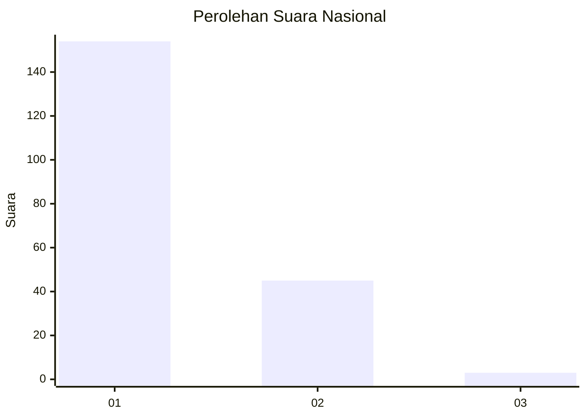
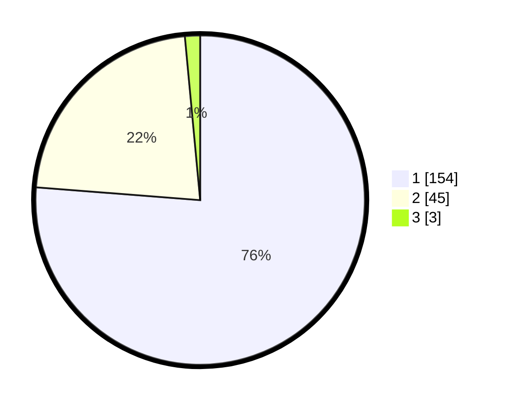

# Hasil

## Grafik

## Tabel

| No. | Nama Paslon    | Suara | Suara (raw) | Persentase |
|:--- |:-------------- | -----:| -----------:| ----------:|
| 1   | ANIES MUHAIMIN | 154   | [154][p-1]  | 76,24      |
| 2   | PRABOWO GIBRAN | 45    | [45][p-2]   | 22,28      |
| 3   | GANJAR MAHFUD  | 3     | [3][p-3]    | 1,49       |

[p-1]: https://github.com/gigit-pemilu/pemilu-2024/blob/main/pilpres/hitung-suara/sub/11-aceh/sub/01-aceh-selatan/sub/06-samadua/sub/2013-ujung-tanah/sub/001-tps/sub/paslon-1.txt
[p-2]: https://github.com/gigit-pemilu/pemilu-2024/blob/main/pilpres/hitung-suara/sub/11-aceh/sub/01-aceh-selatan/sub/06-samadua/sub/2013-ujung-tanah/sub/001-tps/sub/paslon-2.txt
[p-3]: https://github.com/gigit-pemilu/pemilu-2024/blob/main/pilpres/hitung-suara/sub/11-aceh/sub/01-aceh-selatan/sub/06-samadua/sub/2013-ujung-tanah/sub/001-tps/sub/paslon-3.txt

## Foto C Plano

https://sirekap-obj-formc.kpu.go.id/85ae/pemilu/ppwp/11/01/06/20/13/1101062013001-20240214-233146--32553953-8989-4a41-be53-2c0395e18582.jpg

https://sirekap-obj-formc.kpu.go.id/85ae/pemilu/ppwp/11/01/06/20/13/1101062013001-20240214-234003--6cfd762b-95b1-48d3-9a3d-57329d3d4ba4.jpg

https://sirekap-obj-formc.kpu.go.id/85ae/pemilu/ppwp/11/01/06/20/13/1101062013001-20240214-235500--ac4049f7-6905-4298-9719-651329f01947.jpg

## Metadata

| Key        | Value               |
| ---------- | ------------------- |
| Time Stamp | 2024-02-15 12:00:28 |

## DATA PEMILIH TETAP

Jumlah pemilih dalam DPT: **208**.
 * L: **95**.
 * P: **113**.

## DATA PENGGUNA HAK PILIH

Jumlah pengguna hak pilih dalam DPT: **189**.
 * L: **83**.
 * P: **106**.

Jumlah pengguna hak pilih dalam DPTb: **16**.
 * L: **9**.
 * P: **7**.

Jumlah pengguna hak pilih dalam DPK: **0**.
 * L: **0**.
 * P: **0**.

Jumlah pengguna hak pilih: **205**.
 * L: **92**.
 * P: **113**.

## JUMLAH SUARA SAH DAN TIDAK SAH

JUMLAH SELURUH SUARA SAH: **202**.

JUMLAH SUARA TIDAK SAH: **3**.

JUMLAH SELURUH SUARA SAH DAN SUARA TIDAK SAH: **205**.

