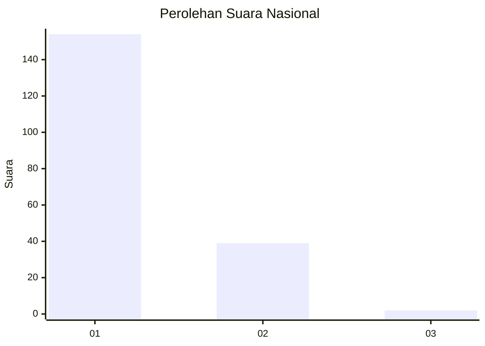
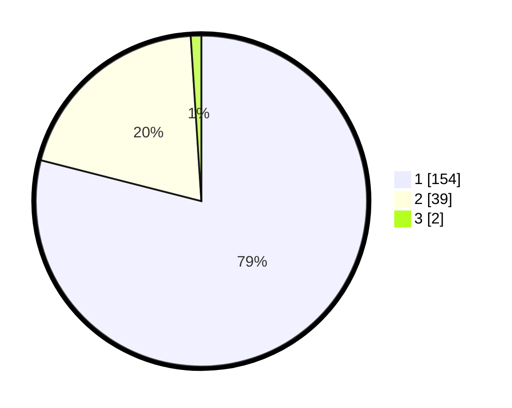

# Hasil

## Grafik

## Tabel

| No. | Nama Paslon    | Suara | Suara (raw) | Persentase |
|:--- |:-------------- | -----:| -----------:| ----------:|
| 1   | ANIES MUHAIMIN | 154   | [154][p-1]  | 78,97      |
| 2   | PRABOWO GIBRAN | 39    | [39][p-2]   | 20,00      |
| 3   | GANJAR MAHFUD  | 2     | [2][p-3]    | 1,03       |

[p-1]: https://github.com/gigit-pemilu/pemilu-2024/blob/main/pilpres/hitung-suara/sub/11-aceh/sub/01-aceh-selatan/sub/06-samadua/sub/2013-ujung-tanah/sub/003-tps/sub/paslon-1.txt
[p-2]: https://github.com/gigit-pemilu/pemilu-2024/blob/main/pilpres/hitung-suara/sub/11-aceh/sub/01-aceh-selatan/sub/06-samadua/sub/2013-ujung-tanah/sub/003-tps/sub/paslon-2.txt
[p-3]: https://github.com/gigit-pemilu/pemilu-2024/blob/main/pilpres/hitung-suara/sub/11-aceh/sub/01-aceh-selatan/sub/06-samadua/sub/2013-ujung-tanah/sub/003-tps/sub/paslon-3.txt

## Foto C Plano

https://sirekap-obj-formc.kpu.go.id/4361/pemilu/ppwp/11/01/06/20/13/1101062013003-20240214-223538--1c5ac5b7-1752-43eb-8b05-92d91012b74b.jpg

https://sirekap-obj-formc.kpu.go.id/4361/pemilu/ppwp/11/01/06/20/13/1101062013003-20240214-223747--546cb0f0-7695-4dea-b6b4-cbfd6414e910.jpg

https://sirekap-obj-formc.kpu.go.id/4361/pemilu/ppwp/11/01/06/20/13/1101062013003-20240214-223923--e68a8842-a06a-45be-838e-56222dd0a707.jpg

## Metadata

| Key        | Value               |
| ---------- | ------------------- |
| Time Stamp | 2024-02-24 22:31:28 |

