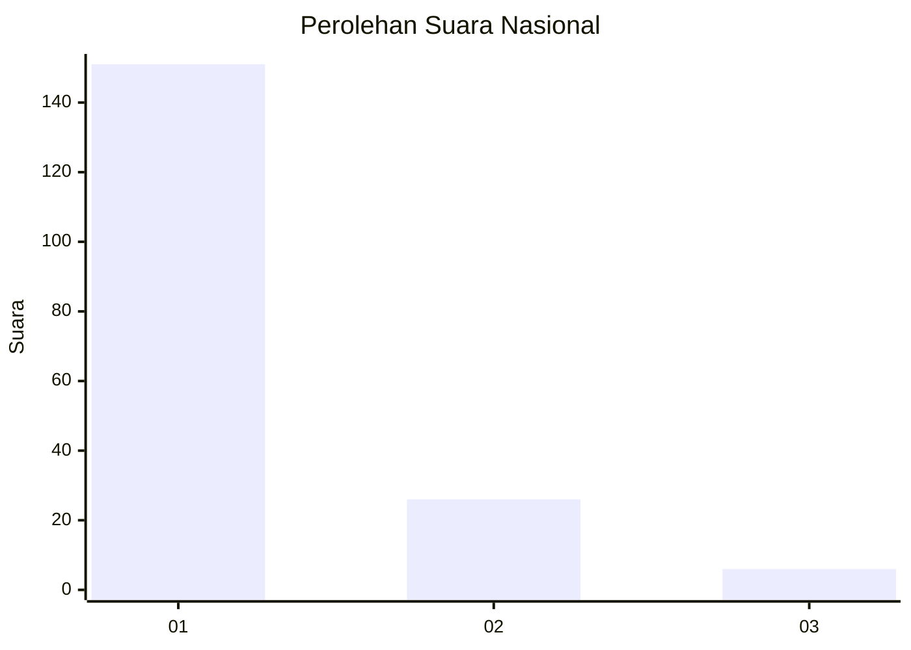
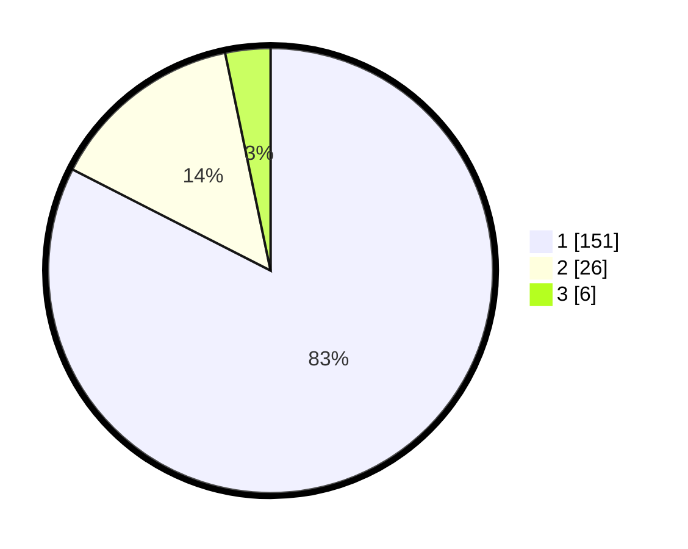

# Hasil

## Grafik

## Tabel

| No. | Nama Paslon    | Suara | Suara (raw) | Persentase |
|:--- |:-------------- | -----:| -----------:| ----------:|
| 1   | ANIES MUHAIMIN | 151   | [151][p-1]  | 82,51      |
| 2   | PRABOWO GIBRAN | 26    | [26][p-2]   | 14,21      |
| 3   | GANJAR MAHFUD  | 6     | [6][p-3]    | 3,28       |

[p-1]: https://github.com/gigit-pemilu/pemilu-2024/blob/main/pilpres/hitung-suara/sub/11-aceh/sub/01-aceh-selatan/sub/06-samadua/sub/2016-luar/sub/001-tps/sub/paslon-1.txt
[p-2]: https://github.com/gigit-pemilu/pemilu-2024/blob/main/pilpres/hitung-suara/sub/11-aceh/sub/01-aceh-selatan/sub/06-samadua/sub/2016-luar/sub/001-tps/sub/paslon-2.txt
[p-3]: https://github.com/gigit-pemilu/pemilu-2024/blob/main/pilpres/hitung-suara/sub/11-aceh/sub/01-aceh-selatan/sub/06-samadua/sub/2016-luar/sub/001-tps/sub/paslon-3.txt

## Foto C Plano

https://sirekap-obj-formc.kpu.go.id/8680/pemilu/ppwp/11/01/06/20/16/1101062016001-20240214-224416--3fa8d115-c7ac-4ca0-b941-a15d9f953e2d.jpg

https://sirekap-obj-formc.kpu.go.id/8680/pemilu/ppwp/11/01/06/20/16/1101062016001-20240214-224241--96b15ef2-eff6-4679-bdd9-93841e847fe8.jpg

https://sirekap-obj-formc.kpu.go.id/8680/pemilu/ppwp/11/01/06/20/16/1101062016001-20240214-224323--80c0d2b6-0647-4ad2-a1e9-dd7ae63c0c06.jpg

## Metadata

| Key        | Value               |
| ---------- | ------------------- |
| Time Stamp | 2024-02-16 21:01:00 |

## DATA PEMILIH TETAP

Jumlah pemilih dalam DPT: **193**.
 * L: **86**.
 * P: **107**.

## DATA PENGGUNA HAK PILIH

Jumlah pengguna hak pilih dalam DPT: **179**.
 * L: **77**.
 * P: **102**.

Jumlah pengguna hak pilih dalam DPTb: **4**.
 * L: **3**.
 * P: **1**.

Jumlah pengguna hak pilih dalam DPK: **0**.
 * L: **0**.
 * P: **0**.

Jumlah pengguna hak pilih: **183**.
 * L: **80**.
 * P: **103**.

## JUMLAH SUARA SAH DAN TIDAK SAH

JUMLAH SELURUH SUARA SAH: **183**.

JUMLAH SUARA TIDAK SAH: **0**.

JUMLAH SELURUH SUARA SAH DAN SUARA TIDAK SAH: **183**.

