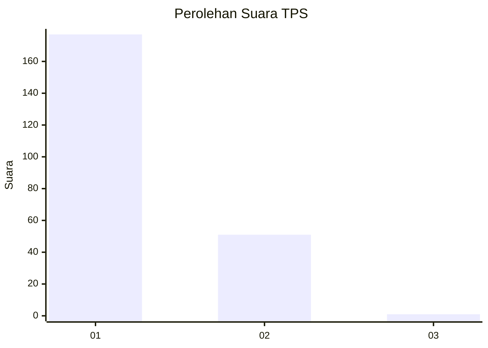
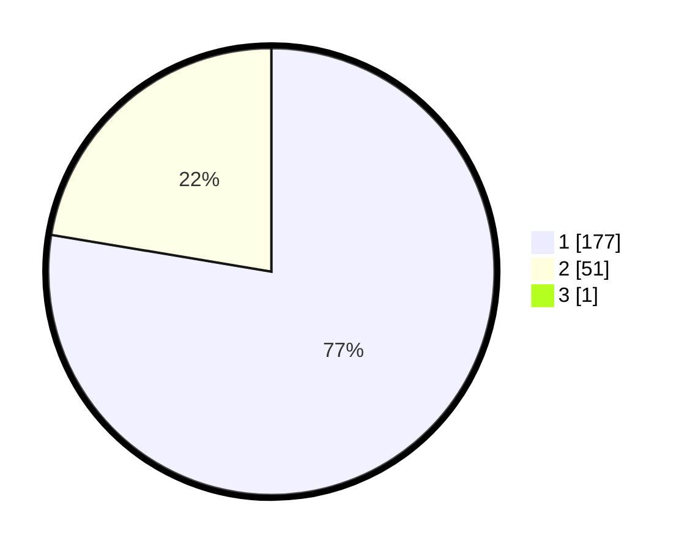

# Hasil

## Grafik

## Tabel

| No. | Nama Paslon    | Suara | Suara (raw) | Persentase |
|:--- |:-------------- | -----:| -----------:| ----------:|
| 1   | ANIES MUHAIMIN | 177   | [177][p-1]  | 77,29      |
| 2   | PRABOWO GIBRAN | 51    | [51][p-2]   | 22,27      |
| 3   | GANJAR MAHFUD  | 1     | [1][p-3]    | 0,44       |

[p-1]: https://github.com/gigit-pemilu/pemilu-2024-11-aceh/blob/main/pilpres/hitung-suara/sub/11-aceh/sub/01-aceh-selatan/sub/06-samadua/sub/2019-tampang/sub/001-tps/sub/paslon-1.txt
[p-2]: https://github.com/gigit-pemilu/pemilu-2024-11-aceh/blob/main/pilpres/hitung-suara/sub/11-aceh/sub/01-aceh-selatan/sub/06-samadua/sub/2019-tampang/sub/001-tps/sub/paslon-2.txt
[p-3]: https://github.com/gigit-pemilu/pemilu-2024-11-aceh/blob/main/pilpres/hitung-suara/sub/11-aceh/sub/01-aceh-selatan/sub/06-samadua/sub/2019-tampang/sub/001-tps/sub/paslon-3.txt

## Foto C Plano

https://sirekap-obj-formc.kpu.go.id/604b/pemilu/ppwp/11/01/06/20/19/1101062019001-20240215-042624--d66cf1ba-3aef-4da2-ac8d-8100d63f9661.jpg

https://sirekap-obj-formc.kpu.go.id/604b/pemilu/ppwp/11/01/06/20/19/1101062019001-20240215-042735--4a0abfa5-d006-414f-bc62-8e2eb9777a28.jpg

https://sirekap-obj-formc.kpu.go.id/604b/pemilu/ppwp/11/01/06/20/19/1101062019001-20240215-042917--7c48950e-a918-4ed4-b575-8fb340c3ea39.jpg

## Metadata

| Key        | Value               |
| ---------- | ------------------- |
| Time Stamp | 2024-02-15 21:01:18 |

