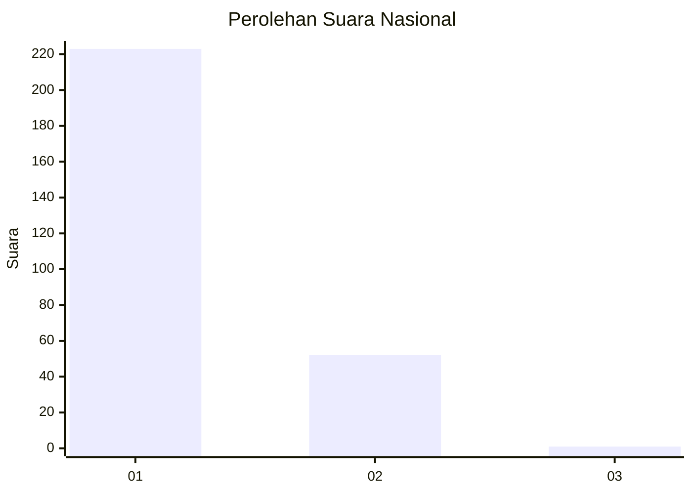
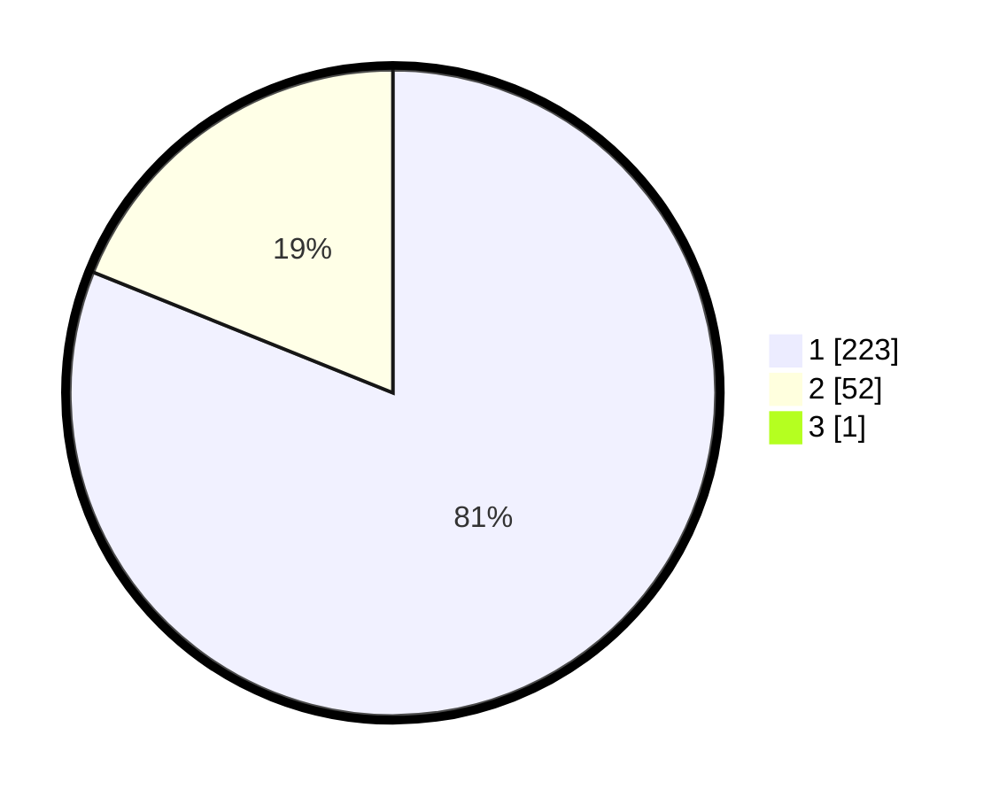

# Hasil

## Grafik

## Tabel

| No. | Nama Paslon    | Suara | Suara (raw) | Persentase |
|:--- |:-------------- | -----:| -----------:| ----------:|
| 1   | ANIES MUHAIMIN | 223   | [223][p-1]  | 80,80      |
| 2   | PRABOWO GIBRAN | 52    | [52][p-2]   | 18,84      |
| 3   | GANJAR MAHFUD  | 1     | [1][p-3]    | 0,36       |

[p-1]: https://github.com/gigit-pemilu/pemilu-2024/blob/main/pilpres/hitung-suara/sub/11-aceh/sub/01-aceh-selatan/sub/06-samadua/sub/2020-payonan-gadang/sub/001-tps/sub/paslon-1.txt
[p-2]: https://github.com/gigit-pemilu/pemilu-2024/blob/main/pilpres/hitung-suara/sub/11-aceh/sub/01-aceh-selatan/sub/06-samadua/sub/2020-payonan-gadang/sub/001-tps/sub/paslon-2.txt
[p-3]: https://github.com/gigit-pemilu/pemilu-2024/blob/main/pilpres/hitung-suara/sub/11-aceh/sub/01-aceh-selatan/sub/06-samadua/sub/2020-payonan-gadang/sub/001-tps/sub/paslon-3.txt

## Foto C Plano

https://sirekap-obj-formc.kpu.go.id/b3d7/pemilu/ppwp/11/01/06/20/20/1101062020001-20240216-125946--605cfcc9-81ef-459e-8435-98b6b17d56e4.jpg

https://sirekap-obj-formc.kpu.go.id/b3d7/pemilu/ppwp/11/01/06/20/20/1101062020001-20240215-020914--e6c1b5e4-6fa0-48cb-8949-407058f4221f.jpg

https://sirekap-obj-formc.kpu.go.id/b3d7/pemilu/ppwp/11/01/06/20/20/1101062020001-20240215-021111--fd827a92-bd96-43ea-bdee-b45a66a5b94d.jpg

## Metadata

| Key        | Value               |
| ---------- | ------------------- |
| Time Stamp | 2024-02-16 13:00:29 |

## DATA PEMILIH TETAP

Jumlah pemilih dalam DPT: **296**.
 * L: **145**.
 * P: **151**.

## DATA PENGGUNA HAK PILIH

Jumlah pengguna hak pilih dalam DPT: **283**.
 * L: **138**.
 * P: **145**.

Jumlah pengguna hak pilih dalam DPTb: **1**.
 * L: **1**.
 * P: **0**.

Jumlah pengguna hak pilih dalam DPK: **0**.
 * L: **0**.
 * P: **0**.

Jumlah pengguna hak pilih: **284**.
 * L: **139**.
 * P: **145**.

## JUMLAH SUARA SAH DAN TIDAK SAH

JUMLAH SELURUH SUARA SAH: **276**.

JUMLAH SUARA TIDAK SAH: **7**.

JUMLAH SELURUH SUARA SAH DAN SUARA TIDAK SAH: **283**.

