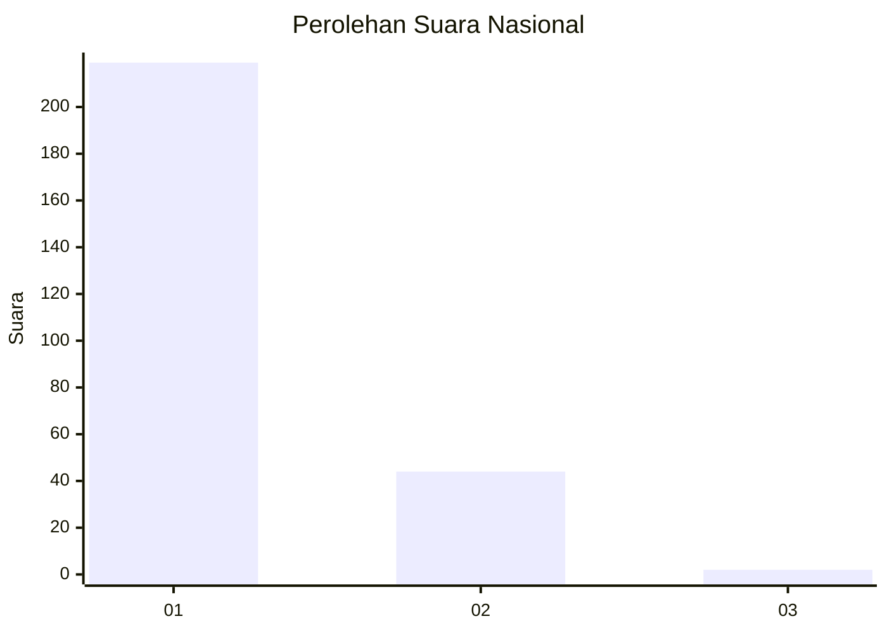
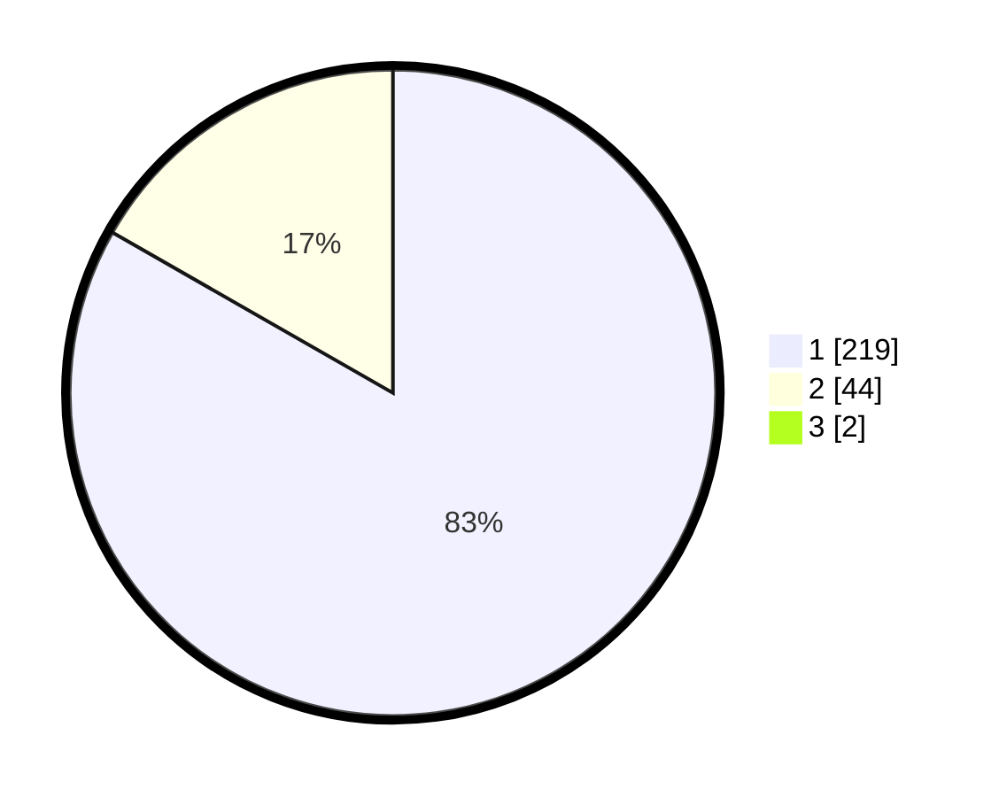

# Hasil

## Grafik

## Tabel

| No. | Nama Paslon    | Suara | Suara (raw) | Persentase |
|:--- |:-------------- | -----:| -----------:| ----------:|
| 1   | ANIES MUHAIMIN | 219   | [219][p-1]  | 82,64      |
| 2   | PRABOWO GIBRAN | 44    | [44][p-2]   | 16,60      |
| 3   | GANJAR MAHFUD  | 2     | [2][p-3]    | 0,75       |

[p-1]: https://github.com/gigit-pemilu/pemilu-2024/blob/main/pilpres/hitung-suara/sub/11-aceh/sub/01-aceh-selatan/sub/06-samadua/sub/2020-payonan-gadang/sub/002-tps/sub/paslon-1.txt
[p-2]: https://github.com/gigit-pemilu/pemilu-2024/blob/main/pilpres/hitung-suara/sub/11-aceh/sub/01-aceh-selatan/sub/06-samadua/sub/2020-payonan-gadang/sub/002-tps/sub/paslon-2.txt
[p-3]: https://github.com/gigit-pemilu/pemilu-2024/blob/main/pilpres/hitung-suara/sub/11-aceh/sub/01-aceh-selatan/sub/06-samadua/sub/2020-payonan-gadang/sub/002-tps/sub/paslon-3.txt

## Foto C Plano

https://sirekap-obj-formc.kpu.go.id/28be/pemilu/ppwp/11/01/06/20/20/1101062020002-20240215-040004--1d5b400e-c0de-482d-8569-080c87247d69.jpg

https://sirekap-obj-formc.kpu.go.id/28be/pemilu/ppwp/11/01/06/20/20/1101062020002-20240215-040508--632c3d67-5986-45e2-b1d0-2b105a3f7364.jpg

https://sirekap-obj-formc.kpu.go.id/28be/pemilu/ppwp/11/01/06/20/20/1101062020002-20240215-040619--1cc535df-012f-427b-afd9-be2c51526ecb.jpg

## Metadata

| Key        | Value               |
| ---------- | ------------------- |
| Time Stamp | 2024-02-16 13:30:32 |

