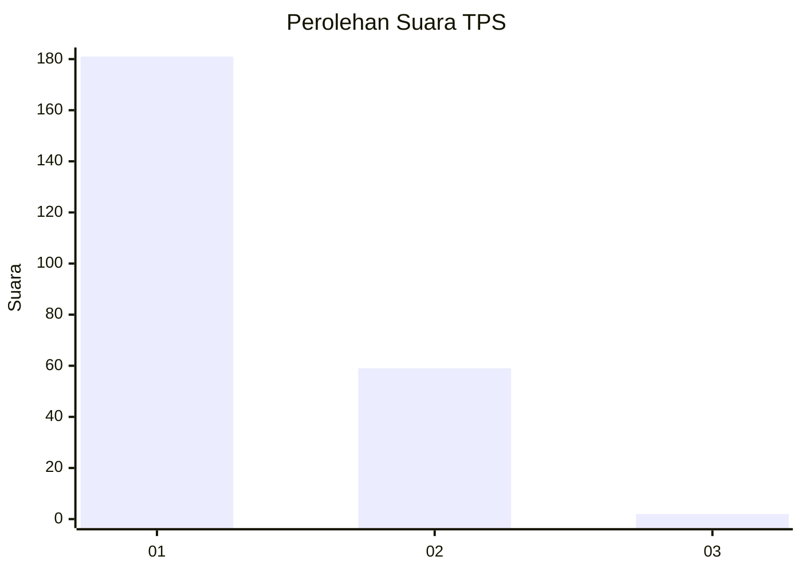
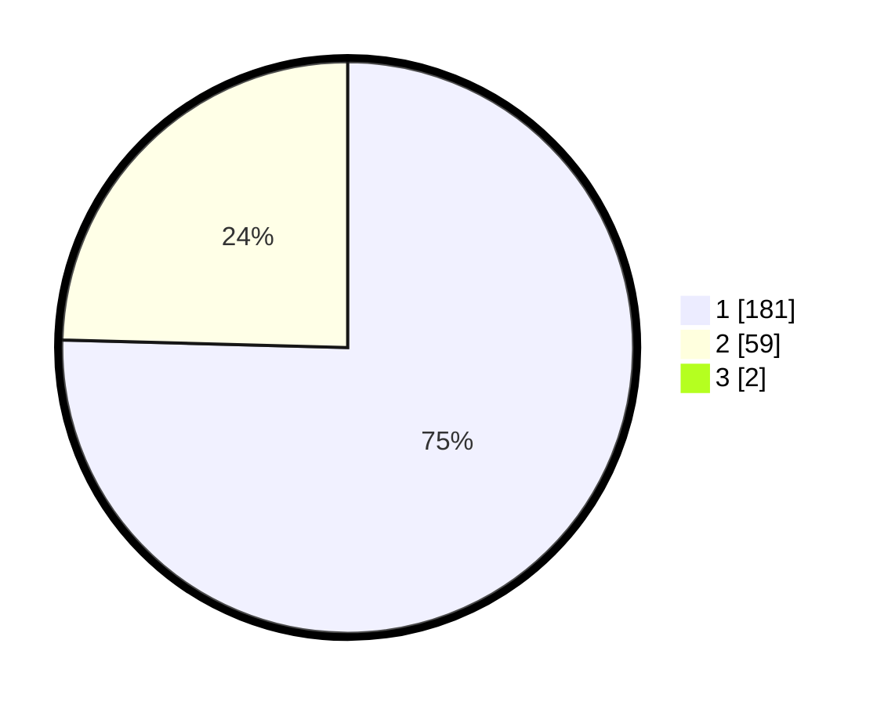

# Hasil

## Grafik

## Tabel

| No. | Nama Paslon    | Suara | Suara (raw) | Persentase |
|:--- |:-------------- | -----:| -----------:| ----------:|
| 1   | ANIES MUHAIMIN | 181   | [181][p-1]  | 74,79      |
| 2   | PRABOWO GIBRAN | 59    | [59][p-2]   | 24,38      |
| 3   | GANJAR MAHFUD  | 2     | [2][p-3]    | 0,83       |

[p-1]: https://github.com/gigit-pemilu/pemilu-2024-11-aceh/blob/main/pilpres/hitung-suara/sub/11-aceh/sub/01-aceh-selatan/sub/06-samadua/sub/2024-air-sialang-hilir-/sub/001-tps/sub/paslon-1.txt
[p-2]: https://github.com/gigit-pemilu/pemilu-2024-11-aceh/blob/main/pilpres/hitung-suara/sub/11-aceh/sub/01-aceh-selatan/sub/06-samadua/sub/2024-air-sialang-hilir-/sub/001-tps/sub/paslon-2.txt
[p-3]: https://github.com/gigit-pemilu/pemilu-2024-11-aceh/blob/main/pilpres/hitung-suara/sub/11-aceh/sub/01-aceh-selatan/sub/06-samadua/sub/2024-air-sialang-hilir-/sub/001-tps/sub/paslon-3.txt

## Foto C Plano

https://sirekap-obj-formc.kpu.go.id/84dc/pemilu/ppwp/11/01/06/20/24/1101062024001-20240215-171631--584053be-0394-4c29-8777-90d34e630588.jpg

https://sirekap-obj-formc.kpu.go.id/84dc/pemilu/ppwp/11/01/06/20/24/1101062024001-20240215-172135--ccfb204b-c7dd-4b2b-91c6-ee3c1992f3be.jpg

## Metadata

| Key        | Value               |
| ---------- | ------------------- |
| Time Stamp | 2024-02-24 22:31:28 |

