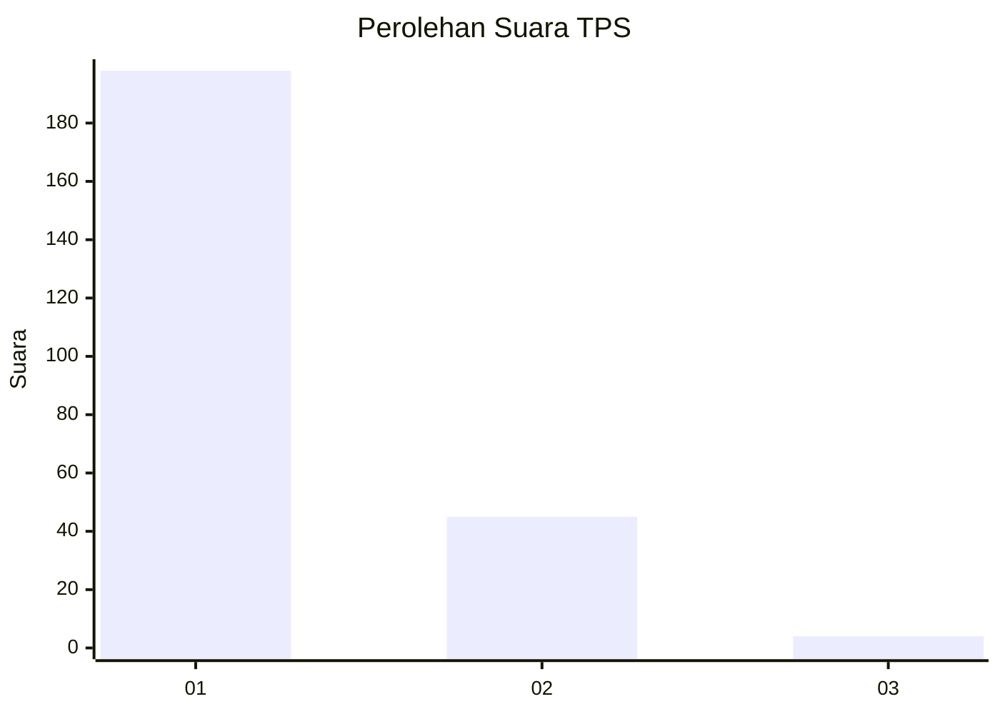
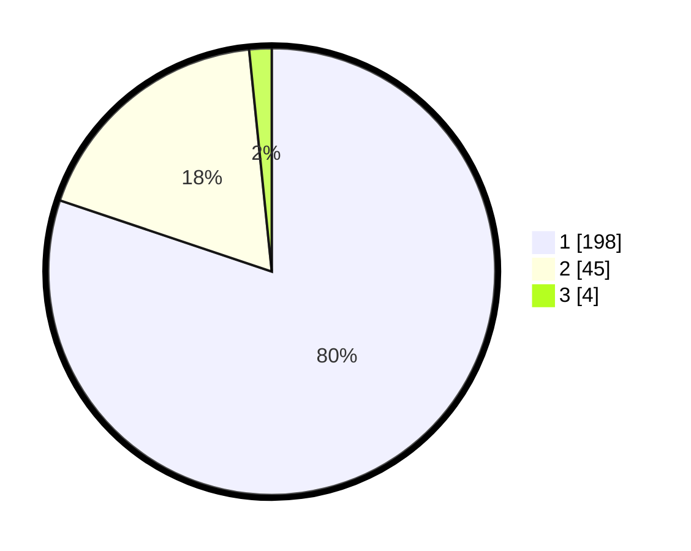

# Hasil

## Grafik

## Tabel

| No. | Nama Paslon    | Suara | Suara (raw) | Persentase |
|:--- |:-------------- | -----:| -----------:| ----------:|
| 1   | ANIES MUHAIMIN | 198   | [198][p-1]  | 80,16      |
| 2   | PRABOWO GIBRAN | 45    | [45][p-2]   | 18,22      |
| 3   | GANJAR MAHFUD  | 4     | [4][p-3]    | 1,62       |

[p-1]: https://github.com/gigit-pemilu/pemilu-2024-11-aceh/blob/main/pilpres/hitung-suara/sub/11-aceh/sub/01-aceh-selatan/sub/06-samadua/sub/2024-air-sialang-hilir-/sub/002-tps/sub/paslon-1.txt
[p-2]: https://github.com/gigit-pemilu/pemilu-2024-11-aceh/blob/main/pilpres/hitung-suara/sub/11-aceh/sub/01-aceh-selatan/sub/06-samadua/sub/2024-air-sialang-hilir-/sub/002-tps/sub/paslon-2.txt
[p-3]: https://github.com/gigit-pemilu/pemilu-2024-11-aceh/blob/main/pilpres/hitung-suara/sub/11-aceh/sub/01-aceh-selatan/sub/06-samadua/sub/2024-air-sialang-hilir-/sub/002-tps/sub/paslon-3.txt

## Foto C Plano

https://sirekap-obj-formc.kpu.go.id/12a1/pemilu/ppwp/11/01/06/20/24/1101062024002-20240222-222312--317354b6-0f3e-41a0-8a05-4ca3fec18bc9.jpg

https://sirekap-obj-formc.kpu.go.id/12a1/pemilu/ppwp/11/01/06/20/24/1101062024002-20240222-222502--1a5c244f-6641-4376-a26b-025b17444468.jpg

https://sirekap-obj-formc.kpu.go.id/12a1/pemilu/ppwp/11/01/06/20/24/1101062024002-20240222-222624--87360ffd-b7ee-4c1c-8ff0-98df98c68685.jpg

## Metadata

| Key        | Value               |
| ---------- | ------------------- |
| Time Stamp | 2024-02-22 23:00:00 |

## DATA PEMILIH TETAP

Jumlah pemilih dalam DPT: **286**.
 * L: **139**.
 * P: **147**.

## DATA PENGGUNA HAK PILIH

Jumlah pengguna hak pilih dalam DPT: **248**.
 * L: **120**.
 * P: **128**.

Jumlah pengguna hak pilih dalam DPTb: **3**.
 * L: **1**.
 * P: **2**.

Jumlah pengguna hak pilih dalam DPK: **0**.
 * L: **0**.
 * P: **0**.

Jumlah pengguna hak pilih: **251**.
 * L: **121**.
 * P: **130**.

## JUMLAH SUARA SAH DAN TIDAK SAH

JUMLAH SELURUH SUARA SAH: **247**.

JUMLAH SUARA TIDAK SAH: **4**.

JUMLAH SELURUH SUARA SAH DAN SUARA TIDAK SAH: **251**.

