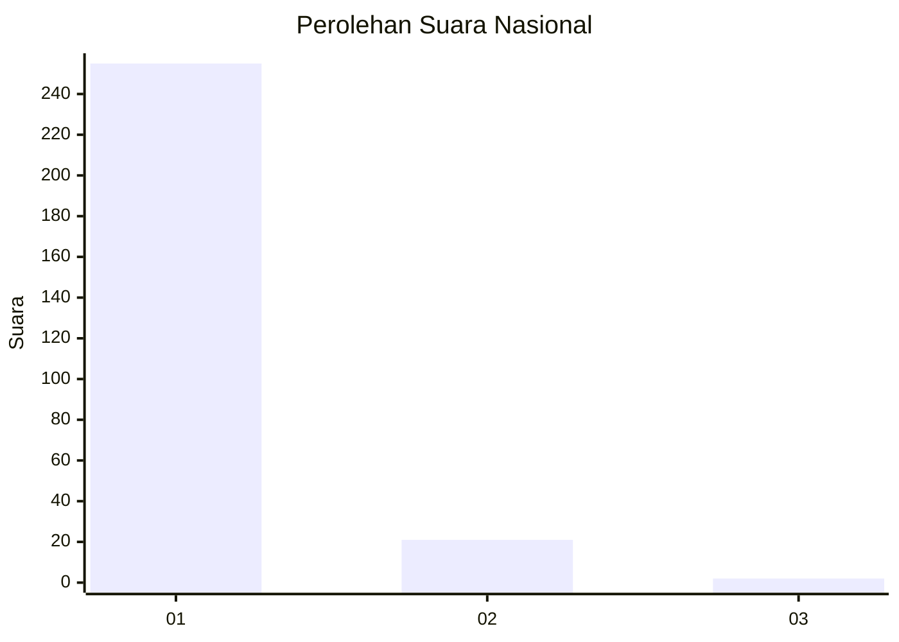
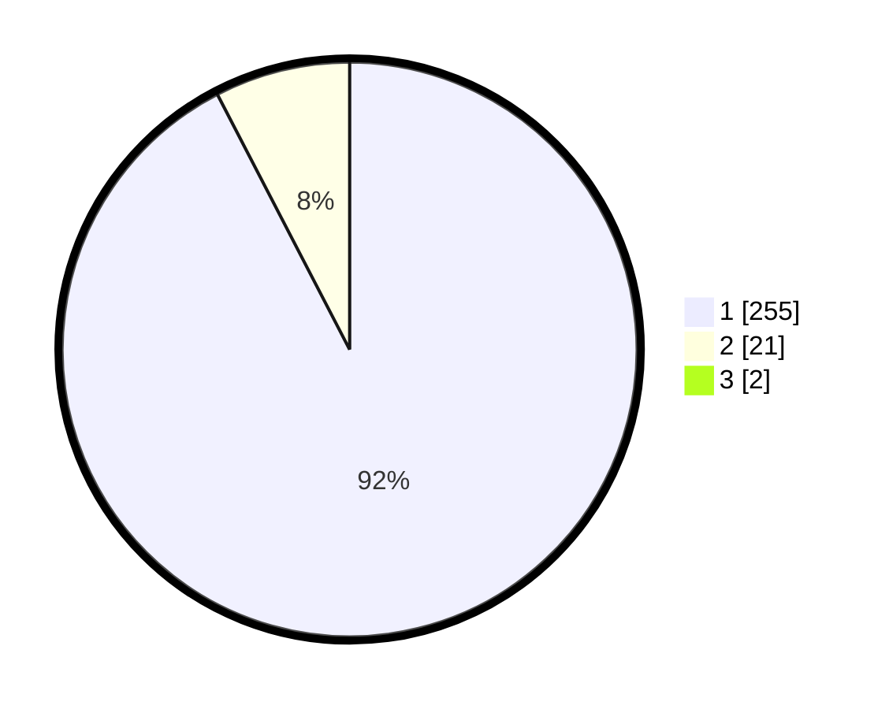

# Hasil

## Grafik

## Tabel

| No. | Nama Paslon    | Suara | Suara (raw) | Persentase |
|:--- |:-------------- | -----:| -----------:| ----------:|
| 1   | ANIES MUHAIMIN | 255   | [255][p-1]  | 91,73      |
| 2   | PRABOWO GIBRAN | 21    | [21][p-2]   | 7,55       |
| 3   | GANJAR MAHFUD  | 2     | [2][p-3]    | 0,72       |

[p-1]: https://github.com/gigit-pemilu/pemilu-2024/blob/main/pilpres/hitung-suara/sub/11-aceh/sub/01-aceh-selatan/sub/07-sawang/sub/2001-sikulat/sub/001-tps/sub/paslon-1.txt
[p-2]: https://github.com/gigit-pemilu/pemilu-2024/blob/main/pilpres/hitung-suara/sub/11-aceh/sub/01-aceh-selatan/sub/07-sawang/sub/2001-sikulat/sub/001-tps/sub/paslon-2.txt
[p-3]: https://github.com/gigit-pemilu/pemilu-2024/blob/main/pilpres/hitung-suara/sub/11-aceh/sub/01-aceh-selatan/sub/07-sawang/sub/2001-sikulat/sub/001-tps/sub/paslon-3.txt

## Foto C Plano

https://sirekap-obj-formc.kpu.go.id/76ff/pemilu/ppwp/11/01/07/20/01/1101072001001-20240218-123215--9db62946-2d38-4b92-8b27-d4c96deac137.jpg

https://sirekap-obj-formc.kpu.go.id/76ff/pemilu/ppwp/11/01/07/20/01/1101072001001-20240218-123615--362fba18-7c08-4169-bc3f-13b6884e2c4e.jpg

https://sirekap-obj-formc.kpu.go.id/76ff/pemilu/ppwp/11/01/07/20/01/1101072001001-20240218-123751--a811d364-9343-474c-a6d8-b915d845fba5.jpg

## Metadata

| Key        | Value               |
| ---------- | ------------------- |
| Time Stamp | 2024-02-19 06:16:00 |

## DATA PEMILIH TETAP

Jumlah pemilih dalam DPT: **289**.
 * L: **139**.
 * P: **150**.

## DATA PENGGUNA HAK PILIH

Jumlah pengguna hak pilih dalam DPT: **277**.
 * L: **133**.
 * P: **144**.

Jumlah pengguna hak pilih dalam DPTb: **0**.
 * L: **0**.
 * P: **0**.

Jumlah pengguna hak pilih dalam DPK: **2**.
 * L: **1**.
 * P: **1**.

Jumlah pengguna hak pilih: **279**.
 * L: **134**.
 * P: **145**.

## JUMLAH SUARA SAH DAN TIDAK SAH

JUMLAH SELURUH SUARA SAH: **278**.

JUMLAH SUARA TIDAK SAH: **1**.

JUMLAH SELURUH SUARA SAH DAN SUARA TIDAK SAH: **279**.

