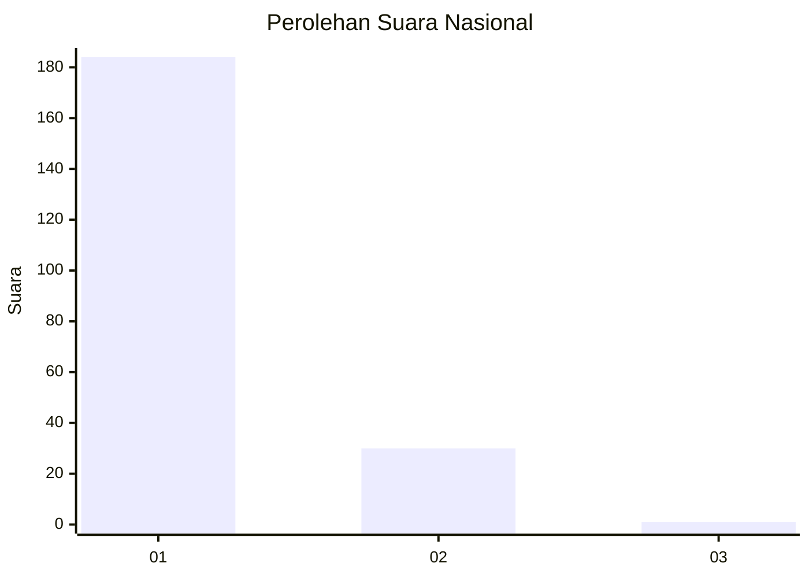
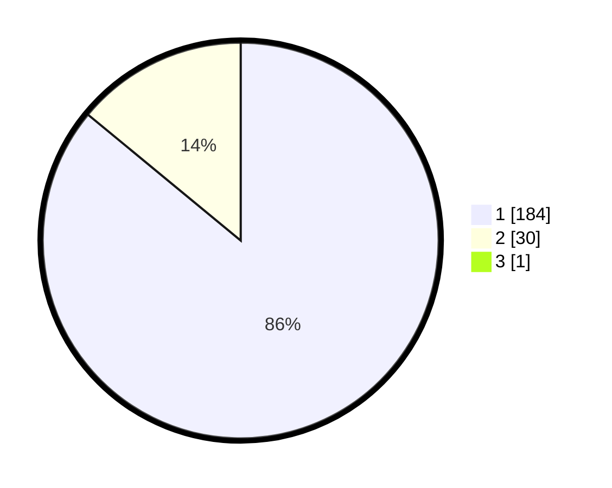

# Hasil

## Grafik

## Tabel

| No. | Nama Paslon    | Suara | Suara (raw) | Persentase |
|:--- |:-------------- | -----:| -----------:| ----------:|
| 1   | ANIES MUHAIMIN | 184   | [184][p-1]  | 85,58      |
| 2   | PRABOWO GIBRAN | 30    | [30][p-2]   | 13,95      |
| 3   | GANJAR MAHFUD  | 1     | [1][p-3]    | 0,47       |

[p-1]: https://github.com/gigit-pemilu/pemilu-2024/blob/main/pilpres/hitung-suara/sub/11-aceh/sub/01-aceh-selatan/sub/07-sawang/sub/2002-sawang-i/sub/001-tps/sub/paslon-1.txt
[p-2]: https://github.com/gigit-pemilu/pemilu-2024/blob/main/pilpres/hitung-suara/sub/11-aceh/sub/01-aceh-selatan/sub/07-sawang/sub/2002-sawang-i/sub/001-tps/sub/paslon-2.txt
[p-3]: https://github.com/gigit-pemilu/pemilu-2024/blob/main/pilpres/hitung-suara/sub/11-aceh/sub/01-aceh-selatan/sub/07-sawang/sub/2002-sawang-i/sub/001-tps/sub/paslon-3.txt

## Foto C Plano

https://sirekap-obj-formc.kpu.go.id/306d/pemilu/ppwp/11/01/07/20/02/1101072002001-20240221-160102--dcfa80a6-1d69-479c-9418-7879a0305a7c.jpg

https://sirekap-obj-formc.kpu.go.id/306d/pemilu/ppwp/11/01/07/20/02/1101072002001-20240221-160141--6f70d039-47da-4d9e-bf20-04e3d9f11c25.jpg

https://sirekap-obj-formc.kpu.go.id/306d/pemilu/ppwp/11/01/07/20/02/1101072002001-20240221-160248--9671023c-af79-4279-b5c7-1df2c8dcf654.jpg

## Metadata

| Key        | Value               |
| ---------- | ------------------- |
| Time Stamp | 2024-02-24 22:31:28 |

## DATA PEMILIH TETAP

Jumlah pemilih dalam DPT: **228**.
 * L: **106**.
 * P: **122**.

## DATA PENGGUNA HAK PILIH

Jumlah pengguna hak pilih dalam DPT: **209**.
 * L: **97**.
 * P: **112**.

Jumlah pengguna hak pilih dalam DPTb: **1**.
 * L: **0**.
 * P: **1**.

Jumlah pengguna hak pilih dalam DPK: **7**.
 * L: **3**.
 * P: **4**.

Jumlah pengguna hak pilih: **217**.
 * L: **100**.
 * P: **117**.

## JUMLAH SUARA SAH DAN TIDAK SAH

JUMLAH SELURUH SUARA SAH: **215**.

JUMLAH SUARA TIDAK SAH: **2**.

JUMLAH SELURUH SUARA SAH DAN SUARA TIDAK SAH: **217**.

