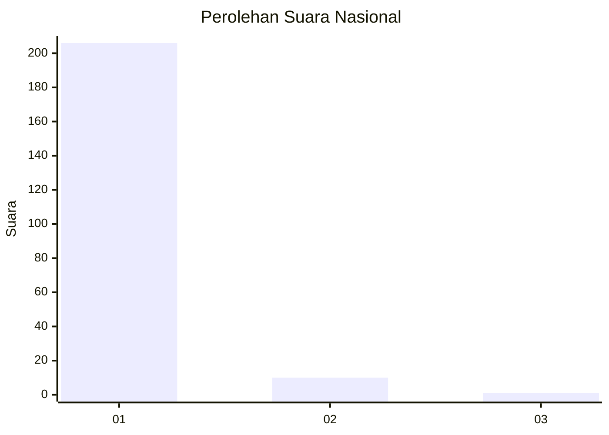
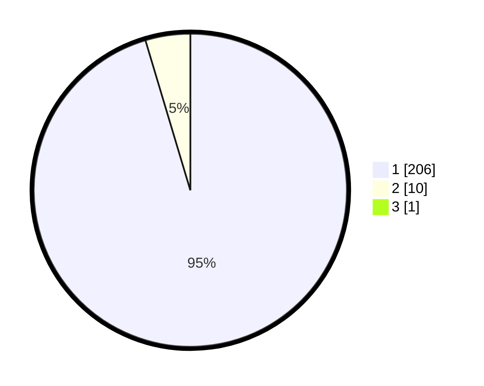

# Hasil

## Grafik

## Tabel

| No. | Nama Paslon    | Suara | Suara (raw) | Persentase |
|:--- |:-------------- | -----:| -----------:| ----------:|
| 1   | ANIES MUHAIMIN | 206   | [206][p-1]  | 94,93      |
| 2   | PRABOWO GIBRAN | 10    | [10][p-2]   | 4,61       |
| 3   | GANJAR MAHFUD  | 1     | [1][p-3]    | 0,46       |

[p-1]: https://github.com/gigit-pemilu/pemilu-2024/blob/main/pilpres/hitung-suara/sub/11-aceh/sub/01-aceh-selatan/sub/07-sawang/sub/2003-meuligo/sub/003-tps/sub/paslon-1.txt
[p-2]: https://github.com/gigit-pemilu/pemilu-2024/blob/main/pilpres/hitung-suara/sub/11-aceh/sub/01-aceh-selatan/sub/07-sawang/sub/2003-meuligo/sub/003-tps/sub/paslon-2.txt
[p-3]: https://github.com/gigit-pemilu/pemilu-2024/blob/main/pilpres/hitung-suara/sub/11-aceh/sub/01-aceh-selatan/sub/07-sawang/sub/2003-meuligo/sub/003-tps/sub/paslon-3.txt

## Foto C Plano

https://sirekap-obj-formc.kpu.go.id/1325/pemilu/ppwp/11/01/07/20/03/1101072003003-20240214-185403--95764994-5c55-47c5-aed2-45a48407aa23.jpg

https://sirekap-obj-formc.kpu.go.id/1325/pemilu/ppwp/11/01/07/20/03/1101072003003-20240215-043203--6ab2cd2b-d834-465b-a72d-077dcbad9f19.jpg

https://sirekap-obj-formc.kpu.go.id/1325/pemilu/ppwp/11/01/07/20/03/1101072003003-20240214-195746--2204f536-7dec-4341-b0f1-4ff02e3f7d82.jpg

## Metadata

| Key        | Value               |
| ---------- | ------------------- |
| Time Stamp | 2024-02-16 21:01:00 |

## DATA PEMILIH TETAP

Jumlah pemilih dalam DPT: **251**.
 * L: **134**.
 * P: **117**.

## DATA PENGGUNA HAK PILIH

Jumlah pengguna hak pilih dalam DPT: **213**.
 * L: **107**.
 * P: **106**.

Jumlah pengguna hak pilih dalam DPTb: **2**.
 * L: **1**.
 * P: **1**.

Jumlah pengguna hak pilih dalam DPK: **5**.
 * L: **1**.
 * P: **4**.

Jumlah pengguna hak pilih: **220**.
 * L: **109**.
 * P: **111**.

## JUMLAH SUARA SAH DAN TIDAK SAH

JUMLAH SELURUH SUARA SAH: **217**.

JUMLAH SUARA TIDAK SAH: **3**.

JUMLAH SELURUH SUARA SAH DAN SUARA TIDAK SAH: **220**.

