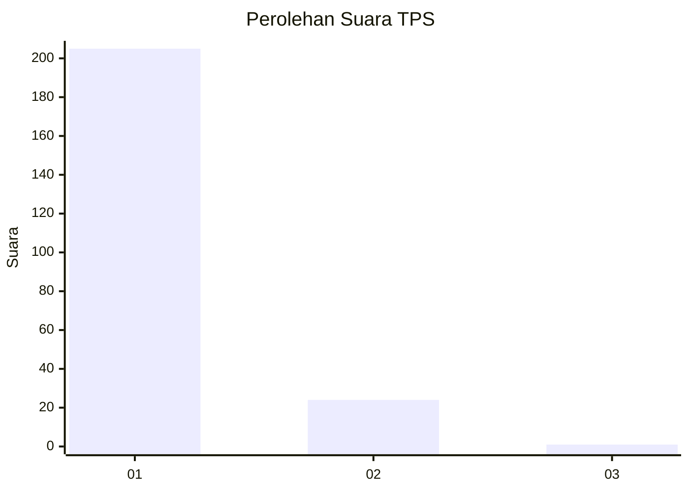
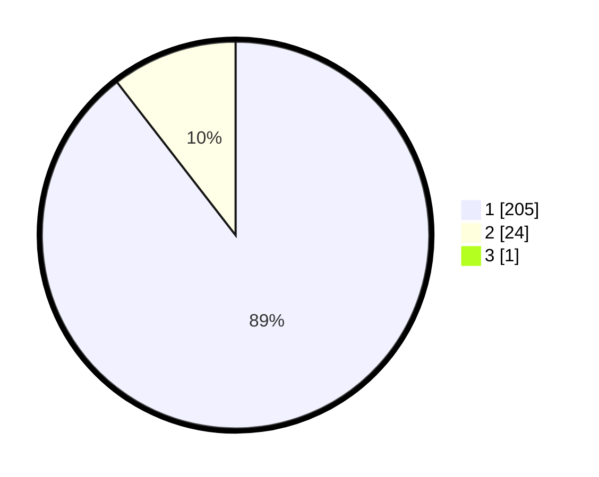

# Hasil

## Grafik

## Tabel

| No. | Nama Paslon    | Suara | Suara (raw) | Persentase |
|:--- |:-------------- | -----:| -----------:| ----------:|
| 1   | ANIES MUHAIMIN | 205   | [205][p-1]  | 89,13      |
| 2   | PRABOWO GIBRAN | 24    | [24][p-2]   | 10,43      |
| 3   | GANJAR MAHFUD  | 1     | [1][p-3]    | 0,43       |

[p-1]: https://github.com/gigit-pemilu/pemilu-2024-11-aceh/blob/main/pilpres/hitung-suara/sub/11-aceh/sub/01-aceh-selatan/sub/07-sawang/sub/2004-lhok-pawoh/sub/001-tps/sub/paslon-1.txt
[p-2]: https://github.com/gigit-pemilu/pemilu-2024-11-aceh/blob/main/pilpres/hitung-suara/sub/11-aceh/sub/01-aceh-selatan/sub/07-sawang/sub/2004-lhok-pawoh/sub/001-tps/sub/paslon-2.txt
[p-3]: https://github.com/gigit-pemilu/pemilu-2024-11-aceh/blob/main/pilpres/hitung-suara/sub/11-aceh/sub/01-aceh-selatan/sub/07-sawang/sub/2004-lhok-pawoh/sub/001-tps/sub/paslon-3.txt

## Foto C Plano

https://sirekap-obj-formc.kpu.go.id/2f98/pemilu/ppwp/11/01/07/20/04/1101072004001-20240214-231549--04b2f2bf-f71c-458e-a2cd-8d839b563fd5.jpg

https://sirekap-obj-formc.kpu.go.id/2f98/pemilu/ppwp/11/01/07/20/04/1101072004001-20240214-231717--186b032f-774e-42c0-94fe-424ff0f147df.jpg

https://sirekap-obj-formc.kpu.go.id/2f98/pemilu/ppwp/11/01/07/20/04/1101072004001-20240214-231841--a4866db7-0a33-4c6b-be59-fa5de784d64d.jpg

## Metadata

| Key        | Value               |
| ---------- | ------------------- |
| Time Stamp | 2024-02-16 21:01:00 |

