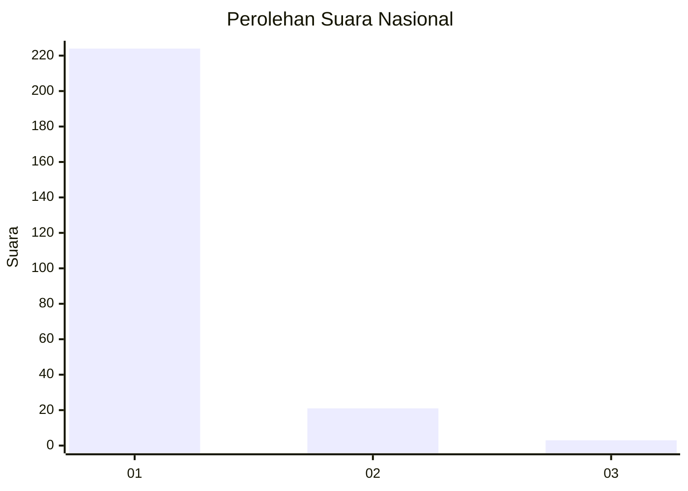
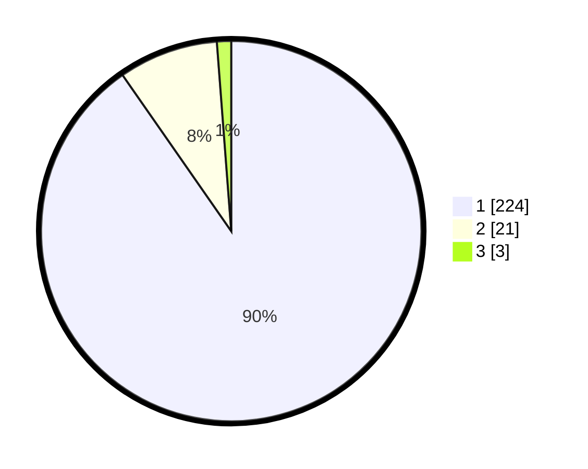

# Hasil

## Grafik

## Tabel

| No. | Nama Paslon    | Suara | Suara (raw) | Persentase |
|:--- |:-------------- | -----:| -----------:| ----------:|
| 1   | ANIES MUHAIMIN | 224   | [224][p-1]  | 90,32      |
| 2   | PRABOWO GIBRAN | 21    | [21][p-2]   | 8,47       |
| 3   | GANJAR MAHFUD  | 3     | [3][p-3]    | 1,21       |

[p-1]: https://github.com/gigit-pemilu/pemilu-2024/blob/main/pilpres/hitung-suara/sub/11-aceh/sub/01-aceh-selatan/sub/07-sawang/sub/2004-lhok-pawoh/sub/003-tps/sub/paslon-1.txt
[p-2]: https://github.com/gigit-pemilu/pemilu-2024/blob/main/pilpres/hitung-suara/sub/11-aceh/sub/01-aceh-selatan/sub/07-sawang/sub/2004-lhok-pawoh/sub/003-tps/sub/paslon-2.txt
[p-3]: https://github.com/gigit-pemilu/pemilu-2024/blob/main/pilpres/hitung-suara/sub/11-aceh/sub/01-aceh-selatan/sub/07-sawang/sub/2004-lhok-pawoh/sub/003-tps/sub/paslon-3.txt

## Foto C Plano

https://sirekap-obj-formc.kpu.go.id/4918/pemilu/ppwp/11/01/07/20/04/1101072004003-20240214-230613--f33b4195-d66f-430a-91dd-b2265b46a3b5.jpg

https://sirekap-obj-formc.kpu.go.id/4918/pemilu/ppwp/11/01/07/20/04/1101072004003-20240214-230825--602cc5d0-0842-463c-9eda-782b55d39597.jpg

https://sirekap-obj-formc.kpu.go.id/4918/pemilu/ppwp/11/01/07/20/04/1101072004003-20240214-230942--1a244da7-fc7d-4b87-9ba3-bba27f4b825a.jpg

## Metadata

| Key        | Value               |
| ---------- | ------------------- |
| Time Stamp | 2024-02-24 22:31:28 |

