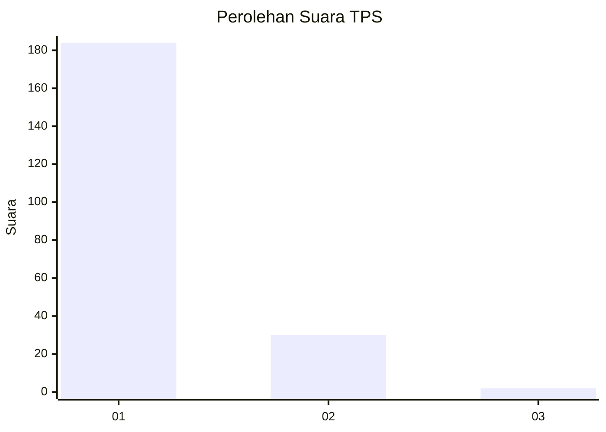
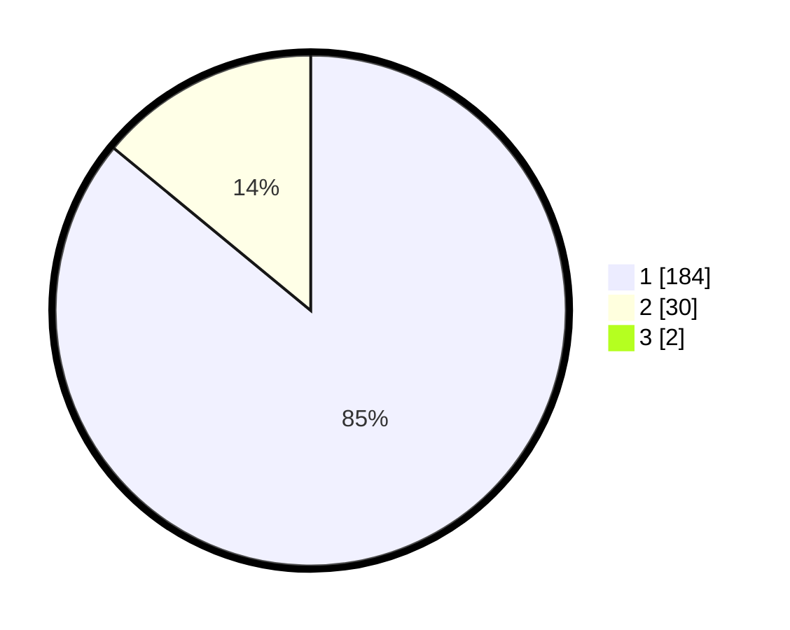

# Hasil

## Grafik

## Tabel

| No. | Nama Paslon    | Suara | Suara (raw) | Persentase |
|:--- |:-------------- | -----:| -----------:| ----------:|
| 1   | ANIES MUHAIMIN | 184   | [184][p-1]  | 85,19      |
| 2   | PRABOWO GIBRAN | 30    | [30][p-2]   | 13,89      |
| 3   | GANJAR MAHFUD  | 2     | [2][p-3]    | 0,93       |

[p-1]: https://github.com/gigit-pemilu/pemilu-2024-11-aceh/blob/main/pilpres/hitung-suara/sub/11-aceh/sub/01-aceh-selatan/sub/07-sawang/sub/2006-ujung-karang/sub/002-tps/sub/paslon-1.txt
[p-2]: https://github.com/gigit-pemilu/pemilu-2024-11-aceh/blob/main/pilpres/hitung-suara/sub/11-aceh/sub/01-aceh-selatan/sub/07-sawang/sub/2006-ujung-karang/sub/002-tps/sub/paslon-2.txt
[p-3]: https://github.com/gigit-pemilu/pemilu-2024-11-aceh/blob/main/pilpres/hitung-suara/sub/11-aceh/sub/01-aceh-selatan/sub/07-sawang/sub/2006-ujung-karang/sub/002-tps/sub/paslon-3.txt

## Foto C Plano

https://sirekap-obj-formc.kpu.go.id/3d4f/pemilu/ppwp/11/01/07/20/06/1101072006002-20240214-215828--df3a3b2d-765d-488b-98d3-24d8936b51d0.jpg

https://sirekap-obj-formc.kpu.go.id/3d4f/pemilu/ppwp/11/01/07/20/06/1101072006002-20240216-121954--549dbedd-2c4a-4565-9890-d02d7a00d7d8.jpg

## Metadata

| Key        | Value               |
| ---------- | ------------------- |
| Time Stamp | 2024-02-24 22:31:28 |

