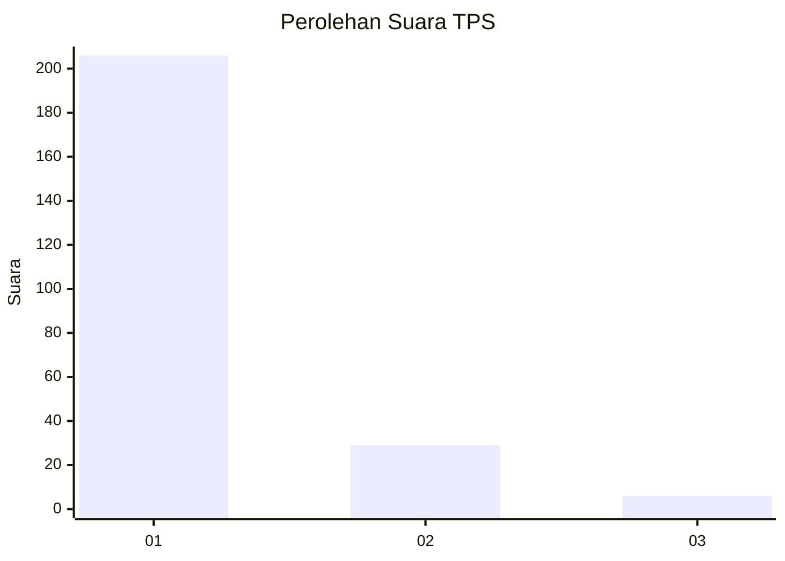
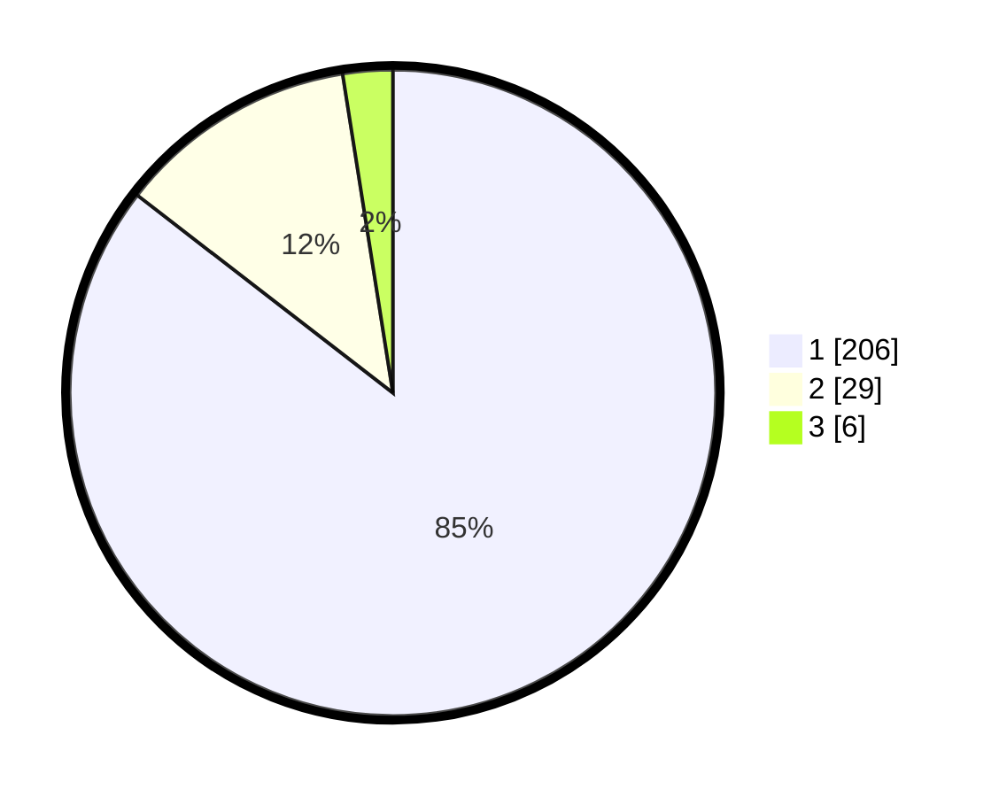

# Hasil

## Grafik

## Tabel

| No. | Nama Paslon    | Suara | Suara (raw) | Persentase |
|:--- |:-------------- | -----:| -----------:| ----------:|
| 1   | ANIES MUHAIMIN | 206   | [206][p-1]  | 85,48      |
| 2   | PRABOWO GIBRAN | 29    | [29][p-2]   | 12,03      |
| 3   | GANJAR MAHFUD  | 6     | [6][p-3]    | 2,49       |

[p-1]: https://github.com/gigit-pemilu/pemilu-2024-11-aceh/blob/main/pilpres/hitung-suara/sub/11-aceh/sub/01-aceh-selatan/sub/07-sawang/sub/2007-trieng-meuduro-baroh/sub/003-tps/sub/paslon-1.txt
[p-2]: https://github.com/gigit-pemilu/pemilu-2024-11-aceh/blob/main/pilpres/hitung-suara/sub/11-aceh/sub/01-aceh-selatan/sub/07-sawang/sub/2007-trieng-meuduro-baroh/sub/003-tps/sub/paslon-2.txt
[p-3]: https://github.com/gigit-pemilu/pemilu-2024-11-aceh/blob/main/pilpres/hitung-suara/sub/11-aceh/sub/01-aceh-selatan/sub/07-sawang/sub/2007-trieng-meuduro-baroh/sub/003-tps/sub/paslon-3.txt

## Foto C Plano

https://sirekap-obj-formc.kpu.go.id/b1ce/pemilu/ppwp/11/01/07/20/07/1101072007003-20240216-151824--c475d070-4d40-449c-8cb3-0f792b397803.jpg

https://sirekap-obj-formc.kpu.go.id/b1ce/pemilu/ppwp/11/01/07/20/07/1101072007003-20240214-190500--8bf116af-bbce-408a-9b6e-7d999dc16c26.jpg

https://sirekap-obj-formc.kpu.go.id/b1ce/pemilu/ppwp/11/01/07/20/07/1101072007003-20240216-151825--8253d9c5-e774-4068-8e7c-d9cd5a4ebc75.jpg

## Metadata

| Key        | Value               |
| ---------- | ------------------- |
| Time Stamp | 2024-02-16 16:25:10 |

## DATA PEMILIH TETAP

Jumlah pemilih dalam DPT: **280**.
 * L: **149**.
 * P: **131**.

## DATA PENGGUNA HAK PILIH

Jumlah pengguna hak pilih dalam DPT: **251**.
 * L: **121**.
 * P: **130**.

Jumlah pengguna hak pilih dalam DPTb: **0**.
 * L: **0**.
 * P: **0**.

Jumlah pengguna hak pilih dalam DPK: **0**.
 * L: **0**.
 * P: **0**.

Jumlah pengguna hak pilih: **251**.
 * L: **121**.
 * P: **130**.

## JUMLAH SUARA SAH DAN TIDAK SAH

JUMLAH SELURUH SUARA SAH: **241**.

JUMLAH SUARA TIDAK SAH: **10**.

JUMLAH SELURUH SUARA SAH DAN SUARA TIDAK SAH: **251**.

