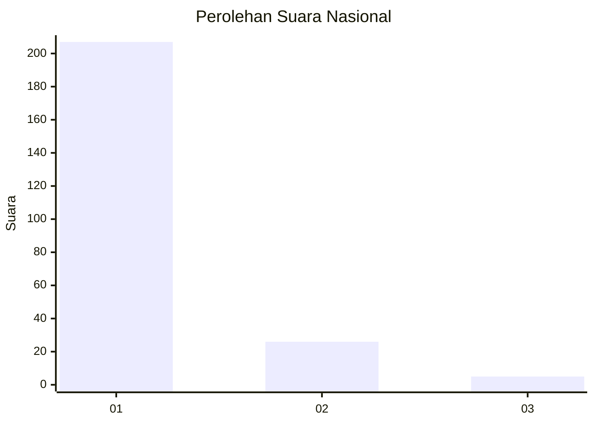
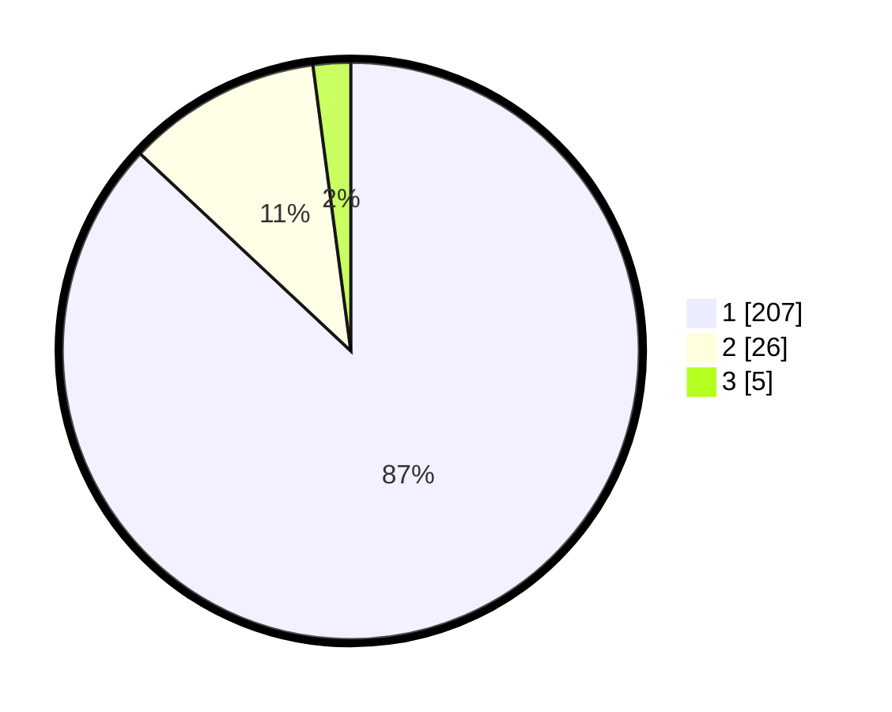

# Hasil

## Grafik

## Tabel

| No. | Nama Paslon    | Suara | Suara (raw) | Persentase |
|:--- |:-------------- | -----:| -----------:| ----------:|
| 1   | ANIES MUHAIMIN | 207   | [207][p-1]  | 86,97      |
| 2   | PRABOWO GIBRAN | 26    | [26][p-2]   | 10,92      |
| 3   | GANJAR MAHFUD  | 5     | [5][p-3]    | 2,10       |

[p-1]: https://github.com/gigit-pemilu/pemilu-2024/blob/main/pilpres/hitung-suara/sub/11-aceh/sub/01-aceh-selatan/sub/07-sawang/sub/2008-trieng-meuduro-tunong/sub/001-tps/sub/paslon-1.txt
[p-2]: https://github.com/gigit-pemilu/pemilu-2024/blob/main/pilpres/hitung-suara/sub/11-aceh/sub/01-aceh-selatan/sub/07-sawang/sub/2008-trieng-meuduro-tunong/sub/001-tps/sub/paslon-2.txt
[p-3]: https://github.com/gigit-pemilu/pemilu-2024/blob/main/pilpres/hitung-suara/sub/11-aceh/sub/01-aceh-selatan/sub/07-sawang/sub/2008-trieng-meuduro-tunong/sub/001-tps/sub/paslon-3.txt

## Foto C Plano

https://sirekap-obj-formc.kpu.go.id/155d/pemilu/ppwp/11/01/07/20/08/1101072008001-20240222-183040--ffbc112c-fd64-450a-b714-81ff1bb27afb.jpg

https://sirekap-obj-formc.kpu.go.id/155d/pemilu/ppwp/11/01/07/20/08/1101072008001-20240222-183125--e9e9aaf4-a755-4fac-ba1b-777712f45a4b.jpg

https://sirekap-obj-formc.kpu.go.id/155d/pemilu/ppwp/11/01/07/20/08/1101072008001-20240222-183154--53c3030f-81eb-41b2-a138-49238d5c8543.jpg

## Metadata

| Key        | Value               |
| ---------- | ------------------- |
| Time Stamp | 2024-02-24 22:31:28 |

## DATA PEMILIH TETAP

Jumlah pemilih dalam DPT: **278**.
 * L: **130**.
 * P: **148**.

## DATA PENGGUNA HAK PILIH

Jumlah pengguna hak pilih dalam DPT: **237**.
 * L: **107**.
 * P: **130**.

Jumlah pengguna hak pilih dalam DPTb: **2**.
 * L: **1**.
 * P: **1**.

Jumlah pengguna hak pilih dalam DPK: **3**.
 * L: **2**.
 * P: **1**.

Jumlah pengguna hak pilih: **242**.
 * L: **110**.
 * P: **132**.

## JUMLAH SUARA SAH DAN TIDAK SAH

JUMLAH SELURUH SUARA SAH: **238**.

JUMLAH SUARA TIDAK SAH: **4**.

JUMLAH SELURUH SUARA SAH DAN SUARA TIDAK SAH: **242**.

